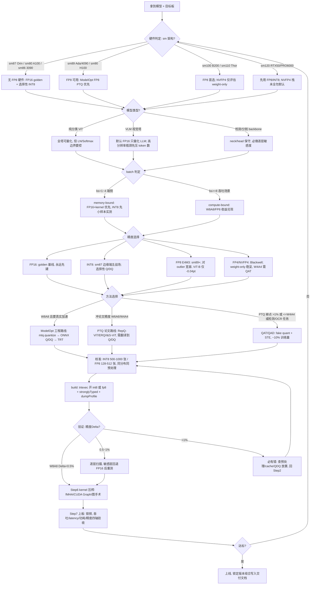

# ViT 在 NVIDIA 平台的量化与部署极致优化指南

> **定位**：面向端侧/边缘侧模型部署工程师的深度实战手册。读完本指南，你将系统掌握 ViT（含大模型/VLM 中的视觉塔）在 NVIDIA 芯片上从量化方法选型、TensorRT 工程落地、kernel 级压榨到上板验收的完整闭环。
>
> **时效**：内容检索与核实截至 2026 年 7 月，覆盖 TensorRT 10.x/11、Hopper FP8、Blackwell FP4/NVFP4、Jetson AGX Thor 等最新栈。
>
> **使用方式**：赶时间直接读 **第12章**（SOP + 排错手册 + 30 条 checklist）→ 按问题回查对应章节；系统学习按章序阅读，第 5 章为全书实操核心。

---

## 目录

- [第1章 全景导论：ViT 量化为什难、能拿到多少收益](#第1章-全景导论vit-量化为什难能拿到多少收益)
- [第2章 量化基础与 ViT 特有挑战](#第2章-量化基础与-vit-特有挑战)
- [第3章 ViT 专用 PTQ 方法图谱](#第3章-vit-专用-ptq-方法图谱)
- [第4章 QAT 与低比特训练路线](#第4章-qat-与低比特训练路线)
- [第5章 TensorRT INT8 部署全流程实战（核心实操章）](#第5章-tensorrt-int8-部署全流程实战核心实操章)
- [第6章 FP8、FP4 与新硬件路线](#第6章-fp8fp4-与新硬件路线)
- [第7章 Kernel 级极致优化与 Profiling 方法论](#第7章-kernel-级极致优化与-profiling-方法论)
- [第8章 Jetson 端侧部署实战](#第8章-jetson-端侧部署实战)
- [第9章 大模型/VLM 中视觉塔的量化部署](#第9章-大模型vlm-中视觉塔的量化部署)
- [第10章 校准集构建与精度调试方法论](#第10章-校准集构建与精度调试方法论)
- [第11章 性能基准与收益预期（数据速查）](#第11章-性能基准与收益预期数据速查)
- [第12章 端到端 SOP 与排错手册](#第12章-端到端-sop-与排错手册)
- [附录 A 术语速查表](#附录-a-术语速查表)

---

## 第1章 全景导论：ViT 量化为什难、能拿到多少收益

### 1.1 适用读者与文档地图

本文档面向需要在 NVIDIA 平台（数据中心 GPU / RTX 工作站 / Jetson 端侧）部署 ViT 类模型的工程师，默认读者已具备：PyTorch 模型导出 ONNX 的基本经验、TensorRT 引擎构建的入门知识、对 PTQ/QAT 概念的粗浅了解。三类典型读者：

- **端侧部署工程师**：要把检测/分割 backbone（ViT、Swin、DPT 类）或 VLA 模型的视觉塔压进 Jetson Orin/Thor 的实时预算（10~30 Hz）；
- **VLM 推理工程师**：负责 LLaVA / InternVL / Qwen-VL 类模型的视觉编码器加速，需要决定视觉塔量化与否、与 LLM 侧策略如何分工；
- **算法工程师**：需要看懂 ViT 量化论文（PTQ4ViT/FQ-ViT/RepQ-ViT 等）的方法，并把其中的量化器映射到 TensorRT 的 Q/DQ 显式量化范式上落地。

全书共 12 章，按"为什么难 → 怎么量化 → 怎么部署 → 怎么验收"组织：

| 章 | 标题 | 回答的问题 |
|---|---|---|
| 第1章 | 全景导论：ViT 量化为什难、能拿到多少收益（本章） | 技术栈全貌、真实收益预期、硬件×模型×batch 决策树 |
| 第2章 | 难点解剖：LayerNorm / GELU / Softmax 与 outlier token | ViT 激活分布在通道级、token 级两个维度的极端 outlier 从哪来 |
| 第3章 | ViT 专用 PTQ 方法谱系 | PTQ4ViT / FQ-ViT / RepQ-ViT / APQ-ViT / QwT / RegCache 各自修了什么 |
| 第4章 | QAT 与 4-bit 低比特路线 | fake quant / STE、蒸馏、W4A4 何时必须上 QAT |
| 第5章 | TensorRT INT8 工程全流程 | PyTorch→ONNX→Q/DQ→engine 的每一步命令与坑 |
| 第6章 | FP8 与 FP4：Ada / Hopper / Blackwell 的新精度红利 | E4M3/E5M2、NVFP4、Transformer Engine、ModelOpt FP8 PTQ |
| 第7章 | Kernel 级极致优化 | fused MHA、CUDA Graph、plugin、与量化正交的加速手段 |
| 第8章 | Jetson 端侧部署实战 | Orin/Thor 的功耗档位、统一内存、DLA 边界、上板验收 |
| 第9章 | VLM 视觉塔实战 | TensorRT-LLM multimodal / vLLM 中视觉塔与 LLM 的量化分工 |
| 第10章 | 校准集构建方法论 | 喂什么图、喂多少、失败怎么查 |
| 第11章 | 性能基准与收益核算 | 官方/论文基准如何对齐基线、如何自己测 |
| 第12章 | 故障排查与上线检查清单 | 版本锁定、精度回退、latency 异常的排查顺序 |

各章可独立阅读；时间紧的读者可按"第1章 → 第8章（Jetson）或第5/6章（GPU）→ 第10章（校准）→ 第12章（排障）"的捷径走。

### 1.2 一句话总览：ViT 为什么比 CNN 难量化

CNN 量化之所以"容易"，本质是 **BatchNorm + ReLU 组合把激活分布驯化成了近似有界、近高斯、通道间差异小的形态**；而 ViT 的 LayerNorm（无 BN 式的通道间统计量复用）、GELU（正负区间严重不对称）、Softmax（[0,1] 幂律长尾）三个非线性算子，叠加大规模预训练中涌现的 massive activation / attention sink 现象，使其激活分布呈现**通道级与 token 级两个维度的极端 outlier**——量化证据是：naive W8A8 per-tensor PTQ 在 ViT-B 上直接崩坏（ImageNet top-1 从 84.53% 掉到 23.64%），在 CLIP-B/16 上 zero-shot 从 68.32% 掉到 34.01%，SigLIP2-B/16 从 78.47% 掉到 26.04%（来源：https://arxiv.org/abs/2111.13824 ，https://arxiv.org/abs/2510.04547 ）。

三个非线性算子各自的"翻车方式"都有硬数字：LayerNorm 输入的通道间动态范围差异极大，部分 channel 取值范围超过中位数的 40 倍，per-tensor 单一 scale 必然对小值 channel 造成灾难性舍入；post-GELU 激活正值无界、负值被压在 ≈[−0.17, 0] 的极窄区间，对称 uniform 量化白白浪费一半码位；post-Softmax 的 attention map 呈幂律长尾，INT4 uniform 量化下 ViT-B 只剩 9.53%（FP 84.54%），换 log2 量化即恢复 83.23%——这决定了 post-Softmax 必须走 log 域或 FP8，不能硬套 uniform（来源：https://arxiv.org/abs/2111.13824 ，https://arxiv.org/abs/2111.12293 ）。token 级维度上，大规模预训练 ViT 中约 2% 的背景 patch token 会演化成 attention sink（norm 约为普通 token 的 10 倍），一个 outlier token 就能把 per-tensor 量化的 scale 撑大一个数量级（来源：https://arxiv.org/abs/2309.16588 ）。难点的机制级拆解见第2章，对应修法见第3、4章。

### 1.3 量化/部署技术栈全景

#### 1.3.1 精度格式：INT8 / FP8 / FP4 的硬件门槛

低精度格式能不能"快"，首先取决于目标芯片有没有对应的 Tensor Core 路径，其次才是算法：

| 格式 | 硬件门槛 | ViT 适配性 | 典型定位 |
|---|---|---|---|
| FP16/BF16 | 全平台 | 无损基线 | 一切优化的对照组；bs=1 场景的正确答案 |
| INT8 | sm61+（几乎全平台） | uniform 量化对 outlier 不友好，需 ViT 专用 PTQ 技巧；Q/DQ 开销在小模型/小 batch 占比高 | Ampere 时代主力；Orin 上对 ViT 收益存疑（见 1.4.4） |
| FP8（E4M3/E5M2） | sm89（RTX 4090/L40S/RTX 6000 Ada）、sm90（H100/H200）、sm100（B200）、sm120（RTX 50 系）、Thor | E4M3 指数位天然适配长尾/幂律分布，对 post-Softmax、post-LayerNorm 的 outlier 比 INT8 uniform 友好；ViT-B/16 PTQ 仅 −0.04 pt（来源：https://github.com/NVIDIA/TensorRT-Model-Optimizer/issues/194 ） | 2026 年 ViT 量化的首选格式（在有硬件的平台） |
| FP4（NVFP4） | Blackwell 专属（sm100/sm120、Jetson Thor） | W4A4 需格式定制算法（MR-GPTQ 类 Hadamard 旋转）才可用；W4A16 weight-only 风险小得多（来源：https://arxiv.org/html/2509.23202v3 ） | Thor/B200 上的上限选项，视觉塔建议先 FP8 再评估 |

E4M3 单格式动态范围有限（max=448，无 inf），推理侧必须配 per-tensor FP32 scale；权重 per-channel、激活 per-tensor 是 TensorRT 的标准粒度（来源：https://arxiv.org/abs/2209.05433 ，https://developer.nvidia.com/blog/model-quantization-turn-fp8-checkpoints-into-high-performance-inference-engines-with-nvidia-tensorrt/ ）。注意 TensorRT 层面 FP8 仅加速 GEMM（sm89+），LayerNorm/Softmax/GELU 仍走 FP16——这既是 FP8 对 ViT"精度省心"的原因（敏感非线性不动），也是其 e2e 加速天花板只有 ~1.4× 的原因（见 1.4.2）。

#### 1.3.2 方法谱系：PTQ / QAT / weight-only

| 路线 | 代表方法 | ViT-B/16 典型掉点 | 成本 | 适用 |
|---|---|---|---|---|
| 朴素 PTQ（MinMax/percentile） | TensorRT 内置校准 | INT8 W8A8：−1.4~−2.2 pt（官方 160 张校准、percentile 99.99）（来源：https://github.com/NVIDIA/FasterTransformer/blob/main/docs/vit_guide.md ）；大预训练视觉编码器直接崩坏 | 分钟级 | 仅作基线，勿上线 |
| ViT 专用 PTQ | PTQ4ViT / FQ-ViT / RepQ-ViT / QwT / RegCache | W8A8 可压到 Δ≤1.3 pt，PTQ4ViT 8-bit Δ<0.5%（来源：https://arxiv.org/abs/2111.13824 ，https://arxiv.org/pdf/2111.12293 ） | 小时级，免重训 | INT8 上线主力（见第3章） |
| FP8 PTQ | ModelOpt `quantize_mode=fp8` | ViT-B/16 −0.04 pt（H100，500 张校准） | 分钟级 | sm89+ 首选（见第6章） |
| QAT | Q-ViT、ModelOpt QAT | W4A4 可做到无损甚至反超 FP32（DeiT-B 83.0 vs FP 81.8），代价是重训练（来源：https://proceedings.neurips.cc/paper_files/paper/2022/file/deb921bff461a7b0a5c344a4871e7101-Paper-Conference.pdf ） | 天级 | 4-bit 唯一可靠路线（见第4章） |
| weight-only（W4A16） | AWQ / GPTQ | 精度稳，但省的是显存不是算力；Ampere 上 dequant 开销使 TPOT +10.4%~+56.3%（来源：https://arxiv.org/html/2607.08029v1 ） | 小时级 | VLM 的 LLM 侧省显存（见第9章） |

#### 1.3.3 工具链：一条主线，两个旁路

2026 年 NVIDIA 侧的主线是 **显式量化（Q/DQ）范式**：PyTorch 导出 ONNX → ModelOpt（`modelopt.torch.quantization` 或 `modelopt.onnx.quantization`）插入 Q/DQ 节点 → TensorRT 10.x 在 build 时把 Q/DQ 融合进相邻算子并路由到对应精度的 kernel → 目标机上 `trtexec` 现场构建 engine：

```bash
# 主线示例：FP8 PTQ（INT8 把 quantize_mode 换成 int8）
python -m modelopt.onnx.quantization \
    --onnx_path=vit_base_patch16_224.onnx \
    --quantize_mode=fp8 \
    --calibration_data=calib.npy --calibration_method=max \
    --output_path=vit.quantfp8.onnx
trtexec --onnxFile=vit.quantfp8.onnx --stronglyTyped --saveEngine=vit.fp8.engine
```

（来源：https://github.com/NVIDIA/TensorRT-Model-Optimizer/tree/main/onnx_ptq ；命令细节与版本矩阵见第5、6章。）两个旁路：一是 TensorRT 内置 INT8 calibrator（implicit quantization），老流程仍在用但官方已不推荐，FP8 更是只支持 explicit 路径；二是 TensorRT-LLM multimodal 管线，其官方示例中 InternVL2 的 FP8/INT8-SmoothQuant **只作用于 LLM 部分、视觉塔保持 FP16 构建引擎**——这本身就是官方对"视觉塔该不该量化"的默认回答（来源：https://github.com/NVIDIA/TensorRT-LLM/blob/main/examples/models/core/multimodal/README.md ）。论文里的 log2/twin 量化器无法直接用 Q/DQ scale 表达，落地时需映射为 FP8、查表 plugin 或保持 FP16 回退（见第5章）。

#### 1.3.4 硬件分档与低精度峰值

判断理论收益前先对齐 dense/sparse 口径（NVIDIA 官方规格表常并列引用 sparse 数字）：

| 平台 | sm | FP16/BF16 | INT8 | FP8 | FP4 |
|---|---|---|---|---|---|
| A100 80GB | sm80 | 312 TFLOPS | 624 TOPS | — | — |
| RTX 3090 | sm86 | ~71 TFLOPS | ~284 TOPS | — | — |
| RTX 4090 | sm89 | 165 TFLOPS | 660 TOPS | 660 TFLOPS | — |
| H100 SXM | sm90 | 989.5（dense BF16） | 1979 TOPS | 1979（dense） | — |
| B200 | sm100 | — | — | 4.5 PFLOPS（dense） | 9 PFLOPS（dense） |
| RTX 50 系 | sm120 | — | — | 有 | NVFP4 |
| Orin NX 16GB | sm87 | — | 157 TOPS（sparse，整机口径） | — | — |
| AGX Orin 64GB | sm87 | ~85（dense） | 275 sparse / ~137 dense | — | — |
| Jetson Thor T5000 | Blackwell | 517 sparse（dense ~258.5） | 1035 sparse | 1035 sparse | 2070 sparse |

（来源：https://arxiv.org/html/2603.09582 ，https://lambdalabs.com/blog/nvidia-hopper-h100-and-fp8-support ，https://arxiv.org/html/2509.23202v3 ，https://arxiv.org/html/2607.08029v1 ，https://openzeka.com/wp-content/uploads/2022/02/Jetson_AGX_Orin_DS-10662-001_v1.1.pdf ，https://developer.nvidia.com/blog/introducing-nvidia-jetson-thor-the-ultimate-platform-for-physical-ai/ ）

两条推论决定后文所有收益预期：其一，**INT8/FP8 的理论峰值仅为同档 FP16 的 2×**（A100、4090、H100 均如此），且 ViT 中 LayerNorm/Softmax/GELU 等 element-wise 操作留在 FP16 域，Amdahl 定律下实测远低于 2×；其二，Ampere 边缘卡（Orin sm87）没有 FP8/FP4 单元，Thor（Blackwell）的甜点精度是 FP8/FP4，INT8 在两代边缘平台上都不是主角。

### 1.4 收益预期管理：先把账算对

#### 1.4.1 基线陷阱：论文里的 4~5× 是相对朴素 FP32

读 ViT 量化文献时第一要务是对齐基线。QwT（CVPR 2025）在 RTX 3090、batch 64、TensorRT 下实测：DeiT-T INT8 加速 4.1×、Swin-S 3.8×、ViT-S 4.9×、ViT-B 5.5×——但这些数字的对照组是**未优化的朴素 FP32 TensorRT engine**；同表 ViT-B 朴素 INT8 掉点 −8.7 pt（84.5→75.8），靠 QwT 补偿才拉回 82.8（来源：https://arxiv.org/html/2411.13918 ）。若基线换成优化后的 FP16 engine，INT8 增益回落到 1.4~1.7× 量级（见下节）。**凡是不标注基线精度的加速比，都不可用于立项估算。**

#### 1.4.2 INT8 相对优化后 FP16 的真实收益：1.4~1.7×（A100 官方数据）

NVIDIA 官方 FasterTransformer ViT 基准（A100，CUDA 11.4，输入分辨率 384²/224²，latency 单位 ms）是最诚实的对照：

| 模型@分辨率 | bs=1 | bs=8 | bs=16 | bs=32 |
|---|---|---|---|---|
| ViT-B/16 @384 | 2.24→2.26（**0.99×**） | 11.14→7.93（1.41×） | 21.50→14.66（1.47×） | 43.81→29.07（1.51×） |
| ViT-B/16 @224 | 1.53→1.52（1.01×） | 3.03→2.38（1.27×） | 5.30→3.74（1.42×） | 10.04→6.43（1.56×） |
| ViT-L/16 @384 | 5.36→4.77（1.12×） | 30.95→20.25（1.53×） | 60.99→39.43（1.57×） | 124.85→80.05（1.56×） |
| ViT-L/16 @224 | 2.97→2.91（1.02×） | 8.09→5.44（1.49×） | 15.03→9.23（1.63×） | 29.66→17.28（1.72×） |

（来源：https://github.com/NVIDIA/FasterTransformer/blob/main/docs/vit_guide.md ，表中为 FP16→INT8 latency。）折算 throughput：ViT-B/16@384、bs32 时 FP16 ≈ 730 img/s、INT8 ≈ 1100 img/s。规律：模型越大、batch 越大，INT8 越接近天花板 ~1.7×；小算力卡反而收益更高——T4 上 ViT-B/16@384 的 bs=1 也有 1.73×（8.53→4.93 ms），因为计算受限更严重、Q/DQ 占比小。FP8 的情况对称：NVIDIA 官方 CLIP FP8 PTQ 在 RTX 6000 Ada、batch 128 下，图像编码器 166.2→119.8 ms（1.39×）、主导 GEMM 1.8→0.84 ms（>2×）、引擎体积 −48%，e2e 只有 ~1.4× 的原因同样是 LN/Softmax/GELU 留在 FP16（来源：https://developer.nvidia.com/blog/model-quantization-turn-fp8-checkpoints-into-high-performance-inference-engines-with-nvidia-tensorrt/ ）。代际升级的账另算：H100 相对 A100 同精度约 2×、切 FP8 再 2×，MLPerf 口径合计最高 4.5×——换卡比换格式的收益大得多（来源：https://github.com/gstaff/TensorRT-LLM/blob/main/docs/source/blogs/H100vsA100.md ）。

#### 1.4.3 bs=1 几乎无加速：低延迟场景别把量化当银弹

A100 上 ViT INT8 在 bs=1 的加速比是 0.99~1.12×——Q/DQ 的 cast/reformat 开销吃掉了 GEMM 收益（来源：https://github.com/NVIDIA/FasterTransformer/blob/main/docs/vit_guide.md ）。FP8 同样：ModelOpt 官方示例在 H100 上 ViT-B/16 单样本 FP8 0.651 ms 反而慢于 FP16 0.621 ms（来源：https://github.com/NVIDIA/TensorRT-Model-Optimizer/issues/194 ）；SD3.5 官方模型卡在 H100 上 CLIP-G 文本编码器 BF16 13.83 ms → FP8 16.80 ms，**小 ViT 编码器上 FP8 反而更慢，收益集中在大 GEMM 主体**（同卡 MMDiT 1.42×）（来源：https://modelscope.cn/models/stabilityai/stable-diffusion-3.5-large-tensorrt ）。机器人、实时检测这类 bs=1 场景，正确答案是 FP16 + fused MHA + CUDA Graph（见第7章），量化预算应留给大 batch 的吞吐场景。

#### 1.4.4 Orin：INT8 可能零收益甚至负优化

Ampere 边缘卡上，INT8 对 ViT 的收益整体存疑，三组独立证据：

1. **TensorRT 原生 INT8 仅快 ~3~5%**：NVIDIA 官方论坛案例中，Orin Nano 上 ViT-S 经 ModelOpt INT8 + `trtexec`，修复版 TRT 实测 FP16 36.68 ms vs INT8 35.45 ms（仅 ~3%），官方结论"the gain of the underlying kernel from INT8 is limited"；同一案例里 `--stronglyTyped` INT8 引擎曾出现 41.8→114.1 ms 的 **2.7× 性能回退**，ModelOpt 0.40 导出的 INT8 ONNX 在 TRT 10.3 直接编译失败（来源：https://forums.developer.nvidia.com/t/tensorrt-model-optimizer-int8-quantization-causes-2-7x-performance-regression-on-jetson-orin-nano-4gb-vit-s-dpt-architecture/357835 ）。
2. **BitsAndBytes INT8 在 SigLIP 视觉塔上是灾难**：2026 年 sVLM 论文实测，Jetson Orin NX/AGX 上 PaliGemma2 的 SigLIP-So400m 视觉编码 INT8 后延迟 ×3.86/×4.66（AGX 98.5→459.1 ms），DeepSeek-VL2-Tiny ×3.02/×3.11，LLaVA-OV ×2.61/×2.43——精度没掉，速度严重回退，原因是 BitsAndBytes INT8 kernel 与 SigLIP 计算 pattern 在 Ampere 上不匹配（来源：https://arxiv.org/html/2607.08029v1 ）。
3. **但"只量化 GEMM、LN/Softmax 留 FP"的 partial quantization 可行**：Embedl 在 AGX Orin 上把 ViT 做到 3.6 ms，INT8 再加速 2× 且精度损失 <0.01%，叠加结构化剪枝总加速 4×——差别正在于量化范围与 kernel 栈选择（来源：https://www.embedl.com/optimizing-vision-transformers-for-peak-performance-on-nvidia-jetson-agx-orinvidia-jetson-agx-orin ）。

为什么 Orin 上 INT8 理论上有带宽红利却兑现不了？Jetson 全系是 iGPU 统一内存架构，CPU/GPU 共享同一块 LPDDR5：AGX Orin 带宽仅 204.8 GB/s、Orin NX 102.4 GB/s，ViT 在其上本应是 memory-bound、INT8 字节数减半应该直接受益；但 Transformer 的 GEMM 形状（小 M、大 K/N）让 INT8 kernel 的 tile 利用率差，Q/DQ 节点引入的 reformat/cast kernel 在小 batch 下 overhead 占比高，两项相抵后净收益趋近于零（来源：https://arxiv.org/html/2602.18397v1 ，https://forums.developer.nvidia.com/t/jetson-thor-int8-quantization-show-no-performance-gain-over-fp16/353308 ）。

结论：Orin 上默认 FP16 + TensorRT；INT8 必须先在目标板小样本实测，预期增益 0~5%，且校准/构建/验收全流程必须在目标板上完成（engine 不可跨板移植）。另一个 Orin 特有的边界：DLA（NVDLA v2）截至 JetPack 6.2 不支持 transformer attention/LayerNorm/GELU，ViT 不要指望 DLA 分流，全走 GPU（来源：https://proventusnova.com/blog/tensorrt-vs-dla-jetson-orin/ ）。

#### 1.4.5 Thor / Blackwell：甜点转向 FP8/FP4

Jetson Thor（T5000，Blackwell iGPU）的算力结构决定了新甜点：sparse FP4 2070 TFLOPS、sparse FP8/INT8 1035、sparse FP16 仅 517——FP8 是 FP16 的 2×，FP4 再 2×，且 Transformer Engine 原生支持 FP4/FP8 动态切换（来源：https://developer.nvidia.com/blog/introducing-nvidia-jetson-thor-the-ultimate-platform-for-physical-ai/ ）。与此同时 INT8 沦为"过渡精度"、缺少最优 kernel 路径：2025-12 两起独立论坛案例报告 RT-DETR、Swin UNet、MiDaS DPT-Hybrid 在 Thor 上 INT8（无论 PTQ 还是 ModelOpt QAT）不比 FP16 快甚至更慢——DPT-Hybrid FP16 173 FPS vs INT8 97 FPS（来源：https://forums.developer.nvidia.com/t/jetson-thor-int8-quantization-show-no-performance-gain-over-fp16/353308 ，https://forums.developer.nvidia.com/t/int8-throughput-and-latency-worse-than-fp16-for-midas-dpt-hybrid-model-on-thor/354915 ）。还要注意 Thor 的内存带宽仅 273 GB/s（相对 RTX 4090 的 ~1 TB/s 是数量级短板），roofline 分析显示连 SigLIP 视觉塔在 Thor 上都是 memory-bound（平衡 OI 1481.5 vs 视觉编码器 OI 321.4）——**量化在 Jetson 上的第一收益是字节数减半带来的带宽节省，其次才是算力翻倍**，这正是 FP8/FP4 在 Thor 上比 INT8 更对路的深层原因（来源：https://arxiv.org/html/2602.18397v1 ）。FP4 的精度风险见 1.3.1，视觉塔建议先 FP8。

#### 1.4.6 精度账：各路线的典型掉点速查

| 路线 | 证据（测试条件） | 掉点 |
|---|---|---|
| 朴素 W8A8 per-tensor | ViT-B ImageNet：84.53→23.64；CLIP-B/16 zero-shot 68.32→34.01 | 崩坏 |
| 官方朴素 INT8 PTQ | ViT-B/16@384，percentile 99.99，160 张校准 | −1.40~−2.15 pt |
| ViT 专用 PTQ（FQ-ViT 系） | ViT-B W8A8 全量化 | −1.22 pt（83.31） |
| ModelOpt INT8 PTQ | ViT-B/16，H100，500 张 max 校准 | −0.54 pt（84.560） |
| ModelOpt FP8 PTQ | 同上 | −0.04 pt（85.056） |
| 朴素 W4A4 | Qwen3-VL-8B 视觉塔：GQA 59.04→22.32 | 崩坏 |
| RepQ-ViT + RegCache W4A4 | 同上 | 44.00（挽回 21.7 pt） |
| QAT（Q-ViT）W4A4 | DeiT-B，重训练 | 83.0（反超 FP 81.8） |

（来源：https://arxiv.org/abs/2111.13824 ，https://arxiv.org/abs/2510.04547 ，https://github.com/NVIDIA/FasterTransformer/blob/main/docs/vit_guide.md ，https://github.com/NVIDIA/TensorRT-Model-Optimizer/issues/194 ，https://proceedings.neurips.cc/paper_files/paper/2022/file/deb921bff461a7b0a5c344a4871e7101-Paper-Conference.pdf ）

### 1.5 一页决策树：硬件 × 模型 × batch 的推荐路线

按三个问题顺序决策：

**Q1 目标硬件是什么代际？**

- **sm80/sm86（A100、RTX 3090）**：无 FP8。吞吐场景 INT8（ViT 专用 PTQ，第3章）；其余 FP16。
- **sm89/sm90（RTX 4090、L40S、H100/H200）**：FP8 PTQ 为默认首选，免 QAT、Δ<0.5 pt；INT8 作备选。
- **sm100/sm120（B200、RTX 50 系）**：FP8 稳妥保底；上限场景评估 NVFP4（W4A16 先行，W4A4 需 MR-GPTQ 类算法，第6章）。
- **Jetson Orin（sm87）**：默认 FP16 + TensorRT（fused MHA + CUDA Graph）；INT8 仅在经过目标板实测验证后启用，预期 0~5%，禁用 BitsAndBytes 类通用栈跑视觉塔；VLM 的压缩预算放 LLM 侧（W4A16 省显存，接受 TPOT 变差）。
- **Jetson Thor（Blackwell）**：优先 ModelOpt FP8 PTQ；不要沿用 Orin 时代的 INT8 思路（实测可能负优化）；FP4 留给 LLM/action expert，视觉塔先 FP8。

**Q2 模型是纯 ViT 还是 VLM 视觉塔？**

- **纯 ViT（分类/检测/分割 backbone）**：量化敏感层集中在中部 1~2 个 block 的 FC2 输入，混合精度性价比最高；patch embedding 与 head 保持 FP16；W8A8 用 FQ-ViT/RepQ-ViT+QwT 可压到 Δ≤1.3 pt（第2、3章）。
- **VLM 视觉塔（CLIP/SigLIP/InternViT）**：误差会被 LLM 自回归逐 token 放大，且视觉+LLM 组合量化存在非加性误差（PaliGemma2 视觉 INT8 + LLM INT4 比分量误差之和多掉 16.33 MME 分）；naive W8A8 直接崩坏，必须先治 outlier（RegCache 类）或直接用 FP8 绕过；生产默认仍是视觉塔 FP16、LLM 侧激进量化（第9章）。SigLIP 无 CLS token、outlier 弥散，比 CLIP 更难用 token 级技巧处理。

"先治 outlier 再谈位宽"有量化依据：RegCache 实测敏感层输入的 max token ℓ∞ norm，SigLIP2-B/16 高达 148.20（处理后可压到 15.16），OpenCLIP-B/16 92.78→9.64；免训练的 register prefix + token deletion 方案在 CLIP W4A4 上最佳提升 +44.51 个百分点（来源：https://arxiv.org/abs/2510.04547 ）。这解释了为什么同一份 PTQ 脚本在 DeiT 上掉 0.5 pt、在 SigLIP2 上直接崩——位宽不是第一变量，outlier 才是。

**Q3 服务 batch 多大？**

- **bs=1（实时/机器人/交互）**：任何 8-bit 都基本无 GEMM 收益（A100 INT8 0.99×、H100 FP8 0.651 vs 0.621 ms）；走 FP16 + kernel 级优化（第7章），省显存才考虑 weight-only。
- **bs 8~32（常规服务）**：INT8 甜点区，A100 稳定 1.4~1.7×；FP8 在 sm89+ 同档且更省精度。
- **bs ≥64（吞吐优先）**：FP8 收益充分兑现（GEMM >2×，e2e ~1.4×，CLIP 官方案例 batch 128）；INT8 接近 1.7× 天花板；此场景才轮到 4-bit/FP4 谈"再翻倍"。

汇总为矩阵（"—"表示不推荐）：

| 硬件 | 纯 ViT，bs=1 | 纯 ViT，大 batch | VLM 视觉塔，bs=1 | VLM 视觉塔，大 batch |
|---|---|---|---|---|
| A100 / RTX 3090（sm80/86） | FP16 + kernel 优化 | INT8（ViT 专用 PTQ，1.4~1.7×） | FP16；LLM 侧 INT4/INT8 | INT8 + outlier 处理，或视觉塔 FP16 |
| RTX 4090 / H100（sm89/90） | FP16 + kernel 优化 | **FP8 PTQ**（~1.4×，Δ<0.5 pt） | FP16 或 FP8 | **FP8 PTQ**；敏感任务逐任务验收 |
| B200 / RTX 50（sm100/120） | FP16/FP8 | FP8；上限评估 NVFP4 | FP8 | FP8 → NVFP4（W4A16 先行） |
| Jetson Orin（sm87） | FP16 + TensorRT；INT8 先实测 | —（边缘少见大 batch） | FP16；压缩预算给 LLM | — |
| Jetson Thor（Blackwell） | **FP8**（勿用 INT8 思路） | FP8 → FP4 | FP8；LLM 侧 FP4 | FP8/FP4 组合 + MIG 分区 |

三条贯穿全书的纪律：① 一切加速比先对齐基线精度与 batch（1.4 节）；② 量化产物必须在目标硬件、目标 TensorRT/ModelOpt 版本上重新验收，engine 不跨板移植（第8、12章）；③ 端侧验收必须精度、延迟、能耗三轴齐测——Jetson 上 INT4 LLM 省 21.8~47.5% 显存的同时 TPOT 变差 10.4~56.3%、能耗不降反升（来源：https://arxiv.org/html/2607.08029v1 ）。


---

## 第2章 量化基础与 ViT 特有挑战

### 2.1 量化数学基础速览

#### 2.1.1 核心公式：scale 与 zero-point

均匀量化（uniform quantization）把一个浮点张量 `x` 映射到 `b` bit 整数 `x_q`，反量化再映射回浮点近似值 `x̂`：

```
quant:   x_q = clamp(round(x / s) + z, q_min, q_max)
dequant: x̂   = (x_q - z) * s
```

其中 `s`（scale，步长）和 `z`（zero-point，零点偏移）是仅有的两个量化参数；`q_min/q_max` 由 bit 数与符号性决定（INT8 对称时常用 `[-128, 127]` 或 `[-127, 127]`）。量化误差 `e = x̂ - x` 满足 `|e| ≤ s/2`（未 clip 时），所以**一切量化优化的本质都是：在 clip 误差与 round 误差之间做权衡，为特定分布选出最优的 `s` 与 `z`**。

- **对称量化（symmetric）**：`z = 0`，`s = max|x| / q_max`。计算上 zero-point 可以整个消掉，是硬件最友好的形式；代价是分布不对称时浪费一半码位。
- **非对称量化（asymmetric）**：`s = (x_max - x_min) / (q_max - q_min)`，`z = round(q_min - x_min / s)`。能贴住任意 `[x_min, x_max]` 区间，但 GEMM 里会多出 `z` 相关的修正项。

TensorRT 显式量化（Q/DQ 范式）的硬性约束可以直接背下来：**weight 必须 per-channel 对称、activation 必须 per-tensor 对称、zero-point 全 0**，否则 parser 直接 assert 失败（来源：https://leimao.github.io/blog/PyTorch-Eager-Mode-Quantization-TensorRT-Acceleration/ 及 https://forums.developer.nvidia.com/t/how-exactly-are-you-supposed-to-do-explicit-quantization/325824 ）。这条约束决定了后面所有"论文里的花哨量化器"落地时都要做一次变换。

#### 2.1.2 量化粒度：per-tensor / per-channel / per-token

同一个张量用几个 `(s, z)`，就是粒度问题：

| 粒度 | 含义 | 精度 | 硬件支持 |
|---|---|---|---|
| per-tensor（layer-wise） | 整个张量一个 scale | 最差，被极值绑架 | 全部支持，TRT activation 唯一支持 |
| per-channel（channel-wise） | 权重每个输出通道一个 scale | 权重量化标配 | TRT weight 唯一支持；**activation 不支持** |
| per-token / per-group | 每个 token 或每 g 个元素一个 scale | 激活救星 | 多数需要自定义 kernel 或重参数化折叠 |

ViT 部署里反复出现的矛盾就藏在这张表里：**论文里救精度的多是 per-channel / per-token 激活量化，而 TensorRT 显式量化的 activation 只支持 per-tensor**（来源：https://github.com/NVIDIA/Model-Optimizer/issues/149 相关讨论及 RepQ-ViT 工程意义分析）。落地只有两条路——用 QAT 让模型适应 per-tensor，或用 scale 重参数化把 channel-wise 折叠回 layer-wise（RepQ-ViT 思路，见第3章）。

#### 2.1.3 Q/DQ 节点与 fake quantization

训练侧（PyTorch / ModelOpt）和部署侧（TensorRT）通过 **Q/DQ 节点**衔接：在计算图中显式插入 QuantizeLinear（Q）和 DequantizeLinear（DQ）算子，前向时张量先被量化到 INT8 再立刻反量化回 FP16，后续计算照常走高精度——这就是 fake quantization，它让训练/校准过程"看见"舍入误差，而 TensorRT 在 build 引擎时会把 Q/DQ 融合进相邻算子，真正产出 INT8 kernel（来源：https://developer.nvidia.com/blog/model-quantization-turn-fp8-checkpoints-into-high-performance-inference-engines-with-nvidia-tensorrt/ ）。

用 20 行 Python 可以把整个机制模拟出来，建议读者亲手跑一遍建立直觉：

```python
import torch

def fake_quant(x, num_bits=8, per_channel=False, symmetric=True):
    """Q/DQ 模拟：量化到 num_bits 再反量化回 FP。"""
    q_max = 2 ** (num_bits - 1) - 1            # 对称 signed: [-127, 127]（int8）
    dim = 0 if per_channel else None
    amax = x.abs().amax(dim=dim, keepdim=True)
    s = amax / q_max                            # symmetric => z = 0
    x_q = torch.clamp(torch.round(x / s), -q_max - 1, q_max)
    return x_q * s                              # DQ 后的 x̂，误差 = x̂ - x

x = torch.randn(197, 768) * 0.1
x[5, 300] = 40.0                              # 人为注入一个 outlier
for pc in (False, True):
    err = (fake_quant(x, 8, pc) - x).abs().mean().item()
    print(f"per_channel={pc}: mean |err| = {err:.6f}")
# per-tensor 的误差被一个 40.0 的 outlier 直接放大 ~1 个数量级
```

工程上两个高频踩坑：Q/DQ 节点摆放不当（transpose 前插 QDQ、weight 前有 transpose）会导致 INT8 比 FP16 还慢，ViT 大量 transpose + matmul 结构极易触发（来源：https://github.com/NVIDIA/TensorRT/issues/1604 ）；ONNX 导出时 `do_constant_folding=True` 会把 QDQ 折叠掉，必须关掉（来源：https://userweb.cs.txstate.edu/~k_y47/webpage/pubs/mcsoc23.pdf ）。

#### 2.1.4 校准（calibration）与 scale 搜索指标

PTQ 的 scale 来自校准：用少量代表性数据前向跑一遍网络，统计每层激活的 amax / 直方图，再按某种指标（MinMax、Entropy/KL、MSE、Percentile）定 scale。ViT 上有一个专门的坑：**MSE、cosine distance 等常用局部指标在 ViT 上选不出最优 scale**，PTQ4ViT 因此引入 Hessian guided metric——用任务 loss 对层输出的梯度平方作对角权重，一次前向 + 一次反向即可，32–128 张校准图、单张 V100 上 2–69 分钟完成全模型量化（ViT-S 2–7 min，Swin-B/384 25–69 min）（来源：https://arxiv.org/abs/2111.12293 ）。

### 2.2 ViT 三大生死算子深度解析

CNN 量化之所以"容易"，本质是 **BatchNorm + ReLU 组合把激活分布驯化成了近似有界、近高斯、通道间差异小的形态**：BN 推理时折叠进 conv，ReLU 把激活截断到 `[0, +∞)`。ViT 的 LayerNorm、Softmax、GELU 三个非线性算子各自制造一种极端分布，是 ViT 量化掉点的三大结构性来源（来源：https://arxiv.org/abs/2111.12293 ）。

#### 2.2.1 post-LayerNorm：通道间 40 倍极差

ViT 每个 block 有两个 LayerNorm（pre-LN 结构），LN 输入来自残差流逐层累加，**通道间动态范围差异极大**。FQ-ViT 实测：LN 输入存在严重的 inter-channel variation，部分 channel 的取值范围超过中位数的 **40 倍**（来源：https://arxiv.org/abs/2111.13824 ）。RepQ-ViT 给出更细的微观证据——DeiT-S 第 1 个 block 第 300–350 通道的 boxplot 中，各通道 min/mean/max 的动态范围分别达到 3.94 / 7.11 / 22.2（来源：https://ar5iv.labs.arxiv.org/abs/2212.08254 ）。

per-tensor 量化用单一 scale 罩住所有 channel，小值通道被压进极少数 bin，舍入误差是灾难性的。直接数字对比：W4A4 DeiT-S 用 layer-wise 量化只有 **33.17%**，换 channel-wise 激活量化能到 **70.28%**——但 channel-wise 激活量化没有主流硬件支持（来源：https://ar5iv.labs.arxiv.org/abs/2212.08254 ）。

工程对策（均在论文中验证）：

- **FQ-ViT 的 PTF（Power-of-Two Factor）**：全局 scale × 每通道 2 的幂次因子，均值/方差可在整数域用 BitShift 计算，实现 integer-only LN；
- **RepQ-ViT 的 scale reparameterization**：校准阶段 channel-wise，随后把 scale 差异吸收进 LN 的 affine 参数（γ̃=γ/r₁, β̃=(β+s·r₂)/r₁）和下一层权重（W̃=r₁⊙W），推理时退化为 layer-wise，零额外开销，代价约 1.25 个点（DeiT-S W4A4：70.28→69.03）（来源：https://arxiv.org/abs/2212.08254 ）；
- TensorRT 标准路线：Q/DQ 不插入 LN 内部，LN 保持 FP16/FP32 kernel——这是 INT8 ViT 加速比的主要损耗点之一。

#### 2.2.2 post-Softmax：幂律长尾与"保大值"原则

post-Softmax 的 attention map 被压在 `[0,1]`，但分布极端不均：绝大多数值挤在 0~0.01，极少数关键 attention 值接近 1。uniform 量化器为了覆盖大值被迫用大 scale，把小值全部量成 0（丢失 patch 间弱关联）；用小 scale 又把大值压小（削弱关键注意力）。APQ-ViT 进一步指出 Softmax 输出服从 power-law 分布，量化极易破坏其 **Matthew effect（强者愈强的头部集中性）**，导致 attention 机制功能失效——这是 W4A4 下模型直接 crash 而非缓慢掉点的结构性原因（来源：https://arxiv.org/abs/2303.14341 ）。

两组必须记住的数字：

| 实验 | 配置 | 精度 | 来源 |
|---|---|---|---|
| FQ-ViT Tab.4，ViT-B（FP 84.54） | attention map INT4 uniform | **9.53%** | https://arxiv.org/abs/2111.13824 |
| 同上 | attention map INT4 Log2 | 83.23% | 同上 |
| 同上，DeiT-B（FP 81.84） | INT4 uniform → INT4 Log2 | 23.07% → 81.41% | 同上 |
| DopQ-ViT clip 实验，W4A4 ViT-B | 裁掉最接近 0 的 1% 值 | 70.73%（基本无损） | https://arxiv.org/html/2408.03291v3 |
| 同上 | 裁掉最接近 1 的 1% 值 | **2.20%**（崩溃） | 同上 |

结论有两层：(1) **post-Softmax 必须上 log 域量化**（FQ-ViT 的 LIS、RepQ-ViT 的 log√2→log2 重参数化），log 域下 attention map × V 的 MatMul 可退化为 BitShift；(2) attention map 的误差容忍度是**单向的**——小值归零几乎无感，大值受损立即崩，任何 post-Softmax 量化器设计都必须"保头部"。

#### 2.2.3 post-GELU：正负不对称

PTQ4ViT 首次系统指出：post-GELU 激活呈高度不对称分布——正值无界且范围大，负值被压缩在 ≈[-0.17, 0] 的极窄区间（GELU 最小值 -0.17 在 x≈-0.75 处取得）。对称 uniform 量化要么浪费一半码位在几乎无信息的负区间，要么 clip 正值破坏 MLP 表达（来源：https://arxiv.org/abs/2111.12293 ）。

对策是 PTQ4ViT 的 **twin uniform quantization**：正/负区间各用一个 scale（约束两者为 2 的幂次比以便硬件实现），8-bit 下 ViT/DeiT/Swin 掉点 <0.5%（32 张校准图，W8A8：ViT-B 84.54→84.25，DeiT-B 81.80→81.48，Swin-B 85.27→85.15）。注意 sigmoid 系激活（SiLU）在 YOLOv5 TensorRT INT8 PTQ 中同样导致 mAP 0.362→0.054 的崩溃（来源：https://github.com/NVIDIA/TensorRT/issues/1114 ）——**"光滑 S 形非线性 + 无界输出"是量化天敌的普遍规律**，不限于 GELU。超低 bit（W3A3）下 APHQ-ViT 还有一招：校准时把 GELU 临时换成 ReLU 稳定重建（见第3章）。

三大算子的敏感度排序与对策汇总：

| 算子 | 病态分布 | 决定性数字 | 必要对策 | 敏感度 |
|---|---|---|---|---|
| post-Softmax | 幂律长尾 [0,1] | INT4 uniform 仅 9.53%（ViT-B） | log2/log√2 量化，保大值 | ★★★ 最高 |
| post-LayerNorm | 通道极差 >40× | W4A4 DeiT-S layer-wise 33.17% | channel-wise 校准 + 重参数化 | ★★★ |
| post-GELU | 正负不对称 | 负区间仅 [-0.17, 0] | twin uniform / shift-log2 | ★★ 中等 |

### 2.3 outlier token 与 massive activation：大预训练视觉编码器的新敌人

上述三大算子问题在 ImageNet 规模的 ViT/DeiT/Swin 上已被充分研究；而在 CLIP/SigLIP2/DINOv2 这类大规模预训练视觉编码器（VLM 视觉塔的主力）上，还叠加了一层更凶的 **token 级 outlier**。

#### 2.3.1 现象：结构性 outlier token

Darcet et al.《Vision Transformers Need Registers》（ICLR 2024）发现：大模型训练中会涌现出少量高 norm 的 outlier token，其 norm 约为普通 token 的 **10 倍**、约占序列 **2%**，多位于低信息量背景区域，被模型"挪用"为全局信息寄存器（attention sink / massive activation）（来源：https://arxiv.org/abs/2309.16588 ）。RegCache 实测量化敏感层输入的 max token ℓ∞ norm：

| 模型 | Vanilla max token norm | RegCache 处理后 |
|---|---|---|
| CLIP-B/16 | 41.38 | 11.45 |
| OpenCLIP-B/16 | 92.78 | 9.64 |
| SigLIP-B/16 | 35.82 | 3.64 |
| SigLIP2-B/16 | **148.20** | 15.16 |

（来源：https://arxiv.org/abs/2510.04547 ）

一个 148 的 outlier token 就能把 per-tensor 量化的 scale 撑大一个数量级，所有正常 token 的有效位宽被活活挤没——用 2.1.3 节的代码亲手验证一遍就能看到这个效应。

更麻烦的是 outlier 的**结构性**：RegCache 实测 SigLIP-B/16 中间层 outlier token 跨图像余弦相似度 **0.89±0.07**，正常 token 仅 0.26±0.10——outlier 是图像无关的"结构性寄存器"。这意味着校准集稍偏就会失准：scale 被少数结构性 outlier 主导，而非被数据内容主导（来源：https://arxiv.org/abs/2510.04547 ）。

#### 2.3.2 崩坏证据：naive W8A8 直接打穿 CLIP

在 W8A8 per-tensor naive 量化下，大规模视觉编码器不是"掉点"而是崩坏：CLIP-B/16 zero-shot ImageNet 从 **68.32% 掉到 34.01%**，SigLIP2-B/16 从 78.47% 掉到 26.04%（RegCache Tab.2，来源：https://arxiv.org/abs/2510.04547 ）。对照实验更有说服力：把 outlier token 排除出 per-tensor 统计范围（单独 per-token 量化）后，精度暴涨——DINOv2-B 从 19.20 → 76.58（+57.38），SigLIP2-B/16 从 26.04 → 74.54（+48.50）（来源：https://arxiv.org/html/2510.04547v4 ）。这证明该场景下**量化误差的最大来源不是权重，而是这些 token 的激活幅值**。

两个模型差异细节值得记住：SigLIP 没有 CLS token（patch-wise pooling），outlier 弥散在 patch token 中、无单一 token 可隔离，比 CLIP 更难用 token 级技巧处理；且 softmax-based（CLIP）比 sigmoid-based（SigLIP）从 outlier 抑制中获益更多——softmax 是 outlier 的主要制造者（来源：https://arxiv.org/abs/2510.04547 ）。

工程含义：**大预训练视觉编码器先治 outlier 再谈位宽**。要么免训练消灭（RegCache 的 prefix register + token deletion，CLIP W4A4 最佳提升 +44.51 个百分点），要么借助 FP8 E4M3 的指数位动态范围绕过（见第4章），要么 per-token 分组（IGQ-ViT）。VLM 场景下这层误差还会被 LLM 自回归放大：Qwen3-VL-8B 视觉塔 W4A4 naive 量化后 GQA 从 59.04 → 22.32，即便 8B LLM 保持高精度也救不回来（来源：https://arxiv.org/abs/2510.04547 ）。

### 2.4 激活 vs 权重：谁是瓶颈

ViT 低 bit 量化的第一性结论：**激活是瓶颈，权重相对耐量化**。ERQ（ICML 2024）的对照实验（Appendix G）给出了干净的证据——权重固定 4-bit，激活从 4-bit 提到 8-bit 的收益：

| 模型 | W4A4 → W4A8 提升 |
|---|---|
| ViT-S | +8.93 |
| ViT-B | +5.35 |
| DeiT-T | +8.02 |
| DeiT-S | +4.97 |
| DeiT-B | +1.99 |
| Swin-S | +1.50 |
| Swin-B | +1.79 |

（来源：https://arxiv.org/abs/2407.06794 ）

即 **W4A8 ≫ W4A4，提升幅度 2~9 个百分点**，且小模型（ViT-S/DeiT-T）收益最大。反过来，权重 4-bit 配合 rounding 优化（ERQ 的 Wqer、GPTQ、AIQViT 的低秩补偿）可以压得住——ERQ 的 W4A4 DeiT-S 达 72.56%，仅需 32 张校准图、4 分钟完成。

机理解释有四条：权重分布平滑、静态可知（训练完就固定，可离线慢慢搜 scale，group size 128 是业界默认）；weight-only 方案计算图无 Q/DQ 注入，不动 LayerNorm/Softmax/GELU 这些最脆弱的算子；端侧小 batch 场景本来就是 memory-bound，W4A16 把权重读带宽降约 4× 直接转化为延迟收益；误差随模型规模下降（VLM 侧 W3 RTN 在 7B/8B 上平均掉 9.6%，>26B 只掉 1.5%）（来源：https://arxiv.org/html/2412.19509v1 ）。

由此得出位宽预算分配原则：**预算有限时优先保激活位宽**。W4A16（weight-only）通常稳，W4A8 是端侧甜点，W4A4 必须配合专用方法或 QAT（见第3、4章）。注意 weight-only 稳的是精度不是能效——W4A16 的 FP-INT 混合计算能耗约为 W8A8 INT-only 的 1.7×（来源：https://arxiv.org/pdf/2411.15982 ）。

### 2.5 深度与误差累积

ViT 是 12/24/32 个同质 block 的堆叠，量化误差沿深度**乘性累积且互相耦合**，这带来三个直接的工程后果。

**第一，逐层独立校准是次优的。** Q-VLM（NeurIPS 2024）证明逐层贪心搜 rounding function 会忽视 cross-layer dependency 而显著掉点；其发现层激活熵与该层量化误差的跨层传播显著相关，以熵为 proxy 做 block 级联合搜索后，LLaVA-7B W4A4 ScienceQA 达 79.79（比 QLoRA 基线 +2.26），13B 模型整体内存压缩 2.78×、生成提速 1.44×（来源：https://arxiv.org/abs/2410.08119 ）。APQ-ViT 的 BBC（Bottom-elimination Blockwise Calibration）同样按 block 粒度感知相邻层量化损失，W4A4 下分类平均提升 5.17%、检测相对基线 +243.43%（来源：https://arxiv.org/abs/2303.14341 ）。

**第二，敏感层非均匀分布，混合精度的钱要花在中层。** RegCache 的逐层敏感性实验（Fig.3）显示：ViT 的量化敏感层高度集中在 **1~2 个中间 block 的 MLP 投影层（FC2 输入）**，恰与 outlier 开始涌现的位置重合；浅层和末层相对鲁棒（来源：https://arxiv.org/abs/2510.04547 ）。这为混合精度位宽分配（敏感中层给 8-bit，其余 4-bit）提供了直接依据。DINOv2 的敏感层比 CLIP/SigLIP 更分散，自监督模型更难搞。

**第三，误差累积的起点随数据分布移动。** RegCache 的 FG-only 实验证明：背景越易识别，outlier 越早出现且幅值越大——即校准集的背景形态会移动误差累积的起点，**校准数据必须覆盖部署域的背景形态，而非仅做类别均衡**（来源：https://arxiv.org/abs/2510.04547 ）。

还有一个纯 ViT 特有的结构性弱点：patch embedding 是单层 16×16 stride-16 卷积（等价线性投影），没有 BN 可折叠、没有多层 conv 平滑，其量化误差会 1:1 注入每一个 token 并沿 depth 放大。因此业界惯例把 patch embedding 与最终 head/projector 保持 FP16/INT8 高精度——这是性价比最高的 partial quantization（来源：https://github.com/pytorch/pytorch/blob/main/docs/source/quantization-accuracy-debugging.rst 及 https://github.com/NVIDIA/TensorRT/issues/1114 ）。

最后提醒一个元问题：优化型 PTQ 方法（BRECQ/QDrop/PD-Quant）在 ViT 上容易因校准集不足而**过拟合**，4-bit 下被无优化的 RepQ-ViT 反超（来源：https://arxiv.org/abs/2311.10126 ）。重建型方法 256 张校准图后收益饱和（ERQ 消融），校准型方法 32–128 张即可——误差累积问题靠算法解决不了的部分，最终都要靠校准数据的代表性兜底。


---

## 第3章 ViT 专用 PTQ 方法图谱

ViT 的 PTQ 方法之所以"专用"，是因为它们都在解三个 CNN 上不存在的分布难题：post-Softmax 激活的 power-law 长尾、post-LayerNorm 激活的 channel 间差异、post-GELU 激活的正负不对称（误差机理详见第1章）。本章把 2021–2026 年的专用方法按技术路线拆解，给出全档位精度对比和面向 NVIDIA 部署的选型结论。注意各论文 FP baseline 略有差异（如 DeiT-B 81.80 vs 81.84、Swin-B 83.59 vs 85.27，来自不同训练/评测配置），下文每行数字均以其来源论文的 baseline 为准。

### 3.1 方法演进时间线（2021–2026）

| 方法 | 发表 | 核心技术 | integer-only | 代码 |
|---|---|---|---|---|
| Liu et al.（首个 ViT PTQ） | NeurIPS 2021 | ranking loss 保 softmax 顺序 + nuclear norm 混合精度 | 否 | — |
| FQ-ViT | IJCAI 2022 | PTF（Power-of-Two Factor）+ LIS（Log-Int-Softmax） | 是（attention 4-bit + BitShift） | github.com/megvii-research/FQ-ViT |
| PTQ4ViT | ECCV 2022 | twin uniform quantization + Hessian guided metric | 否 | github.com/hahnyuan/PTQ4ViT |
| APQ-ViT | ACM MM 2022 | BBC blockwise 校准 + MPQ 马太效应保持量化 | 否 | — |
| I-ViT | ICCV 2023 | Shiftmax / ShiftGELU / I-LayerNorm + dyadic arithmetic | **是（首个全整图）** | github.com/zkkli/I-ViT |
| RepQ-ViT | ICCV 2023 | scale reparameterization（channel-wise→layer-wise，log√2→log2） | 推理侧 bit-shift | github.com/zkkli/RepQ-ViT |
| NoisyQuant | CVPR 2023 | 给被量化激活加固定 uniform noisy bias | 否 | github.com/FranxYao/NoisyQuant |
| I&S-ViT | AAAI 2024 / TPAMI 2026 | SULQ（shift-uniform-log2）+ 三阶段 SOS 重建 | 推理友好（bit-shift） | — |
| ERQ | ICML 2024 | Aqer（Ridge Regression 降激活误差）+ Wqer（迭代 rounding） | 否 | — |
| AIQViT | AAAI 2025 | architecture-informed 低秩补偿 + DFQ 动态聚焦量化器 | 否 | — |
| DopQ-ViT / APHQ-ViT / ADFQ-ViT / IGQ-ViT / AdaLog / TP-ViT / PackQViT | 2024–2026 | TanQ+MOSF / 平均扰动 Hessian+GELU→ReLU / per-patch outlier / instance-aware 分组 / 任意底数 log / 截断 uniform-log2 / Int-2n-Softmax | — | — |

演进分三个明显的阶段：

- **2021–2022，观测与校准期**：社区刚发现 ViT 的极端分布，方法集中在"设计匹配分布的量化器"（PTQ4ViT 的 twin、FQ-ViT 的 PTF/LIS、APQ-ViT 的 MPQ），共同点是量化器本身越来越非标准，与硬件渐行渐远。
- **2023，部署友好转向**：RepQ-ViT 提出量化-推理解耦，把复杂量化器折叠回标准算子；I-ViT 把整个计算图整数化；NoisyQuant 反过来改数据分布去适配最朴素的 linear quantizer。这一年确立的两条路线——"推理侧只留标准量化器"与"integer-only 全整图"——至今仍是工程选型的主干。
- **2024–2026，重建与超低 bit 期**：I&S-ViT、ERQ、AIQViT、DopQ-ViT、APHQ-ViT 把战场推到 W3A3/W3A4，手段从"设计量化器"转向"设计误差补偿机制"（Ridge Regression 闭式解、低秩补偿、扰动 Hessian 重建），W4A4 在此阶段被推过实用线。

### 3.2 PTQ4ViT：twin uniform quantization + Hessian guided metric（ECCV 2022）

PTQ4ViT（北大+后摩智能）是最常被引用的 baseline，贡献有两个（来源：https://arxiv.org/abs/2111.12293 ）：

**twin uniform quantization**：对 post-Softmax 激活按大/小值分两段、对 post-GELU 激活按正/负分两段，各配一个独立 scale 的 uniform 量化器，并设计了让两段 scale 可对齐的数据格式，使硬件仍只需处理 uniform 量化。这直接回应了"单一 uniform 量化器罩不住不对称分布"的观测。

**Hessian guided metric**：MSE、cosine distance 这类局部指标在 ViT 上选不出最优 scale；PTQ4ViT 改用任务 loss 对层输出的梯度平方作为对角权重（对角 Hessian 近似），只需一次前向加一次反向即可评估候选 scale 对最终任务的影响。

**校准成本**：32–128 张校准图，单张 V100 上 2–69 分钟完成（ViT-S 2–7 min，Swin-B/384 25–69 min）。32 张下 W8A8 精度（来源论文 Table 4）：

| Model | FP | W8A8 | W6A6 |
|---|---|---|---|
| ViT-S/224 | 81.39 | 81.00 | 78.63 |
| ViT-B/224 | 84.54 | 84.25 | 81.65 |
| DeiT-S | 79.85 | 79.47 | 76.28 |
| DeiT-B | 81.80 | 81.48 | 80.25 |
| Swin-T | 81.39 | 81.25 | 80.47 |
| Swin-B | 85.27 | 85.15 | 84.01 |

W8A8 全线掉点 <0.5%，这是"W8A8 已成熟"这一结论的最早证据。但 W4A4 大幅退化（ViT-S 42.57 / ViT-B 30.69），W3A3 直接崩溃到 0.01–0.35（I&S-ViT 论文 Table 1，来源：https://arxiv.org/abs/2311.10126 ）。踩坑提示：twin quantizer 是非标准算子，TensorRT/Tensor Core 上没有原生 kernel，论文精度是 fake quantization 模拟值，直接导出 QDQ 模型无法复现。

### 3.3 FQ-ViT：PTF + LIS 全量化（IJCAI 2022）

FQ-ViT（旷视）是首个"全量化"ViT：连 LayerNorm 和 Softmax 也量化，不保留 FP 算子（来源：https://arxiv.org/abs/2111.13824 ）。

- **PTF（Power-of-Two Factor）**：针对 LayerNorm 输入的 channel 间差异，给每通道配一个 2 的幂次因子再加全局 scale，推理时用 bit-shift 实现，等价于"硬件免费的 per-channel 量化"。
- **LIS（Log-Int-Softmax）**：对 attention map 先做 4-bit log2 量化，softmax 的 exp 用 integer i-exp 实现，softmax 输出与 V 的 MatMul 因此退化为 **BitShift**。

attention map 量化对比（ViT-B，Table 4，来源：https://arxiv.org/pdf/2111.13824v1 ）：FP 84.54 / INT8 83.46 / **INT4-uniform 9.53** / INT4-Log2 83.23 / LIS integer-only 82.91；DeiT-B：81.84 / 81.48 / 23.07 / 81.41 / 81.06；Swin-B：83.59 / 83.26 / 81.28 / 83.14 / 82.80。这组数字有两层含义：一是 4-bit uniform 量化 attention map 直接报废（9.53%），证明 attention map 必须特殊处理；二是 log2 量化器能把它单独压到 4-bit 而几乎无损——后续所有方法的 post-Softmax 处理都建立在这一观测上。

注意一个常被误读的点：FQ-ViT 的"4-bit"仅指 attention map，其 W4A4（权重也 4-bit）会崩溃（ViT-S/ViT-B 0.10，I&S-ViT Table 1）。

### 3.4 APQ-ViT：BBC + MPQ（ACM MM 2022）

APQ-ViT 的两个组件分别针对校准策略和 attention map（来源：https://arxiv.org/abs/2303.14341 ）：

- **BBC（Bottom-elimination Blockwise Calibration）**：以 block 为粒度做二阶误差校准，让当前层的量化感知相邻层的损失；同时剔除"不可避免的小误差"对应的二阶梯度项，让优化容量聚焦在显著误差上，缓解 blockwise 重建在小校准集上的过拟合。
- **MPQ（Matthew-effect Preserving Quantization）**：对 power-law 分布的 attention map 做非对称线性量化，目标是保持"马太效应"（大值的主导地位）而非单纯最小化量化误差。

精度：W4A4 下 ViT-S 47.95 / ViT-B 41.41 / DeiT-T 47.94 / DeiT-S 43.55，比 PTQ4ViT baseline（42.57/30.69）提升明显；量化器消融（W4A4 ViT-S）MPQ vs Log vs Segmental = **47.95 vs 44.72 vs 37.70**，说明为 attention map 定制量化器收益明确。W6A6 ViT-S 79.10 / ViT-B 82.21 / DeiT-S 80.42；W8A8 ViT-S 81.25 / ViT-B 84.26。检测任务上（COCO W4A4，Mask R-CNN + Swin-T，APbox，ERQ 论文 Table 3 复现口径）：APQ-ViT 23.7，远高于 PTQ4ViT 的 6.9，但低于 GPTQ 36.3 / ERQ 36.8——它是 2022 年的最好水平，放到 2024 年后已不够看。

### 3.5 RepQ-ViT：scale 重参数化，部署最友好（ICCV 2023）

RepQ-ViT（中科院自动化所）的核心思想是**量化-推理解耦**：校准时用复杂量化器保精度，部署前通过 scale reparameterization 把复杂度等价折叠进已有参数，推理侧只剩硬件友好的简单量化器（来源：https://arxiv.org/abs/2212.08254 ；代码：https://github.com/zkkli/RepQ-ViT ）。

**post-LayerNorm：channel-wise → layer-wise**。校准阶段对 LN 输出做 channel-wise 量化（DeiT-S W4A4 下 channel-wise 70.28% vs layer-wise 33.17%，差距 37 个点，来源：https://ar5iv.labs.arxiv.org/abs/2212.08254 ）；部署前把 scale/zero-point 的通道间差异吸收进 LayerNorm 的 affine 参数和下一层权重：

```python
# RepQ-ViT post-LayerNorm 重参数化（导出部署模型前离线执行一次）
# 校准得到：通道方向 scale 向量 r1、与 zero-point 相关的修正项 r2、全局 scale s
gamma_t = gamma / r1              # LayerNorm 权重
beta_t  = (beta + s * r2) / r1    # LayerNorm 偏置
W_t     = r1 * W                  # 下一层 Linear 权重（按输入通道缩放，广播到对应维度）
b_t     = b - (s * r2) @ W        # 下一层 Linear 偏置补偿
```

变换后激活可用单个 layer-wise scale 量化，代价是 W̃ 分布被改变、需重新校准，精度损失约 1.25%（DeiT-S W4A4：70.28→69.03）。

**post-Softmax：log√2 → log2**。校准阶段用 log√2（以 √2 为底，粒度比 log2 细一倍）量化 attention map；部署前通过等价变换转成标准 log2 量化器，推理用 bit-shift。log√2 比 log2 在 Swin-S W4A4 上高 1.58%。

**结果与定位**：全程无超参、无重建优化，校准成本极低；W4A4 DeiT-S 69.03（掉 10.82 个点）、DeiT-T 约 57.8，比 APQ-ViT 高 9 个点以上，是首个把 4-bit PTQ 推到"可用"的方法。W3A3 仍崩（DeiT-T 0.97 / DeiT-S 4.37 / DeiT-B 4.84）。工程意义在于：推理侧只有 layer-wise uniform + log2(bit-shift) 两种标准量化器，不需要任何自定义 kernel，可直接走 TensorRT QDQ 路线（导出细节见第5章）。

### 3.6 NoisyQuant：主动加噪改分布（CVPR 2023）

NoisyQuant 提供了一个反直觉的视角：对给定量化器，**给被量化的值加一个固定的 uniform noisy bias（N~U[-0.5Δ, 0.5Δ]）**，在满足可证条件时能显著降低量化误差——不去改量化器适配分布，而是主动改分布去适配量化器（来源：https://arxiv.org/abs/2211.16056 ）。

```python
# NoisyQuant 核心操作：量化前注入一次固定噪声（每层仅一次加法）
n = torch.empty_like(x).uniform_(-0.5 * delta, 0.5 * delta)
x_q = quantize(x + n)
```

它是 quantizer-agnostic 插件，1024 张校准图。W6A6 数字：NoisyQuant-Linear 比 EasyQuant 提升 ViT-S +1.75%、DeiT-S +1.1%、Swin-T +0.5%——**朴素的 linear quantizer 加噪后可打平甚至超过非线性的 PTQ4ViT**；NoisyQuant-PTQ4ViT 组合把 DeiT-S 从 76.28 推到 77.43（+1.25）、DeiT-B 从 80.25 推到 80.70，Swin-S/Swin-B 的 W6A6 首次进入 FP 0.5% 以内；输出 logits MSE 下降 ViT-S -17%、Swin-T -16%。DETR W8A8 mAP 41.4（EasyQuant 41.1，Percentile 38.6）。层消融（ViT-S，W6A6 起点 75.27）：只加 qkv 噪声 75.38，只加 fc1/fc2 75.45，**所有线性层输入都加 76.37**——噪声应铺满全部线性层输入，而不是只加在"看起来敏感"的层（论文 Table 6）。

### 3.7 I-ViT：integer-only 端到端 INT8（ICCV 2023）

I-ViT（中科院自动化所）是**首个 integer-only 的 ViT PTQ**：整个计算图只用整数运算加 bit-shift，零浮点（来源：https://arxiv.org/abs/2207.01405 ；代码：https://github.com/zkkli/I-ViT ）。线性层走 dyadic arithmetic pipeline（INT8×INT8→INT32 累加→requantize）；三个非线性算子全部整数近似：

- **Shiftmax**：softmax 的 exp/div 用 ShiftExp + IntDiv（2 的幂移位）实现；
- **ShiftGELU**：利用 GELU(x) = x·sigmoid(1.702x)，常数 1.702 ≈ 1 + 1/2 + 1/8 + 1/16 用三次移位加实现；
- **I-LayerNorm**：开方用整数迭代。

```c
// I-ViT ShiftGELU：GELU(x) ≈ x · sigmoid(1.702x)，全程 INT + bit-shift
int32_t t   = I_in + (I_in >> 1) + (I_in >> 3) + (I_in >> 4);  // 1.702 * I_in
int32_t sig = ShiftExp(-t);          // sigmoid 的 ShiftExp 整数近似
int32_t out = IntDiv(I_in * sig);    // 2 的幂整数除法完成 requantize
```

精度：INT8 integer-only 与 FP 持平甚至略高（DeiT-B 81.74，比 I-BERT 高 0.95）。**它是文献中少数给出真实硬件数字的工作**：用 TVM 部署到 RTX 2080Ti（Turing INT8 tensor core），batch=8，相对 FP 加速 **3.72~4.11×**。这个数字的意义要放在对比中看：FQ-ViT/PTQ4ViT 这类"softmax/LayerNorm 保 FP"的方案，在真实硬件上非线性算子会卡住加速比（TensorRT 标准路线下通常只有 1.4~1.7×，见第11章基准数据），I-ViT 是唯一证明端到端 INT8 能跑出 4 倍级加速的路线。缺点也明确：只做了 INT8，没有低 bit 结果，且需要 TVM/自定义 kernel 而非 TensorRT 开箱即用。

### 3.8 I&S-ViT：SULQ + 三阶段 SOS（AAAI 2024，扩展版 TPAMI 2026.02）

I&S-ViT 指出低 bit 下两个被忽视的问题（来源：https://arxiv.org/abs/2311.10126 ）：(1) log2 量化器在 3/4-bit 下"量化效率低"——大量码本值被浪费在极小值区；(2) post-LayerNorm 粗粒度量化的 loss landscape 崎岖，且被异常通道放大。

- **SULQ（shift-uniform-log2 quantizer）**：先对 log2 域输入加一个 shift bias η 再做 uniform 量化，只多 1 次 round + 2 次加法，输出仍是整数、可 bit-shift；
- **SOS（三阶段 smooth optimization）**：融合 channel-wise 与 layer-wise 优点的分阶段平滑重建，缓解小校准集过拟合。

W3A3 成绩（ImageNet top-1）：ViT-S 45.16 / **ViT-B 63.77（比此前最好方法 +50.68%）** / DeiT-T 41.52 / DeiT-S 55.78 / DeiT-B 73.30 / Swin-S 74.20 / Swin-B 69.30。W4A4 全面超过 RepQ-ViT：ViT-S +9.82 / ViT-B +11.59 / DeiT-T +3.28 / DeiT-S +6.78 / DeiT-B +4.36 / Swin-S +1.72 / Swin-B +1.48。W6A6 近无损：DeiT-B 81.68（-0.12）/ Swin-S 82.89（-0.34）/ Swin-B 84.94（-0.33）。它是"推理仍走 bit-shift、但校准端带重建优化"路线的代表。

### 3.9 ERQ：Aqer + Wqer 两步误差消减（ICML 2024）

ERQ（厦大）把量化误差拆成激活、权重两半分别消减（来源：https://arxiv.org/abs/2407.06794 ）：

- **Aqer（Activation-quantization error reduction）**：把"激活量化误差最小化"建模成 Ridge Regression，用 FP 权重更新闭式求解；
- **Wqer（Weight-quantization error reduction）**：迭代式量化权重——每轮量化一半 FP 权重，做 rounding refinement（用输出误差代理修正取整方向），剩余 FP 权重再解 Ridge Regression 补偿已量化部分引入的误差。组合后平均量化误差降 32–47%。

数字：W4A4 DeiT-S 72.56%，**整个校准只用 32 张图、4 分钟**（256 张后收益饱和）；W3A4 相比此前方法 ViT-S +36.81 / ViT-B +27.74 / DeiT-S +19.53（v2 口径；v1 摘要报告 W3A4 超 GPTQ +22.36%）；W6A6 近无损（DeiT-B -0.26% / Swin-B -0.21%）。

ERQ 最有工程价值的附带结论是 **W4A8 ≫ W4A4**：激活从 4-bit 提到 8-bit，ViT-S +8.93 / ViT-B +5.35 / DeiT-T +8.02 / DeiT-S +4.97 / DeiT-B +1.99 / Swin-S +1.50 / Swin-B +1.79（论文 Appendix G）。这证明 ViT 低 bit 下**激活是瓶颈、权重不是**——预算紧张时优先保激活位宽。

### 3.10 AIQViT：低秩补偿 + 动态聚焦量化器（AAAI 2025）

AIQViT 代表"给模型加一点可学习参数换精度"的路线（来源：https://arxiv.org/abs/2502.04628 ）：

- **architecture-informed low-rank compensation**：每个 Linear 层加 LoRA 式低秩可学习补偿 W₀+BA，秩 r 用可微 NAS 逐层搜索，并用课程学习式逐步扩充校准集防过拟合；
- **DFQ（dynamic focusing quantizer）**：批评 log 系量化器把精度浪费在 0 附近的冗余小值，改为**学习最有价值的区间**、区间内做标准 uniform 量化。

数字：W6A6 DeiT-B 81.40（-0.4%）；W4A4 DeiT-T 62.33 / DeiT-S 72.75（auto r；手工 r=20 只有 59.61/69.73，说明秩搜索本身值 3 个点）；W3A3 DeiT-T 38.51 / DeiT-S 55.36。一个有用的副产物：DFQ 学到的量化区间**浅层显著大于深层**，印证浅层激活动态范围更大、更敏感（论文 Fig.4a），与"浅层要特殊照顾"的部署经验一致。

### 3.11 2024–2026 后续工作速览

- **DopQ-ViT**（来源：https://arxiv.org/abs/2408.03291 ）：TanQ（兼顾 0 和 1 附近的 post-Softmax 量化器）+ MOSF（多尺度因子修复 RepQ 重参数化后的异常通道）。其 clip 实验量化了 attention map 大值的重要性：W4A4 ViT-B 裁掉最接近 0 的 1% 值还剩 70.73%，裁掉最接近 1 的 1% 值直接崩到 2.20%。W4A4 ViT-S 75.69 / ViT-B 80.95 / DeiT-S 75.84 / DeiT-B 80.13；W3A3 ViT-S 54.72 / DeiT-S 59.26 / DeiT-B 74.91；W6A6 DeiT-B 仅 -0.11%。
- **APHQ-ViT**（来源：https://arxiv.org/abs/2504.02508 ）：平均扰动 Hessian 重建 + 校准时把 GELU 换成 ReLU（MLP Reconstruction）稳定超低 bit。W3A3 比 DopQ-ViT 再高：DeiT-T +10.71%，平均 +7.21%；W3A3 ViT-S 63.17 / ViT-B 76.31 / DeiT-T 55.42 / DeiT-S 68.76（APH+MR 消融口径）。
- **ADFQ-ViT**（来源：https://arxiv.org/abs/2407.02763 ）：per-patch outlier-aware quantizer（post-LN）+ shift-log2（post-GELU）+ attention-score 增强的模块级优化。
- **其余**：IGQ-ViT（instance-aware 动态分组量化）、AdaLog（任意底数 log 量化器 + 渐进超参搜索）、Evol-Q（ICMLW 2023，进化搜索敏感 scale）、TP-ViT（2025，截断 uniform-log2 + 逐 bit 递减重建）、PackQViT（Int-2n-Softmax，面向 SIMD）。

### 3.12 通用重建方法在 ViT 上为何落败

AdaRound/BRECQ/QDrop/PD-Quant 这批为 CNN 设计的 block/layer 重建方法，在 ViT 低 bit 下全面落败，证据最硬的一组数字来自 COCO 检测（W4A4，Mask R-CNN + Swin-T，APbox，* 为 ERQ 论文用官方代码复现，来源：https://arxiv.org/abs/2407.06794 ）：

| 方法 | APbox |
|---|---|
| ERQ | **36.8** |
| GPTQ* | 36.3 |
| RepQ-ViT（无任何重建优化） | 36.1 |
| BRECQ* | 25.2 |
| AdaRound* | 16.3 |
| PD-Quant* | 15.7 |
| QDrop* | **10.4** |
| PTQ4ViT | 6.9 |

QDrop 在 CNN 上是 SOTA 级重建方法，在 ViT 检测任务上只有 10.4 APbox，比不做任何优化的 RepQ-ViT 低 25.7 个点。原因有三：

1. **小校准集上过拟合**。ViT PTQ 惯例是 32–256 张校准图（ERQ 消融显示 256 张后饱和），blockwise 重建参数量远大于 scale 搜索，校准集不足时重建直接拟合噪声。I&S-ViT 论文 5.2 节明确论证：这是重建型方法在 4-bit 被无优化的 RepQ-ViT 反超的主因（来源：https://arxiv.org/abs/2311.10126 ）。
2. **异常通道破坏重建假设**。post-LayerNorm 激活的 channel 间差异可达 22.2/7.11（max/mean 比值量级，RepQ-ViT 的 DeiT-S boxplot），layer 级重建把异常通道的误差摊到所有通道，反而放大整体误差。
3. **目标错位**。CNN 重建方法最小化的是层输出 MSE 类代理误差，而 ViT 的敏感点在 attention map 的相对大小关系（保序）而非绝对值——PTQ4ViT 用 Hessian 加权、APQ-ViT 保马太效应、ERQ 用 Ridge Regression 闭式解，都是把目标对准"任务 loss"而非"层输出距离"。

结论：在 ViT 上不要把 AdaRound/BRECQ/QDrop 当作即插即用的默认重建器；要么用 ViT 专用的误差消减（ERQ/I&S-ViT），要么干脆用无重建的 RepQ-ViT 路线。

### 3.13 全档位 ImageNet 精度对比总表

以下四表汇总各方法在 ImageNet val 上的 top-1（%）。跨论文横向比较时注意两点：FP baseline 不同（表内以各行来源论文口径为准）；校准集规模不同（PTQ4ViT/ERQ/APHQ 用 32 张，NoisyQuant 用 1024 张）。

**W8A8（基本无损区）**：

| 方法 | ViT-S | ViT-B | DeiT-S | DeiT-B | Swin-T | Swin-B |
|---|---|---|---|---|---|---|
| FP | 81.39 | 84.54 | 79.85 | 81.80 | 81.39 | 85.27 |
| PTQ4ViT | 81.00 | 84.25 | 79.47 | 81.48 | 81.25 | 85.15 |
| FQ-ViT（全量化） | — | 83.46 | 79.42 | 81.48 | 80.70 | 83.26* |
| APQ-ViT | 81.25 | 84.26 | 81.72† | — | — | — |
| NoisyQuant-PTQ4ViT | — | — | 79.51 | 81.45 | — | — |
| I-ViT（integer-only） | ≈FP | ≈FP | ≈FP | 81.74 | ≈FP | ≈FP |

\* Swin-B baseline 83.59（FQ-ViT 论文配置）；† APQ-ViT 的 DeiT-S 81.72 来自其消融表（BBC+MPQ），baseline 定义不同，建议以同源对比为准。

**W6A6（可用区）**：

| 方法 | ViT-S | ViT-B | DeiT-S | DeiT-B | Swin-T |
|---|---|---|---|---|---|
| PTQ4ViT | 78.63 | 81.65 | 76.28 | 80.25 | 80.47 |
| APQ-ViT | 79.10 | 82.21 | 80.42 | — | — |
| NoisyQuant-Linear | ≈77.0* | — | 76.37 | 79.77 | — |
| NoisyQuant-PTQ4ViT | — | — | 77.43 | 80.70 | — |
| I&S-ViT | — | — | — | 81.68（-0.12） | — |
| ERQ | — | — | -0.39%Δ | -0.26%Δ | — |
| DopQ-ViT | — | — | — | -0.11%Δ | — |

\* NoisyQuant-Linear ViT-S 为 EasyQuant 75.27 + 论文报告增益 1.75 的推算值。

**W4A4（分水岭：专用方法与通用方法在此拉开）**：

| 方法 | ViT-S | ViT-B | DeiT-T | DeiT-S | DeiT-B |
|---|---|---|---|---|---|
| PTQ4ViT | 42.57 | 30.69 | ~37 | 43.55 | — |
| APQ-ViT | 47.95 | 41.41 | 47.94 | 43.55 | — |
| RepQ-ViT | — | — | ~57.8 | 69.03 | — |
| I&S-ViT | RepQ+9.82 | RepQ+11.59 | RepQ+3.28 | RepQ+6.78 | RepQ+4.36 |
| ERQ | 此前最佳+4.02 | +3.53 | +2.83 | 72.56 | +3.08 |
| DopQ-ViT | 75.69 | 80.95 | 65.54 | 75.84 | 80.13 |
| AIQViT | — | — | 62.33 | 72.75 | — |

**W3A3 / W3A4（2024–2026 前沿战场）**：

| 方法 | ViT-S | ViT-B | DeiT-T | DeiT-S | DeiT-B |
|---|---|---|---|---|---|
| PTQ4ViT (3/3) | 0.01 | 0.01 | 0.04 | 0.01 | — |
| RepQ-ViT (3/3) | 0.43 | 0.14 | 0.97 | 4.37 | 4.84 |
| QDrop (3/3) | 4.44 | 8.00 | 46.29 | 24.37 | — |
| I&S-ViT (3/3) | 45.16 | 63.77 | 41.52 | 55.78 | 73.30 |
| DopQ-ViT (3/3) | 54.72 | 65.76 | 44.71 | 59.26 | 74.91 |
| APHQ-ViT (3/3) | 63.17 | 76.31 | 55.42 | 68.76 | — |
| ERQ (3/4) | 超 GPTQ +22.36 | — | — | — | — |

（QDrop W3A3 一行来自 I&S-ViT Table 1；APHQ-ViT 一行为其 APH+MR 消融值。）

### 3.14 工程选型建议

**按位宽决策**：

- **W8A8 已成熟，端侧直接上**。任何主流方法掉点 <0.5%，选型标准不是精度而是硬件亲和性。量化器硬件亲和性排序：layer-wise uniform ≈ log2(bit-shift) > twin uniform > log√2 > 任意底数 log——越靠后越需要自定义 kernel。
- **W4A4 是当前工程甜点**。2024 年后的方法（I&S-ViT/ERQ/DopQ-ViT/AIQViT）把 W4A4 推到 72–81 的可用区间；通用重建方法（AdaRound/BRECQ/QDrop）在 ViT W4A4 全面落败且易过拟合，不要直接用。
- **W4A8 是被低估的折中**。ERQ 证明激活从 4-bit 提到 8-bit 可换回 +2~9 个点（Appendix G），而 A8 在很多 INT8 管线上不需要额外代价——预算紧张时优先保激活位宽，权重 4-bit 靠 rounding 优化（ERQ/GPTQ/低秩补偿）压得住。
- **W3A3 仍属研究前沿**。只有 I&S-ViT/DopQ-ViT/APHQ-ViT 能把 ViT-S 推到 45–63，离实用有距离，且需要重建优化、校准成本上升。小模型（DeiT-T/ViT-S）在 W3A3 下比大模型崩得更惨（APHQ-ViT、I&S-ViT 均观测到），移动端小模型建议直接 W4A4 起步。

**按部署路线决策（两条主干）**：

| 维度 | 路线 A：部署友好（RepQ-ViT 系） | 路线 B：全整化（I-ViT / FQ-ViT 系） |
|---|---|---|
| 推理侧算子 | 标准 layer-wise uniform + log2(bit-shift) | 全整数 + bit-shift（Shiftmax/ShiftGELU/I-LayerNorm 或 PTF/LIS） |
| 推理框架 | TensorRT QDQ 开箱即用（见第5章） | TVM / 自定义 kernel |
| 精度性质 | fake quant 模拟口径，LN/Softmax 实际落 FP16 | integer-only 口径，端到端可复现 |
| 实测加速 | 受 FP16 非线性算子拖累（典型 1.4~1.7×，见第11章） | RTX 2080Ti + TVM，batch=8，**3.72~4.11×**（I-ViT） |
| 适用场景 | 快速落地、维护成本低、可接受 LN/Softmax 保 FP16 | 极致延迟、DLA/纯整数流水线、愿意维护 kernel |

- **追求部署友好选 RepQ-ViT 路线**：校准零超参、分钟级完成，推理侧全是标准算子，是 TensorRT 落地成本最低的方案；精度不够时再叠加 ERQ 的权重误差消减（32 张图 4 分钟）。
- **追求全整化选 I-ViT / FQ-ViT 路线**：要 attention map 4-bit 选 FQ-ViT 的 LIS；要端到端 INT8 实测加速选 I-ViT 的 Shiftmax/ShiftGELU，二者都需要 TVM 或自写 kernel 的投入。
- **校准预算参考**：PTQ4ViT 32–128 张 / V100 2–69 分钟；ERQ 32 张 / 4 分钟；RepQ-ViT 无超参分钟级；NoisyQuant 1024 张；I&S-ViT/AIQViT 带重建或 NAS 搜索，成本最高。校准集构建的分布匹配原则见第10章。
- **VLM 视觉塔外推**：本章三大观测（post-Softmax power-law、post-LN channel 方差、post-GELU 不对称）在 LLaVA/Qwen-VL 类视觉塔上同样成立，方法可迁移，但更高分辨率输入下 attention map 更长尾，log 系处理更不可省（见第9章）。


---

## 第4章 QAT 与低比特训练路线

PTQ 在 W8A8 上已经足够好，但当目标位宽下探到 W4A8、W4A4 甚至 NVFP4 时，纯粹靠校准和重建已经压不住误差，必须让模型在训练循环里"看见"量化噪声——这就是 QAT（Quantization-Aware Training）的主场。本章给出 QAT 的机制拆解、NVIDIA 官方推荐配方、蒸馏增强路线、LLM 系方法迁移的失败证据，以及 TensorRT Model Optimizer 的端到端落地流程。

### 4.1 QAT 原理：fake quant + STE

QAT 的前向传播中插入 fake quantization（伪量化）节点：权重和激活先量化到目标 bit，再立刻反量化回 FP16/BF16/FP32，后续计算照常在高精度下进行。反向传播时 round/clip 算子不可导，用 STE（Straight-Through Estimator）把量化算子的梯度近似为恒等映射（clip 区间之外梯度置 0），梯度照常回传到高精度"影子权重"上。损失函数在训练期就暴露在舍入与截断误差之下，模型因此收敛到对量化噪声鲁棒的权重配置（来源：https://developer.nvidia.com/blog/how-quantization-aware-training-enables-low-precision-accuracy-recovery/）。

三个必须澄清的概念：

- **QAT ≠ quantized training**。QAT 的目标是产出一个高精度的低比特推理模型，不追求训练本身加速；fake quant 前向实际上比纯 BF16 训练更慢。NVFP4 的 QAT 甚至可以在 Hopper 上用模拟量化完成，不要求硬件原生支持 FP4（来源：https://developer.nvidia.com/blog/how-quantization-aware-training-enables-low-precision-accuracy-recovery/）。
- **QAT 的输出物**不是 INT 权重文件，而是"原精度 + 更新后的权重"的模型，外加每层 activation 的 scaling factor（amax）、bit 配置、block size 等元数据；导出时把这些 bake 成 Q/DQ 节点交给 TensorRT 显式量化消费（来源：https://developer.nvidia.com/blog/how-quantization-aware-training-enables-low-precision-accuracy-recovery/）。
- **QAT 与 PTQ 不是二选一，而是衔接关系**：先做 calibration 得到各层 scale 作为初始状态，再进入 QAT 微调，比从零开始 QAT 收敛更稳。美团 YOLOv6 量化实践和 AMD Vitis 的 `pof2s_tqt` 策略都明确要求先初始化 scale（`init_quant=True`），否则不收敛（来源：https://juejin.cn/post/7276022293000617984）。

与 PTQ 相比，QAT 的代价是真实可见的：需要完整训练管线、有标签或可蒸馏的数据、GPU 训练预算，以及更小学习率下的调参工作；收益则是在 INT8/INT4 低比特下精度显著优于 PTQ（来源：https://www.arxiv.org/pdf/2505.02309v1 ）。因此对端侧部署的决策逻辑很简单——PTQ 能解决的位宽（W8A8、weight-only W4A16）绝不动训练；只有 PTQ 掉点超标（经验阈值 >1%）或目标位宽进入 PTQ 失效区时才上 QAT。

### 4.2 NVIDIA 推荐 QAT 配方

NVIDIA 官方博客与社区大规模消融给出的配方高度一致，可直接照抄：

| 超参 | 推荐值 | 说明 |
|---|---|---|
| 训练量 | 原训练 epoch 的约 10% | LLM 场景 <1% 预训练时长即可 |
| 初始学习率 | 原训练 LR 的约 1% | cosine annealing 衰减到初始微调 LR 的 1% |
| scale 更新 | QAT 阶段基本冻结 | 或仅慢速滑动平均；每 step 改 scale 会导致训练不稳 |
| 开启时机 | 越晚越好（Late QAT） | 见下 |

（来源：https://developer.nvidia.com/blog/how-quantization-aware-training-enables-low-precision-accuracy-recovery/ ，https://juejin.cn/post/7276022293000617984）

**Late QAT 优于全程 QAT** 这一点有社区级证据：OpenAI parameter-golf 竞赛讨论中的大规模消融发现，QAT 越晚开启越好——有方案只在最后 4% 训练步开 STE，既保住高精度收敛又把量化 gap 压到约 0.007 BPB；同时 INT8 QAT 的 per-step 开销（如 exact percentile 统计增加 20% step 时间）可能得不偿失，低比特（int5/int6）才值回票价（来源：https://github.com/openai/parameter-golf/issues/140）。工程含义：不要从 epoch 0 就开 fake quant，先用高精度把模型训到收敛平台，最后阶段再切入 QAT。

### 4.3 蒸馏 + QAT：Q-ViT 的 4-bit 反超案例

"量化学生、FP 教师"是低比特 QAT 的标准增强手段：学生前向 fake-quant，教师保持 FP16/FP32，用 KL/MSE 对齐 logits（可叠加中间特征对齐），量化误差直接暴露在蒸馏损失里。QAD（Quantization-Aware Distillation）优于"先蒸后量"两步走，原因就在于量化误差在优化目标中显式可见。

代表工作是 Q-ViT（NeurIPS 2022），它先做了精确诊断：全量化 ViT 的精度崩塌瓶颈在**低比特 attention map 的信息失真**——量化后 query 分布方差与 FP 版差异显著（第 1 个 block 方差 1.2124 vs 1.6533），attention 的长程建模能力被破坏。对应两个模块：

- **IRM（Information Rectification Module）**：基于信息熵最大化，在前向修正量化 attention 模块的分布；
- **DGD（Distribution Guided Distillation）**：不直接蒸 attention score，而是对 query/key 的 patch 相似度矩阵 `G = qq^T / ||qq^T||_2` 做蒸馏，消除尺度差异与数值不稳。

结果：4-bit 全量化 ViT-S 达 ImageNet 80.9% top-1，**反超 FP 版 1.0 个百分点**，理论加速 6.14×（来源：https://arxiv.org/pdf/2210.06707 ，代码：https://github.com/YanjingLi0202/Q-ViT）。注意"反超 FP"不是魔法——蒸馏本身带来了正则化收益，Q-ViT 的发现 MSA 和 GELU 是 ViT 中对量化最敏感的两个位置，与 PTQ 侧的逐层敏感度结论互相印证（见第3章）。

NVIDIA 侧，ModelOpt 已提供实验性 QAD API（先 `mtq.quantize` 应用量化配方，再配置 teacher/loss/训练参数）。官方案例：Llama Nemotron Super 经 QAD 后在 GPQA Diamond、Math-500、AIME 2024 等基准上相对 PTQ 恢复 4–22% 精度（来源：https://developer.nvidia.com/blog/how-quantization-aware-training-enables-low-precision-accuracy-recovery/）。

ViT 侧除 Q-ViT 的 DGD 外，通用做法是 logits 蒸馏 + attention/feature 蒸馏叠加。CNN 上的 QKD 提供了另一个可参考的三阶段配方——self-studying（学生先自训）、co-studying（师生共同优化）、tutoring（教师收尾纠偏）——在 W3A3 下恢复到 FP 精度，其阶段化思路对 ViT 同样适用：先让量化学生独立收敛到可用区间，再引入教师对齐分布，避免训练初期量化噪声与蒸馏信号互相干扰（来源：https://arxiv.org/pdf/1911.12491v1.pdf ）。

**什么时候必须上 QAT/QAD**？经验分界线（RepQ-ViT 实验）：W8A8 用 PTQ 基本够（损失 <0.5%）；W4A8 是 PTQ 的极限区（RepQ-ViT 之后部分模型仍掉 >7%，甚至 >15%）；W4A4 及以下必须 QAT/QAD（来源：https://ar5iv.labs.arxiv.org/abs/2212.08254 ）。ViT 社区主流仍是 PTQ + block-wise reconstruction，原因是 ViT 重训练成本高——如果你有训练预算且目标 W4A8/W4A4，QAT 是收益最确定的一档投入。

### 4.4 SmoothQuant/AWQ/GPTQ 迁移到 ViT/VLM：适用性分析

LLM 系 PTQ 三件套在 ViT/VLM 上的表现经常违背直觉。结论先行：**weight-only 的 GPTQ/AWQ 迁移相对安全；涉及 activation 均衡的 SmoothQuant 在 VLM 上经常输给裸 RTN**。

#### 4.4.1 SmoothQuant：不能直接套

SmoothQuant 的核心是按通道把 activation outlier 的量化难度迁移给权重：`Y = XW = (X·diag(s)⁻¹)(diag(s)·W)`，α 控制迁移强度，LLM 上最高 1.56× 加速、2× 显存削减（来源：https://arxiv.org/abs/2211.10438 ）。迁移到 ViT/VLM 有三个已实测的坑：

1. **post-LayerNorm 激活不只 outlier，还严重不对称**。纯对称缩放迁移不够，ViT 版改造（SQ-b）需要引入 bias 项把激活重新居中，配合 post-GELU 分区量化与贪心 bit 分配，4/5-bit PTQ 在 ImageNet 上比基线最高 +23%（来源：https://www.emergentmind.com/topics/smoothquant ）。
2. **跨模态敏感度差异被忽略，直接输给 RTN**。MBQ（AAAI 2025）实测 W4A8 下 SmoothQuant 在 LLaVA-onevision-7B / InternVL2-8B / Qwen2-VL-7B 上平均精度全面低于 RTN——例如 LLaVA-onevision-7B：SQ 50.9 vs RTN 55.8 vs MBQ 62.5（FP16 基线 66.9）。根因是语言 token 对损失的敏感度比视觉 token 高一个数量级（梯度幅值 >10×），而 SQ 的通道均衡对两类 token 一视同仁（来源：https://arxiv.org/html/2412.19509v1 ）。
3. **校准数据选错引发 31 点雪崩**。MBQ 消融显示：SQ（W4A8）把校准集从 Pile（纯文本）换成 COCO caption 后，SEED-Bench 精度从 41.6 崩到 10.2，**-31.4 个点**；加上 modality-balanced 损失后才恢复并反超（来源：https://arxiv.org/html/2412.19509v1 ）。给 VLM/视觉塔做 W4A8，校准数据必须含图像-文本对，且敏感度加权比算法本身更关键。

旋转类方法（QuaRot/DuQuant/SpinQuant）同理：MQuant 指出 QuaRot 方案因模态差异不能直接用于 MLLM，需要为 post-LN 结构的视觉编码器专门设计 Post-LN+Rotate 变体（来源：https://web3.arxiv.org/pdf/2502.00425 ）。

#### 4.4.2 GPTQ / AWQ：weight-only 可搬，但别 expect 提升

GPTQ/AWQ 都是 weight-only（W4A16/W3A16）方法，避开了 activation 难题，对 ViT 结构天然安全。但 2026 年的 LVLM 实测（QIG）泼了冷水：**GPTQ/AWQ 在 LVLM 上经常输给 RTN**——W3A16 下 GPTQ 在 LLaVA-onevision-7B、InternVL2-8B 上平均精度低于 RTN；AWQ 在 LLaVA-onevision-72B 的 W3/W4 下甚至崩溃，平均精度比 RTN 低 10% 以上（MBQ 论文 Tab.2/Tab.8 同样复现）。改造方向是引入跨模态敏感度（MBQ）或 token 级敏感度加权（QIG，比 MBQ 平均再 +0.5%）（来源：https://arxiv.org/html/2603.17809v1 ）。

另一个反直觉点是规模效应：W3 RTN 在 7B/8B VLM 上平均掉 9.6%，而 >26B 模型只掉 1.5%——**小模型的低比特 weight-only 也要谨慎，必要时直接上 QAT**（来源：https://arxiv.org/html/2412.19509v1 ）。

### 4.5 为什么 weight-only W4A16 通常稳

机制层面四条原因：

1. **误差主源在 activation 而非 weight**。Transformer 权重 per-channel 动态范围均匀、训练完成后固定，可以离线慢慢搜 scale 和分组（group size 128 是业界默认）；而 activation 是运行时数据、长尾且含 outlier token——VLM 视觉塔的对照实验显示，仅把 outlier token 排除出 per-tensor 范围（单独 per-token 量化），W8A8 下 zero-shot ImageNet 就能暴涨：DINOv2-B 从 19.20 → 76.58（+57.38），SigLIP2-B/16 从 26.04 → 74.54（+48.50）（来源：https://arxiv.org/html/2510.04547v4 ）。weight-only 直接回避了最难的部分。
2. **计算图不需要 Q/DQ 注入**。W4A16 在 kernel 内 dequant-on-the-fly（INT4→FP16 后走 FP tensor core），图上无显式量化节点，LayerNorm/Softmax/GELU 这些 ViT 量化最脆弱的位置保持原精度（敏感算子分析见第3章）。
3. **端侧/小 batch 场景本来就 memory-bound**。ViT 视觉塔和 VLM decode 阶段的瓶颈是权重读带宽，W4A16 把权重读带宽降约 4×，直接转化为 latency；W8A8 省的是 compute，只有 compute-bound 才受益。实测：MBQ 在 RTX 4090 上 VLM decode 从 FP16 29.6ms → W3 weight-only 21.1ms（1.40×），而同场景 W4A8 只有 26.3ms——decode 场景 weight-only 反而更快，因为省内存且免动态量化开销（来源：https://arxiv.org/html/2412.19509v1 ）。
4. **误差随模型规模下降**。大模型权重冗余度高，W4/W3 损失随规模迅速收窄（上文 9.6% vs 1.5%）。

两条边界必须记住：

- **weight-only 稳的是精度，不是能效**。W4A16 的 FP-INT 混合计算能耗约为 W8A8 INT-only 的 1.7×，且 NPU 上 dequant 中间权重的搬运会吃掉理论加速（来源：https://arxiv.org/pdf/2411.15982 ）。
- **校准数据质量敏感**。Kurtic et al. 的 LLM 侧基准显示 W4A16-INT（GPTQ, group 128, MSE clip）虽是 vLLM 三大生产格式之一，但用随机 token 校准会掉精度，需要 OpenPlatypus 类高质量数据（来源：https://arxiv.org/html/2411.02355v4 ）。LLM-QBench 的实用组合推荐同样是 4-bit weight-only / w4a8 / w8a8，而 2-bit weight-only 和 w4a4 掉 >20% 不实用（来源：http://arxiv.org/pdf/2405.06001v1 ）。

### 4.6 TensorRT Model Optimizer QAT/QAD 完整流程

#### 4.6.1 标准代码流程（PyTorch）

```python
import torch
import modelopt.torch.quantization as mtq
import modelopt.torch.opt as mto

# 1) 选择量化配方（QAT 与 PTQ 完全同一套 config）
config = mtq.INT8_DEFAULT_CFG        # W8A8 INT8
# config = mtq.INT4_AWQ_CFG          # W4A16 weight-only
# config = mtq.FP8_DEFAULT_CFG       # FP8（Hopper+）
# config = mtq.NVFP4_DEFAULT_CFG     # FP4（Blackwell）

# 2) 校准（与 PTQ 相同的 forward loop，in-place 插入 Q/DQ）
def forward_loop(model):
    for batch in calib_loader:        # 建议 128–512 张代表性样本
        model(batch.cuda())

model = mtq.quantize(model, config, forward_loop)

# 3) QAT：直接接你原有的训练循环
#    小 LR（原训练的 ~1%）、cosine、约 10% 原训练量、scale 冻结
train(model, train_loader, optimizer, scheduler, ...)
#    若做 QAD：换成实验性 QAD API，配 teacher + distill loss

# 4) 保存/恢复（modelopt_state 包含 amax 等元数据）
mto.save(model, "vit_qat.mtq.pth")
# mto.restore(model, "vit_qat.mtq.pth")   # 断点续训/换机导出

# 5) 导出带 QDQ 的 ONNX → TensorRT 显式量化
with torch.no_grad():
    torch.onnx.export(model, dummy_input, "vit_qat.onnx",
                      opset_version=17, do_constant_folding=False)
```

（流程来源：https://developer.nvidia.com/blog/how-quantization-aware-training-enables-low-precision-accuracy-recovery/ ，完整 QAT 示例见 ModelOpt issue #549：https://github.com/NVIDIA/Model-Optimizer/issues/549 ）

`mtq.quantize()` 之后模型处于 fake-quant 状态，前向自动带 Q/DQ；继续训练就是 QAT，挂 teacher 就是 QAD。ViT 侧两个已知坑：

- `torch.nn.MultiheadAttention` 的量化支持有缺陷（issue #149，torchvision `vit_b_16` 的 MHA 内部 SDPA 量化失败）。实践中 ViT 视觉塔通常改写/导出为 GEMM+SDPA 分解形式再量化，或只量化 Linear 层——`NVFP4_MLP_ONLY_CFG` 这类只量化 MLP 的 config 也是官方提供的保守选项（来源：https://github.com/NVIDIA/Model-Optimizer/issues/149 ）。
- ONNX 后处理：`modelopt.onnx.quantization.qdq_utils.qdq_to_dq` 可把 QDQ 折叠成 DQ（权重量化进 initializer），减小图开销、避免 TRT 解析问题（来源：https://github.com/NVIDIA/Model-Optimizer/issues/207 ）。

QAT 到底能拉回多少？ModelOpt 官方 benchmark（Llama 2 7B，val loss，越低越好）：

| 配置 | BF16 基线 | PTQ | QAT |
|---|---|---|---|
| INT4 W + FP16 A (samsum) | 1.036 | 1.059 | **1.044** |
| INT4 W + INT8 A (samsum) | 1.036 | 3.321 | **1.294** |
| INT4 W + FP16 A (dolly-15k) | 1.151 | 1.305 | **1.172** |
| INT4 W + INT8 A (dolly-15k) | 1.151 | 2.313 | **1.640** |

结论一目了然：activation 一旦也上低比特，PTQ 直接崩溃（3.321 vs 1.036），QAT 能拉回大部分损失（来源：https://github.com/NVIDIA/TensorRT-Model-Optimizer/blob/main/examples/benchmark.md ）。

#### 4.6.2 TRT 显式量化的硬性约束

导出的 QDQ ONNX 进 TensorRT 走显式量化路线时，parser 有三条硬约束，违反直接 assert 失败：

- **weight 必须 per-channel 对称量化**；
- **activation 必须 per-tensor 对称量化**；
- **zero-point 全为 0**。

（来源：https://leimao.github.io/blog/PyTorch-Eager-Mode-Quantization-TensorRT-Acceleration/ ，https://forums.developer.nvidia.com/t/how-exactly-are-you-supposed-to-do-explicit-quantization/325824 ）

注意第 2、3 条与论文方法的冲突：救 ViT 精度的手段大多是 per-channel/per-token activation 量化或非对称量化器，而 TRT 显式量化 activation 只支持 per-tensor 对称。落地只有两条路——要么靠 QAT 让模型适应 per-tensor 对称量化（这正是 QAT 相对 PTQ 的核心价值：训练过程直接以部署端量化器为准），要么靠 scale 重参数化把 channel-wise 折叠成 layer-wise（RepQ-ViT 思路，见第3章）。

老 toolkit 路线（端侧 CV 模型常用 NVIDIA/TensorRT 仓库的 `pytorch-quantization`）：

```python
from pytorch_quantization import quant_modules
quant_modules.initialize()   # Conv2d/Linear → QuantConv2d/QuantLinear，自动包 Q/DQ
# 校准：enable_calib + histogram calibrator 收集 amax
# 然后 disable_calib，进入 QAT finetune
```

ONNX 导出注意 `do_constant_folding=False`，否则 QDQ 节点被折叠丢失；导出的 int8 zero-point Identity 节点老版 TRT 不支持，需用 Polygraphy surgeon 常量折叠修图（来源：https://userweb.cs.txstate.edu/~k_y47/webpage/pubs/mcsoc23.pdf ）。官方参考数字：YOLOv7 QAT 在 Jetson Orin-X 上 INT8 mAP 0.5113（TRT 内置 PTQ 只有 0.4573，FP16 0.5124），FPS 207（bs1）/266（bs16）vs FP16 140/168（来源：https://github.com/NVIDIA-AI-IOT/deepstream_tools/blob/main/yolo_deepstream/yolov7_qat/README.md ）。

#### 4.6.3 ViT 上 INT8 部署的现实检查

最后一个必须在上线前做的动作：**逐层 profile**。Swin-Transformer-TensorRT 实测（T4/A100, TRT 8.x）显示 INT8 QAT 相对 FP16 几乎无加速甚至回退——ViT 中 LN/Softmax/GELU 回落高精度，Q/DQ 节点本身有开销，GEMM 占比不像 CNN 那样压倒性；QAT 微调 1 epoch 精度 79.98% vs FP32 81.16%（来源：https://github.com/maggiez0138/Swin-Transformer-TensorRT ）。硬件代际也在改变权衡：Blackwell（B200/GB200）与 Jetson Thor 原生支持 FP4/FP8 tensor core，W4A8/NVFP4 的收益比在 Ampere/Ada 上大得多；VLM 场景 NVFP4 相对 MXFP4 在 AI2D/ChartQA/DocVQA 等基准上稳定高不到 1%，InfoVQA 这类密集图表任务差距更明显（来源：https://developer.nvidia.com/blog/how-quantization-aware-training-enables-low-precision-accuracy-recovery/ ）。

实操 checklist：W8A8 目标先试 PTQ（INT8_DEFAULT_CFG + 128–512 张校准图），掉点 >1% 或目标 W4A8/W4A4/NVFP4 再上 QAT（10% 训练量、1% LR、冻结 scale、Late QAT）；VLM 校准数据必须含图像-文本对；视觉塔可以激进（W4A8 几乎无损），LLM 部分求稳（W4A16）；导出前确认 Q/DQ 满足 per-channel 对称 weight + per-tensor 对称 activation + zero-point=0；上线前逐层 profile 确认 INT8 kernel 覆盖率。


---

## 第5章 TensorRT INT8 部署全流程实战（核心实操章）

### 5.1 版本地图：先搞清楚你在哪个世界

TensorRT 的 INT8 量化在 8.6 → 10.x → 11 三代之间发生了范式切换，写错一代的 API 直接报 AttributeError 或 build 失败。下表是部署前必须核对的差异（来源：Ultralytics `onnx2engine` 源码注释 https://docs.ultralytics.com/reference/utils/export/engine ；NVIDIA/TensorRT 官方仓库公告 https://github.com/nvidia/tensorrt ；TRT CHANGELOG https://raw.githubusercontent.com/NVIDIA/TensorRT/main/CHANGELOG.md）：

| 维度 | TRT 8.6（JetPack 5.x） | TRT 10.x（JetPack 6/7，CUDA 12/13） | TRT 11.x |
|---|---|---|---|
| explicit batch | 需显式 `1 << EXPLICIT_BATCH` | flag 已删除，explicit batch 是唯一模式 | 同左 |
| 隐式量化（calibrator） | 支持，主流做法 | 官方标记 deprecated，仍可用 | **彻底移除**：`IInt8Calibrator`、FP16/INT8 builder flag 全部删除 |
| 显式量化（Q/DQ） | 支持（opset ≥ 13） | **推荐路径** | **唯一路径**（ModelOpt 在 ONNX 中烘焙 Q/DQ） |
| 网络类型 | weakly-typed | weakly-typed（默认）/ strongly-typed 可选 | 仅 strongly-typed |
| workspace 设置 | `max_workspace_size` 属性 | `config.set_memory_pool_limit(MemoryPoolType.WORKSPACE, bytes)` | 同左 |
| `platform_has_fast_int8/fp16` | 可用 | 已删除 | — |
| `set_calibration_profile` | 可用 | deprecated，调用导致 internal error | 移除 |
| DLA（Jetson Orin） | 支持 | 支持 | **11.0 不支持 DLA**，需留在 10.x |

两条路线的本质区别（NVIDIA 开发指南定义，中文翻译版 https://github.com/HeKun-NVIDIA/TensorRT-Developer_Guide_in_Chinese）：**隐式量化**下 ONNX 中无 Q/DQ 节点，由 `BuilderFlag.INT8` + calibrator 提供 scale，TensorRT 把模型当浮点模型做图优化，"机会主义"地用 INT8——某层 INT8 更快才用，你几乎无法控制量化边界，优化目标是性能；**显式量化**下每个伪量化操作导出为 `QuantizeLinear` + `DequantizeLinear` 节点对，TensorRT 导入为 `IQuantizeLayer/IDequantizeLayer`，精确按模型语义执行精度转换，build 时把 Q/DQ 融合进相邻层、替换为真正的 INT8 kernel，优化目标是"保持算术精度前提下的性能"。据此给出选型决策树：

1. 目标平台是 TRT 11 / JetPack 未来版本 → **只能显式 Q/DQ**（pytorch-quantization 或 ModelOpt 生成）。
2. 模型是 ViT/Swin/CLIP 视觉塔等 attention-heavy 结构、PTQ 掉点 > 1% → **显式 Q/DQ + QAT 微调**（精确控制 LN/Softmax 边界）。
3. 模型以 CNN 为主、快速验证 INT8 收益、TRT ≤ 10 → 隐式 calibrator 最快上手（EntropyCalibrator2，500 张图）。
4. 同一份模型要跨 GPU 部署 → "层融合前校准"的 calibrator（EntropyCalibrator2/MinMax）生成的 cache 可跨平台移植；Q/DQ ONNX 天然可移植。

注意**两者不能混用**：模型里有任何 Q/DQ 节点，TensorRT 就不允许再加载 calibration table（ONNX Runtime TRT EP 文档明确：https://onnxruntime.ai/docs/execution-providers/TensorRT-ExecutionProvider.html）。

工程结论：**2026 年起的新工程一律走显式 Q/DQ 路线**——隐式 calibrator 只在 TRT ≤ 10 的存量产线上继续服役。ViT 这种 attention-heavy 网络里，显式 Q/DQ 对 LayerNorm/Softmax 量化边界的精确控制是救精度的命根子（隐式模式下 TensorRT 会"机会主义"地决定哪些层跑 INT8，你几乎无法控制边界）。硬件侧快速对号入座：Jetson AGX Orin 64GB 为 Ampere，GPU INT8 约 170 sparse TOPS，配 TRT 8.6（JetPack 5）或 10.x（JetPack 6）；Jetson Thor T5000（Blackwell，2025-08 量产）FP8 1035 sparse TFLOPS（NVIDIA 注明 FP8 TFLOPS ≈ INT8 TOPS），现有 INT8/FP16 模型可不改代码直接跑，但 JetPack 7 配套的是 TRT 10.x（Ultralytics 对该平台强制 pin `tensorrt==10.15.x`），FP8 经 ModelOpt Q/DQ 开启，流程与 INT8 完全同构（来源：https://developer.nvidia.com/blog/introducing-nvidia-jetson-thor-the-ultimate-platform-for-physical-ai/ ；https://www.acrosser.com/nvidia-jetson-thor-vs-orin.html）。

### 5.2 PyTorch → ONNX 导出要点（ViT 专属）

#### opset：13 是 per-channel 分水岭，ViT 建议 17

- ONNX opset 13 才为 `QuantizeLinear/DequantizeLinear` 引入 **axis 属性**——这是 per-channel 量化的前提。因此 PTQ（隐式）模型 opset ≥ 11 即可，但 **QAT / 显式 Q/DQ 模型必须 ≥ 13**（PyTorch 1.8+ 才支持 opset 13 导出）（来源：NVIDIA QAT 官方博客 https://developer.nvidia.com/blog/achieving-fp32-accuracy-for-int8-inference-using-quantization-aware-training-with-nvidia-tensorrt/）。
- ViT 实践中建议 **opset 17**：`nn.LayerNorm` 直接导出为单节点 `LayerNormalization`（opset < 17 会展开成 `ReduceMean/Sub/Pow/ReduceMean/Add/Sqrt/Div/Mul/Add` 一长串，TRT 虽能模式匹配融合，但单节点形态更稳，且 TRT 10.7+ 已有原生 `INormalizationLayer`）；SAM 官方导出脚本默认就是 opset 17。

推荐导出模板：

```python
torch.onnx.export(
    model, dummy_input, "vit.onnx",
    opset_version=17,            # LayerNormalization 单节点 + GELU 形态友好
    do_constant_folding=True,    # NVIDIA QAT 文档明确要求：折叠常量、图更稳定
    input_names=["images"],
    output_names=["logits"],
    dynamic_axes={"images": {0: "batch"}, "logits": {0: "batch"}},
)
```

#### GELU 的 erf/tanh 形态坑

`F.gelu(x, approximate='none')` 导出为 `Div → Erf → Add → Mul → Mul` 子图（即 x·0.5·(1+erf(x/√2))）；`approximate='tanh'` 导出为 Tanh 近似链。原生 `Gelu` 算子要到 opset 20 才有，而旧版 `torch.onnx.export` 最高只支持 opset 17/18。坑在两处：其一，部分推理后端 erf 算子慢或未实现，SAM 官方导出脚本为此专门提供 `--gelu-approximate` 开关，把所有 `torch.nn.GELU` 的 `approximate` 改为 `'tanh'` 再导出（来源：segment-anything 导出脚本 https://www.toymoban.com/news/detail-461140.html）；其二，**FP16 下 erf 链本身的精度损失比 INT8 量化更值得警惕**——日后做数值 mismatch 排查时，若误差出现在 Erf 之后，先怀疑 FP16 的 erf/exp 精度，而不是量化。

#### attention 与 dynamic shape

`F.scaled_dot_product_attention` 会导出为 `MatMul(+Softmax)+MatMul` 标准链，TRT 10 的 attention 融合（fMHA）依赖对该模式的匹配——**显式 Q/DQ 若插在 Softmax 中间会破坏融合**，这也是 5.7 节要求 Softmax 周边保持 FP16 的另一层理由（不只是精度，还有 kernel 融合）。

ViT 只需 batch 维动态：`dynamic_axes={'images': {0: 'batch'}}`；TRT build 时必须给 optimization profile（min/opt/max），**校准用 shape 最好等于 opt shape**。导出后立即自检三步：`polygraphy inspect model vit.onnx` 确认输入输出与 opset；`polygraphy run vit.onnx --onnxrt` 验证 ONNX 与 PyTorch 输出一致（先建立 golden，把导出问题隔离在 TRT 之外）；再 `polygraphy surgeon sanitize vit.onnx --fold-constants -o vit_folded.onnx` 折叠常量（sanitize 比 onnxsim 更容错且保留 dynamic shape）。对动态分辨率视觉塔（Qwen2-VL 的 Naive Dynamic Resolution、SigLIP2 多分辨率等），校准时还需注意分辨率档位与激活分布的关系，多校准集策略见第 9 章。

### 5.3 显式 Q/DQ 实操：pytorch-quantization 与 ModelOpt

#### pytorch-quantization 完整流程

安装：`pip install pytorch-quantization --extra-index-url https://pypi.ngc.nvidia.com`（NGC PyTorch 容器已预装）（来源：https://github.com/NVIDIA/TensorRT/tree/release/8.6/tools/pytorch-quantization）。标准流程：自动替换算子 → PyTorch 侧收集校准统计 → 计算 amax → 导出带 Q/DQ 节点的 ONNX。

```python
from pytorch_quantization import quant_modules, nn as quant_nn

quant_modules.initialize()            # 自动替换 nn.Conv2d/Linear 为 Quant 版本

# --- 1) 收集校准统计 ---
model.eval().cuda()
def collect_stats(model, loader, num_batches=64):
    with torch.no_grad():
        for name, m in model.named_modules():
            if isinstance(m, quant_nn.TensorQuantizer):
                m.enable_calib(); m.disable_quant()
        for i, (x, _) in enumerate(loader):
            model(x.cuda())
            if i >= num_batches: break
        for name, m in model.named_modules():
            if isinstance(m, quant_nn.TensorQuantizer):
                m.disable_calib(); m.enable_quant()

collect_stats(model, calib_loader)

# 计算 amax：ViT 推荐 histogram + percentile/mse，权重 per-channel
for name, m in model.named_modules():
    if isinstance(m, quant_nn.TensorQuantizer):
        if m._calibrator is not None:
            m.load_calib_amax()

# --- 2) 导出 ONNX（opset >= 13！） ---
quant_nn.TensorQuantizer.use_fb_fake_quant = True   # 导出为 Q/DQ 节点对
torch.onnx.export(model, dummy.cuda(), "vit_qdq.onnx",
                  opset_version=17, do_constant_folding=True,
                  input_names=["images"], output_names=["logits"],
                  dynamic_axes={"images": {0: "batch"}, "logits": {0: "batch"}})
```

#### ViT 敏感层：导出前 disable quantizer（本路径最关键的动作）

`quant_modules.initialize()` 会给所有 Linear（含 LN 前后的 fc、attention 的 qkv/proj）装上 `_input_quantizer`。ViT 上必须关闭的典型位置（BERT 官方案例，ViT 同构）：

```python
SENSITIVE_PATTERNS = ["layernorm", "ln_", "norm", "softmax", "attention.self.key",
                      "attention.output.dense", "output.dense", "head", "cls_token", "pos_embed"]
for name, module in model.named_modules():
    if isinstance(module, quant_nn.TensorQuantizer):
        if any(p in name.lower() for p in SENSITIVE_PATTERNS):
            module.disable()          # 该输入不再插 Q/DQ → TRT 中保持 FP16
            print("quant disabled:", name)
```

BERT 案例中实际被 disable 的正是 `attention.output.layernorm_quantizer_*`、`attention.self.key._input_quantizer`、`intermediate.dense._input_quantizer` 等（来源：https://github.com/NVIDIA/TensorRT/issues/2843）。

#### Q/DQ 放置规则（直接影响融合与速度，NVIDIA 官方建议）

1. 量化所有 weighted op（Conv/GEMM）的**输入**（激活 + 权重）；权重 per-channel，**激活只能 per-tensor**（TRT 不支持激活 per-channel）。
2. **默认不量化 weighted op 的输出**——后面接 GELU/SiLU 等需要高精度输入的非线性时尤其如此。
3. PyTorch 的 `nn.Linear` 导出为 GEMM `(K,C)` + `transB`，权重在转置前被量化，因此 **PyTorch 来源 GEMM 的 per-channel 轴 = K = 0**（TensorFlow 是 1）。搞错轴 = 精度直接崩。
4. **Concat 多个输入分支的 scale 必须一致**，否则产生多余的 INT8↔FP16 reformat。YOLOv7 QAT 实测：统一 concat 输入 Q/DQ scale 后，Orin Nano 上 rule-QAT 59 qps vs no-rule-QAT 45 qps，逼近纯 PTQ 的 60 qps（来源：https://github.com/NVIDIA-AI-IOT/deepstream_tools/blob/main/yolo_deepstream/yolov7_qat/doc/Guidance_of_QAT_performance_optimization.md）。
5. TensorRT 会做 Q/DQ 传播（Q 向后、DQ 向前，跨过 MaxPool/reshape 等可 commute 的层）——这解释了为什么某些你没想到的层 build 后也成了 INT8。
6. **不要**导出 `QLinearConv/QLinearMatMul/ConvInteger/MatMulInteger`——TRT 只认 Q/DQ 形式，整数算子直接报导入错误。
7. 不要在训练框架里提前融合 BN+ReLU 再 QAT，TRT 的融合规则会保证算术语义。

#### ModelOpt 新路径

TRT 10 起官方主推 TensorRT Model Optimizer（TRT 11 唯一支持）：`modelopt.torch.quantization`（mtq）做 PTQ（`mtq.INT8_DEFAULT_CFG`，校准算法含 max/histogram/awq）→ `torch.onnx.export` 出 Q/DQ ONNX → trtexec build。NVIDIA 2026-07 的 FP8 博客用同一套流程演示了 **CLIP 视觉塔**的量化：ModelOpt 导出 Q/DQ ONNX → trtexec build → 在 RTX 6000 Ada 上与 FP16 基线对比，INT8 只需把 `--quant fp8` 换成 `--quant int8`（来源：https://developer.nvidia.com/blog/model-quantization-turn-fp8-checkpoints-into-high-performance-inference-engines-with-nvidia-tensorrt/）。VLM 视觉塔（CLIP/SigLIP/Qwen-VL 类）建议优先走这条路。也有一条纯 ONNX 侧命令行路径：`python -m modelopt.onnx.quantization --onnx_path=vit.onnx --quantize_mode=int8 --calibration_data=calib.npy --calibration_method=entropy --output_path=vit.quant.onnx`，官方建议 CNN/ViT 校准数据 ≥ 500 张（来源：https://github.com/NVIDIA/TensorRT-Model-Optimizer/tree/main/onnx_ptq）。

### 5.4 隐式 PTQ 路径：INT8 Calibrator 实现（TRT ≤ 10）

#### 四种 calibrator 选型

| Calibrator | 机制 | 官方推荐场景 | 备注 |
|---|---|---|---|
| `IInt8EntropyCalibrator2` | KL 散度最小化，抑制 outlier | **默认推荐（CNN 类）；DLA 强制要求** | 层融合前校准，cache 可跨平台移植 |
| `IInt8MinMaxCalibrator` | 全量程 min/max | NLP/BERT/Transformer 类 | 层融合前校准，cache 可移植 |
| `IInt8EntropyCalibrator` | 原始熵校准 | 一般被 v2 取代 | 层融合后校准，cache 不可移植 |
| `IInt8LegacyCalibrator` | TRT 2.0 兼容，可自定义 percentile | 兜底；BERT 实测 99.99% percentile 精度最好 | 层融合后校准 |

校准数据量：ImageNet 分类实验表明约 500 张代表性图像足够；校准是确定性的（同设备同 batch 同输入 → 相同 scale）；校准时即使引擎有 INT8 I/O，输入数据也必须给 FP32 且落在 [-128,127]（来源：NVIDIA TensorRT 开发指南中文翻译 https://github.com/HeKun-NVIDIA/TensorRT-Developer_Guide_in_Chinese/blob/main/7.TensorRT中的INT8/TensorRT中的INT8.md）。数量与分布的优先级要分清：PTQ4ViT 证明分布正确时 32 张已接近饱和（20 次随机抽样 top-1 std 仅 0.035%–0.094%），但领域不匹配时加多少图都救不回来；工程上 INT8 entropy 校准建议 **500 张起步、1000 张封顶**，按类均匀抽样、固定随机种子，超过 512 张前先确认算法与分布而非无脑加图（来源：https://arxiv.org/html/2111.12293v3 ；https://arxiv.org/html/2303.12557v3）。两条铁律：**不做任何训练式数据增强**（RandAugment/RandomResizedCrop/ColorJitter 会把激活统计拉宽、scale 被拉松）；**`get_batch` 喂进去的必须是线上 preprocessing 的最终输出**（同一函数，禁止重写一份"近似的"）——NVIDIA 论坛真实案例中预处理不一致（BGR + 未归一化输入喂给 EntropyCalibrator）导致 Inception top-1 从 67.5% 暴跌到 0.1%，换 EntropyCalibrator2 并修正预处理后恢复（来源：https://forums.developer.nvidia.com/t/calibration-and-int8-inference-on-onnx-model/142218）。校准集构建的完整方法论（分层采样配比、逐层误差扫描、多分辨率策略）见第 9 章。

#### EntropyCalibrator2 / MinMax 完整实现 + cache 机制

```python
import tensorrt as trt
import numpy as np, os, torch

class ViTCalibrator(trt.IInt8EntropyCalibrator2):   # 换 MinMax: trt.IInt8MinMaxCalibrator
    def __init__(self, files, batch=8, cache="vit_int8.cache", shape=(1,3,224,224)):
        super().__init__()
        self.files, self.cache, self.batch = files, cache, batch
        self.shape, self.idx = shape, 0
        self.d_input = torch.zeros(shape, dtype=torch.float32, device="cuda")

    def get_batch_size(self): return self.batch

    def get_batch(self, names):
        if self.idx + self.batch > len(self.files): return None
        data = np.stack([preprocess(self.files[self.idx+i]) for i in range(self.batch)])
        self.idx += self.batch
        self.d_input.copy_(torch.from_numpy(data).cuda())   # 必须与推理时完全相同的预处理
        return [int(self.d_input.data_ptr())]               # 返回 device 指针列表

    def read_calibration_cache(self):
        return open(self.cache, "rb").read() if os.path.exists(self.cache) else None

    def write_calibration_cache(self, cache):
        open(self.cache, "wb").write(cache)   # 固化 cache：避免每次重校 + 跨机器复用
```

Ultralytics 在 TRT 7–10 上的实现即同款模式，且 **DLA 平台强制使用 `IInt8EntropyCalibrator2`**（非 DLA 时可选 MinMax）（来源：https://docs.ultralytics.com/reference/utils/export/engine）。注意 cache 与"TRT 版本 + 校准算法 + 模型结构 + 预处理"四元组强绑定：TRT 8.6 生成的 cache 喂给 TRT 10 会报 `Calibration table does not match calibrator algorithm type`（来源：https://forums.developer.nvidia.com/t/int8-calibration-cache-for-trtexec-fails/349856）；跨版本重新校准，并尽量在部署目标设备上校准。

#### Percentile 校准器

NVIDIA 未直接暴露 percentile 参数，社区做法是继承 `IInt8LegacyCalibrator`，在 `get_batch` 中累积每层激活 amax，`write_calibration_cache` 时按 `np.percentile(amaxes, 99.9)` 截断，再以 `TRT-XXXX-EntropyCalibrationTable\nlayer_name : scale` 文本格式写表。工程上更省事的路径：**用 pytorch-quantization 的 `HistogramCalibrator(percentile=99.9)` 在 PyTorch 侧算好 scale，走 Q/DQ 显式导出**——既拿到 percentile 的精度，又得到可移植、TRT 11 兼容的图。

#### builder 接线（含 DLA）

```python
config.set_flag(trt.BuilderFlag.INT8)
config.int8_calibrator = ViTCalibrator(calib_files)
# Jetson DLA：
config.default_device_type = trt.DeviceType.DLA
config.DLA_core = 0
config.set_flag(trt.BuilderFlag.GPU_FALLBACK)     # DLA 不支持的层回退 GPU
```

**最大坑**：`trtexec --int8` 不带 `--calib` 时会用随机 dynamic range 跑（日志显示 `Calibration: Dynamic`），引擎能建出来但精度是垃圾；`--calib=<file>` 只接受已生成的 calibration cache 文件，不接受校准数据目录。cache 可用 polygraphy 生成：`polygraphy convert model.onnx --int8 --data-loader-script ./calib_loader.py --calibration-cache vit_int8.cache -o model.engine`。

### 5.5 trtexec 三条标准命令与关键 flag

```bash
# A. FP16 基线（ViT 上强烈建议先建这个 golden）
trtexec --onnx=vit.onnx --saveEngine=vit_fp16.engine --fp16 \
    --minShapes=images:1x3x224x224 --optShapes=images:8x3x224x224 --maxShapes=images:32x3x224x224 \
    --memPoolSize=workspace:4096 --builderOptimizationLevel=5 --useCudaGraph \
    --dumpProfile --profilingVerbosity=detailed --exportLayerInfo=vit_fp16_layer.json

# B. 显式 Q/DQ INT8（模型自带 Q/DQ，只需 --int8，禁止 --calib）
trtexec --onnx=vit_qdq.onnx --saveEngine=vit_int8_qdq.engine --int8 --fp16 \
    --optShapes=images:8x3x224x224 --memPoolSize=workspace:4096 \
    --dumpProfile --exportLayerInfo=vit_int8_layer.json --verbose

# C. 隐式 PTQ INT8（非 Q/DQ 模型 + 校准 cache；TRT <= 10）
trtexec --onnx=vit.onnx --saveEngine=vit_int8.engine --int8 --calib=vit_int8.cache \
    --minShapesCalib=images:8x3x224x224 --optShapesCalib=images:8x3x224x224 --maxShapesCalib=images:8x3x224x224 \
    --minShapes=images:1x3x224x224 --optShapes=images:8x3x224x224 --maxShapes=images:32x3x224x224
```

只 build 不测速加 `--buildOnly`。关键 flag 按用途分组速查（完整参数表参考 https://www.ppmy.cn/news/64987.html）：

- **精度/量化**：`--fp16 --int8 --best --noTF32 --bf16 --fp8`（10.x）；`--calib=<cache>`；`--precisionConstraints=obey|prefer` + `--layerPrecisions=name:fp16` + `--layerOutputTypes=name:fp32`（逐层精度回退的命令行入口，见 5.7）。
- **shape**：build 用 `--minShapes/--optShapes/--maxShapes`；推理用 `--shapes`；隐式校准用 `--minShapesCalib/...`。
- **build 调优**：`--memPoolSize=workspace:4096`（新版替代 `--workspace`）；`--builderOptimizationLevel=0..5`（默认 3）；`--tacticSources=-CUDNN,+CUBLAS`；`--timingCacheFile=t.cache`（二次 build 提速）。
- **runtime 测量**：`--iterations=100 --warmUp=500 --duration=10 --useCudaGraph --noDataTransfers --streams=N --loadInputs=name:file`。
- **诊断输出**：`--verbose --dumpLayerInfo --exportLayerInfo=l.json --dumpProfile --exportProfile=p.json --profilingVerbosity=detailed --dumpOutput --exportOutput=o.json --percentile=99`。
- **Jetson**：`--useDLACore=N --allowGPUFallback`；跨 GPU 部署：`--hardwareCompatibilityLevel=ampere+`。

Python API 侧对应注意两点：**显式 Q/DQ 网络也必须 `config.set_flag(trt.BuilderFlag.INT8)`**，否则 Q/DQ 被当普通浮点层处理；TRT 10 用 `builder.build_serialized_network(network, config)`，`build_engine` 已废弃。

大模型/VLM 视觉塔（CLIP/SigLIP/ViT-H 630M 级）还有一组 TRT 10 新增 flag 值得知道：`--stripWeights` 生成 weight-stripped plan（引擎缩小约 99%，配合 `REFIT_IDENTICAL` 运行时从 ONNX refit 权重）；`--weightStreaming` 让权重驻留 host、边算边流式加载（仅 strongly-typed），用于单卡显存放不下的场景；校准时全部激活会被物化，**需 32GB+ host RAM**（来源：TRT 10.0 官方博客 https://developer.nvidia.com/blog/nvidia-tensorrt-10-0-upgrades-usability-performance-and-ai-model-support/）。

### 5.6 polygraphy 调试流：run / surgeon / debug

安装：`pip install polygraphy --extra-index-url https://pypi.ngc.nvidia.com`。定位是推理原型 + 调试工具包：多 backend 跑同一模型逐 tensor 对比、图手术、tactic 隔离（来源：https://pypi.org/project/polygraphy/）。标准调试序列：

```bash
# 1) 建立数值 golden：ONNX-RT vs TRT 逐输出对比（ViT 建议 atol/rtol 1e-3 起步）
polygraphy run vit.onnx --onnxrt --trt --fp16 \
    --trt-min-shapes images:[1,3,224,224] --trt-opt-shapes images:[8,3,224,224] \
    --trt-max-shapes images:[32,3,224,224] \
    --input-shapes images:[8,3,224,224] --atol 1e-3 --rtol 1e-3 --verbose

# 2) mismatch 定位：把所有中间 tensor 标为输出逐层对比（非 Q/DQ 模型好用）
polygraphy run vit.onnx --onnxrt --trt --fp16 \
    --onnx-outputs mark all --trt-outputs mark all --atol 1e-3 --rtol 1e-3 --fail-fast
#   Q/DQ/INT8 模型上 mark all 可能报 "Could not find any implementation"（issue #3813），
#   此时改用二分：surgeon extract 截前半段网络单独对比

# 3) 图手术
polygraphy surgeon sanitize vit.onnx --fold-constants -o vit_folded.onnx   # 折叠+清理
polygraphy surgeon extract vit.onnx --inputs images:[8,3,224,224] \
    --outputs /encoder/layer.5/output:float32 -o vit_part.onnx             # 抽子图二分定位
polygraphy surgeon sanitize vit.onnx --override-input-shapes images:[1,3,224,224] -o vit_static.onnx

# 4) 体检
polygraphy inspect model vit.onnx                       # 节点/opset/输入输出
polygraphy inspect model vit.onnx --display-as=trt      # 预览 TRT 解析后的网络
polygraphy inspect capability vit.onnx                  # 哪些子图 TRT 原生支持

# 5) 自动化 debug
polygraphy debug reduce vit.onnx --check "polygraphy run vit.onnx --onnxrt"   # 自动缩到最小复现子图
polygraphy debug precision vit.onnx --fp16 --int8                             # 逐层精度二分找罪魁层
polygraphy run vit.onnx --trt --save-tactics=tactics.json --tacticReplay=tactics.json  # tactic 复现/隔离
```

经验判据：FP16 下 TRT vs ONNX-RT 的 mean abs diff 应在 ~1e-4 量级（3090/2060 案例中 max abs 0.02 已属超差，来源：https://github.com/NVIDIA/TensorRT/issues/2980）。数值 mismatch 的标准排查顺序：**先 ONNX-RT 对齐 PyTorch（排除导出问题）→ polygraphy run --onnxrt --trt --fp16（排除 TRT 浮点路径）→ 加 INT8 对比（隔离量化误差）→ mark all / debug precision 二分定位到层 → 该层回退 FP16 重测**。

### 5.7 逐层精度回退：两种模式两套手法

#### 隐式模式：OBEY_PRECISION_CONSTRAINTS

builder 里对任意层设精度约束：

```python
config.set_flag(trt.BuilderFlag.OBEY_PRECISION_CONSTRAINTS)   # 或 PREFER_
for i in range(network.num_layers):
    layer = network.get_layer(i)
    if any(k in layer.name for k in ["LayerNorm", "Softmax", "Erf", "head"]):
        layer.precision = trt.DataType.HALF          # 强制该层 FP16 计算
        layer.set_output_type(0, trt.DataType.HALF)  # 输出也钉住
```

trtexec 等价写法（spec 从左到右读取，后面的覆盖前面的，`*` 设默认）：

```bash
trtexec --onnx=vit.onnx --int8 --calib=vit_int8.cache \
    --precisionConstraints=obey \
    --layerPrecisions="*":int8,/encoder/layer.*/Softmax:fp16,/encoder/layer.*/LayerNormalization:fp16
```

#### 显式 Q/DQ 模式：不要试图用 setPrecision 救精度

显式模式下量化边界由 Q/DQ 节点语义决定，"INT8 不能用作类型约束"。正确做法是在图层面移除敏感层输入的 Q/DQ：

1. **首选**：导出前 `module.disable()`（见 5.3），让该处保持 FP16。
2. 已导出 ONNX 想补救：用 onnx-graphsurgeon 删掉目标层输入的 QuantizeLinear + DequantizeLinear 对，把上游 DQ 输出直连到层输入，重新 build。

#### ViT 必须保 FP16 的层清单

综合 NVIDIA Q/DQ 放置建议、BERT/ViT 实测与端侧设计规范（来源：https://github.com/NVIDIA/TensorRT/issues/2843 ；https://github.com/zsc/orinx_nn_design/blob/main/chapter6.md）：

- **所有 LayerNorm**（均值/方差统计对精度极敏感）及其输入 quantizer；
- **attention 的 Softmax 及其输入**（指数放大量化误差）、**Q/K 的输入**（影响打分分布）；注意显式 Q/DQ 若插在 Softmax 中间还会破坏 TRT 10 的 fMHA attention 融合；
- **GELU 前**（"默认不量化 weighted op 输出"规则天然覆盖）；
- **位置编码相加、cls token 拼接**（微小扰动会被 INT8 抹平）；
- **分类头/检测头输出层**。

补充一条学术侧证据：对 CLIP/SigLIP/DINOv2 类视觉 encoder 做 leave-one-layer-quantized 敏感度扫描，敏感层高度集中在**网络中部 1–2 个 block 的 MLP-FC2 输入处**，与激活 outlier 出现位置重合（DINOv2 比 CLIP/SigLIP 更敏感）——监控 FC2 输入激活的 max/percentile 就能提前圈出危险 block，把这几个 block 的激活保持 FP16 是最低成本的混合精度方案（来源：https://arxiv.org/html/2510.04547v5）。

#### 敏感层科学定位流程（不要拍脑袋）

1. FP16 全量引擎先过精度——不过就不是量化的锅，先查 erf/softmax 的 FP16 精度。
2. INT8 全量引擎测精度，得到 Δ。
3. 用 `polygraphy debug precision` 或手工二分：前 k 个 block 回退 FP16、其余 INT8，每步测一次任务指标，画"回退层数-精度"曲线，取拐点。
4. 最终形态：QKV/Proj/MLP 的 GEMM 全 INT8，LN/Softmax/residual-add FP16，典型 ViT 精度损失可压到 < 0.5%——DSPE-ViT 在 Jetson AGX Orin 上实测 mAP 仅 −0.5（EntropyCalibrator2、200 张校准图）（来源：https://www.frontiersin.org/journals/neurorobotics/articles/10.3389/fnbot.2026.1849093/full）。

### 5.8 build 失败 / 数值 mismatch 排查表（15 条）

| # | 现象/报错 | 根因 | 修复 |
|---|---|---|---|
| 1 | `two inputs (data and weights) are allowed only in explicit-quantization mode` | Conv/GEMM 权重不是常量（来自激活），非 QAT 模型不允许 | 权重 bake 成 initializer；或走 Q/DQ（issue #2507） |
| 2 | `QLinearConv/QLinearMatMul/ConvInteger not supported` | 导出了整数算子而非 Q/DQ 形式 | pytorch-quantization/ModelOpt 重导；`use_fb_fake_quant=True` |
| 3 | `Could not find any implementation for node ... QuantizeLinear + Conv` | Q/DQ 包了 TRT 不支持的层/形状，或 INT8 tactic 全部不可用 | 移除该处 Q/DQ；升级 TRT；`--tacticSources` 排查（issue #3813） |
| 4 | `Calibration table does not match calibrator algorithm type` | cache 由不同 TRT 版本/算法生成（8.6 vs 10.x） | 同版本重新校准；统一 trtexec 与 polygraphy 版本 |
| 5 | Q/DQ 模型 + `--calib` 报错 | TRT 禁止 Q/DQ 与校准表共存 | 去掉 `--calib` |
| 6 | `IShuffleLayer applied to shape tensor ... dimensions [-1,2]` | 动态 shape 下 Reshape 用 -1 推断 shape tensor | 改静态 reshape 或升级 TRT；sanitize 折叠 |
| 7 | Q/DQ 模型 build 出来全走 FP16，无 INT8 kernel | 忘开 `BuilderFlag.INT8` / 漏 `--int8` | Q/DQ 模型也必须显式开 INT8 |
| 8 | ViT FP16 精度就掉了 | erf 链 FP16 精度、softmax 大 logits 溢出（FP16 max 65504） | GELU 改 tanh 近似重导；Softmax/LN 钉 FP32 |
| 9 | INT8 精度大面积崩（如 top-1 → 0.1%） | 校准集不代表真实分布；`--int8` 无 `--calib` 跑了 random range；预处理不一致 | 校准集按场景分层采样 500+；务必 `--calib`；逐位核对 mean/std/resize/RGB 顺序 |
| 10 | 特定类别全错、其余正常 | 校准集类别覆盖缺失 | 按类均匀重采样（1000 类每类 ≥1 张，10 类每类 20–50 张），固定 seed 复跑 |
| 11 | INT8 比 FP16 慢（ViT 常见） | LN/Softmax/reformat 开销 > INT8 GEMM 收益；Q/DQ 放置破坏融合 | 按 5.3 修 Q/DQ；concat 分支 scale 对齐；不行就 FP16（Swin-T @A100、FasterViT @T4 实测 INT8 无收益甚至更慢） |
| 12 | Myelin 融合层无法看逐层时间 | 多段图被 fuse 成单个 Myelin kernel | `--profilingVerbosity=detailed --exportLayerInfo`；或 `--builderOptimizationLevel=0` 对比 |
| 13 | TRT 10 调 `set_calibration_profile` 报 internal error | TRT 10 已废弃该 API | 删除该调用 |
| 14 | `platform_has_fast_int8` AttributeError | TRT 10 已删除该 API | 版本判断后跳过 |
| 15 | Q/DQ 模型上 `polygraphy run --onnx-outputs mark all` 报错 | Q/DQ/INT8 网络 mark all 触发实现缺失（issue #3813） | 改用 surgeon extract 抽子图二分定位 |

最后再次提醒预期管理：ViT 上 **INT8 ≠ 必然更快**。Swin-T @A100（batch 32，TRT 8.5）INT8 QAT 相比 FP16 几乎无加速；FasterViT-0 @T4（TRT 8.6）INT8 1.461 ms vs FP16 1.364 ms，INT8 更慢；BERT @A100 INT8 11.53 ms vs FP16 11.75 ms，收益边际（来源：https://github.com/maggiez0138/Swin-Transformer-TensorRT ；https://github.com/NVIDIA/TensorRT/issues/3186 ；https://github.com/NVIDIA/TensorRT/issues/2843）。INT8 的确定性收益在边缘端：DSPE-ViT @AGX Orin 60W（TRT 8.5）FP32 54.6 ms → FP16 25.3 ms → INT8 18.5 ms，边缘端仍有约 27% 额外收益。永远先建 FP16 golden，再谈 INT8。


---

## 第6章 FP8、FP4 与新硬件路线

INT8 是 Ampere 时代的主力量化路径（见第3章、第5章），但从 Ada/Hopper 起，NVIDIA 把低精度的重心转向了浮点：FP8 用更大的动态范围换掉了 INT8 对 outlier 的敏感和繁重的 calibration 调参，Blackwell 又进一步把块浮点 FP4 推上硬件。本章按"格式 → 机制 → 实测 → 工具链"的顺序，给出 ViT/VLM 视觉塔在 FP8、FP4 与 2:4 结构化稀疏三条新路线上的可落地结论。

### 6.1 Hopper FP8：E4M3/E5M2 格式与 scaling 机制

#### 6.1.1 格式规格

FP8 不是单一格式，而是 NVIDIA/Arm/Intel 联合白皮书定义的一对变体（来源：https://arxiv.org/abs/2209.05433）：

| 属性 | E4M3 | E5M2 |
|---|---|---|
| 位布局 | 1 sign + 4 exp + 3 mantissa | 1 sign + 5 exp + 2 mantissa |
| 指数 bias | 7 | 15 |
| 最大 normal 值 | **448** | **57,344** |
| 最小 normal 值 | 2⁻⁶ ≈ 0.0156 | 2⁻¹⁴ ≈ 6.1×10⁻⁵ |
| inf / NaN | **无 inf**（inf 编码位被挪去扩展量程），仅 1 个 NaN 位型 | 遵循 IEEE 754，有 inf/NaN |
| 典型用途 | 前向：权重、激活 | 反向：梯度 |

两个变体分工的原因是动态范围不匹配：激活经 LayerNorm 后集中在小范围，吃 E4M3 的精度；梯度可能跨多个数量级，需要 E5M2 的范围兜底。这就是 Transformer Engine 默认的 `Format.HYBRID` recipe——前向 E4M3、反向 E5M2（来源：https://docs.nvidia.com/deeplearning/transformer-engine/）。注意 E4M3 的相对误差约为 BF16 的 3 倍量级，naive cast 直接训练会在几百步内 NaN（来源：https://research.frankk.site/llm-low-precision-formats/）。

对部署工程师最关键的一个数字是 **E4M3 max = 448**：LayerNorm 之后的大 outlier 如果没有足够的 scale 余量，会被静默 clip 到 ±448，不会出现 inf 报警。部署前务必 dump 各层激活 amax 检查余量（详见 6.4 与第10章 calibration 部分）。

#### 6.1.2 硬件门槛与吞吐

FP8 Tensor Core 从 **Ada（SM89：RTX 4090 / L40S / RTX 6000 Ada）和 Hopper（SM90：H100/H200）起**才有，Ampere 无原生 FP8；TensorRT 层面 FP8 仅加速 GEMM（SM89+）（来源：https://developer.nvidia.com/blog/model-quantization-turn-fp8-checkpoints-into-high-performance-inference-engines-with-nvidia-tensorrt/）。H100 SXM 上 FP8 dense ≈ 1,979 TFLOPS，是 BF16 dense（989.5 TFLOPS）的 2 倍（来源：https://www.fp4.dev/algorithm/quantization-inference-guide/）。比较官方 spec 表时注意对齐 dense/sparse 口径——NVIDIA 常并列引用 sparse 数字。

FP8 的独特价值在于：它是**唯一能在 compute 吞吐上（而非仅带宽上）打赢 FP16 的 8-bit 路径**——同周期内处理的 operand 数翻倍；同时权重字节数减半也缓解 memory-bound。这决定了它与 INT8 完全不同的收益模型（见 6.3）。

#### 6.1.3 per-tensor scaling、amax history 与 delayed scaling

FP8 单格式无法覆盖训练/推理中的数值范围，必须配 FP32 的 per-tensor scale。Transformer Engine 的 `DelayedScaling` 标准算法如下（来源：https://docs.nvidia.com/deeplearning/transformer-engine/）：

1. 每个被量化的 tensor 维护一个 **amax history buffer**（最近 N 步的最大绝对值；TE primer 默认 N=16，Megatron-LM 默认 `fp8_amax_history_len=1024`）；
2. 从 history 取 amax，`amax_compute_algo` 可选 `"max"`（取历史最大值，保守）或 `"most_recent"`（取最近值，激进）；
3. 计算 scale：`scale = (FP8_MAX / amax) * 2^(-margin)`，`margin` 为安全余量参数（默认 0）；
4. 量化 `x_fp8 = clip(x * scale, -448, +448)`，反量化时乘 scale 的倒数；
5. **"delayed" 的含义**：第 t 步用的是由 t-1 步及更早统计出的 scale，不在当前 GEMM 前做全 tensor 的 max-reduction，scaling 开销被摊销到接近零；
6. 多卡训练需 `reduce_amax=True`，对 amax 做 allreduce 保证各卡 scale 一致。

训练侧标准写法（Transformer Engine 2.x）：

```python
import transformer_engine.pytorch as te
from transformer_engine.common.recipe import DelayedScaling, Format

fp8_recipe = DelayedScaling(
    margin=0,
    fp8_format=Format.HYBRID,      # 前向 E4M3，反向 E5M2
    amax_history_len=1024,
    amax_compute_algo="max",
)
layer = te.TransformerLayer(hidden_size=4096, ffn_hidden_size=16384,
                            num_attention_heads=32)

with te.fp8_autocast(enabled=True, fp8_recipe=fp8_recipe):
    out = layer(x)
```

#### 6.1.4 TE 2.x 的其他 recipe 与失效模式

截至 2026 年，TE 2.x 的 recipe 全集（来源：https://docs.nvidia.com/deeplearning/transformer-engine/；https://github.com/NVIDIA/TransformerEngine）：

- `DelayedScaling`：默认，per-tensor + amax history；
- `Float8CurrentScaling`：每个 GEMM 前现场算 amax，无 stale-scale 风险，多一次 reduction，适合微调/lr 激进场景；
- `Float8BlockScaling`：DeepSeek-V3 式 1×128 / 128×128 块缩放；
- `MXFP8BlockScaling`：Blackwell MXFP8，全 tensor 统一 E4M3；
- `NVFP4BlockScaling`：NVFP4 训练。

**delayed scaling 的典型失效模式**：某步激活 outlier 比 history 里见过的大 10 倍时，旧 scale 过于激进，该值被 clip 到 ±448，梯度瞬间失真；症状首先出现在 attention 后的 norm 层。诊断方法：监控 amax 曲线与 scale 倒数（趋向 0 = 频繁溢出）；必要时换 `Float8CurrentScaling` 或调大 margin（来源：https://rajatpandit.com/ai-engineering/benchmarking-fp8-stability）。

### 6.2 官方实测：CLIP FP8 → TensorRT 全流程

最贴近"VLM 视觉塔 FP8"的官方数据来自 NVIDIA 开发者博客（2026-06）：ModelOpt FP8 PTQ → ONNX（opset 20+，Q/DQ 节点）→ TensorRT 10.16，`trtexec --stronglyTyped`，硬件 RTX 6000 Ada，batch=128（来源：https://developer.nvidia.com/blog/model-quantization-turn-fp8-checkpoints-into-high-performance-inference-engines-with-nvidia-tensorrt/）：

| 指标 | 图像编码器（ViT） | 文本编码器 |
|---|---|---|
| Latency FP16 → FP8 | **166.2 ms → 119.8 ms（1.39×）** | 13.2 ms → 9.1 ms（1.45×） |
| 主导 GEMM 层耗时 | **1.8 ms → 0.84 ms（>2×）** | — |
| 引擎体积 | 588 MB → 306 MB（**-48%**） | 238 MB → 156 MB（-34%） |
| 精度 | ImageNet top-1 差 <0.05 pt | — |

用 Nsight Deep Learning Designer profile 拆解速度来源：GEMM 由 FP8 Tensor Core kernel 执行，单层 >2×；attention 整块改走 **FP8 MHA fused kernel**（FP16 profile 里的若干 fusion 层消失）；precision donut 从 FP16 为主变为 FP8 为主。

**为什么 e2e 只有约 1.4× 而 GEMM 有 2×+**：LayerNorm / Softmax / GELU / elementwise 仍是 FP16，Amdahl 定律封顶。做收益预估时，FP8 视觉塔的 e2e 期望值应设在 **1.3–1.5×**，而不是 2×——这是规划端侧项目时最常写错的数字。

### 6.3 FP8 收益强依赖负载形态

FP8 不是"开了就快"。ModelOpt 仓库 `onnx_ptq` 官方示例（`vit_base_patch16_224`，500 张校准图，`max` 校准）在 H100 上的实测（来源：https://github.com/NVIDIA/TensorRT-Model-Optimizer/tree/main/onnx_ptq；https://github.com/NVIDIA/TensorRT-Model-Optimizer/issues/194）：

| 精度 | Top-1 | Top-5 | Latency（bs=1） |
|---|---|---|---|
| FP32 | 85.098% | 97.524% | 0.952 ms |
| FP16 | 85.100% | 97.526% | 0.621 ms |
| **FP8** | **85.056%（-0.04 pt）** | 97.530% | **0.651 ms** |
| INT8 | 84.560%（-0.54 pt） | 97.350% | 0.626 ms |

两个结论：

1. **精度上 FP8 PTQ 对 ViT 几乎无损**（-0.04 pt），明显优于 INT8 PTQ（-0.54 pt），且不需要 INT8 那套 per-channel / SmoothQuant / QAT 组合拳（见第3章、第4章）。FP8-BERT（arXiv:2312.05725）在 GLUE/SQuAD 上也验证了同一点：FP8 PTQ 恢复到接近全精度，而 INT8 PTQ 在多个 GLUE 任务崩 50+ 分——"FP8 免 QAT"是它相比 INT8 的最大卖点（来源：https://arxiv.org/abs/2312.05725）。
2. **速度上小 batch / 小模型下 FP8 反而更慢**：ViT-B @ bs=1 是 launch/memory-bound 而非 GEMM-bound，Q/DQ 转换开销吃掉了收益（0.651 ms vs FP16 0.621 ms）。对照 6.2 节 batch=128 时图像编码器 1.39× 的结果，**FP8 的收益要在大 batch、GEMM 占比高的负载形态下才兑现**。端侧单路视频流（等效 bs=1 逐帧）场景，FP8 可能不是正确选择，应先 profile GEMM 占比再决定。

复现命令：

```bash
python -m modelopt.onnx.quantization \
    --onnx_path=vit_base_patch16_224.onnx \
    --quantize_mode=fp8 \
    --calibration_data=calib.npy \
    --calibration_method=max \
    --output_path=vit_base_patch16_224.quantfp8.onnx
```

另外两个值得知道的边界证据：LightGlue（SuperPoint+LightGlue 视觉匹配）在 RTX 4080 Laptop（SM89）+ TensorRT 10.9 + ModelOpt 0.40 下 FP8 加速 1.76–5.97×，但 **match count 明显下降**——几何/对应关系敏感任务对 FP8 的激活量化误差比分类更敏感，必须按任务验收（来源：https://fabio-sim.github.io/blog/fp8-quantized-lightglue-tensorrt-nvidia-model-optimizer/）。SwitchBack（arXiv:2304.13013）在 CLIP ViT-Huge 规模做 FP8 训练时发现 naive tensor-wise FP8 发散，需逐行（row-wise）缩放才能匹配 BF16——**大 ViT 上 per-tensor FP8 训练的稳定性不是天然的**（来源：https://ar5iv.labs.arxiv.org/html/2304.13013）。

### 6.4 TensorRT 侧 FP8 部署要点

TensorRT 10.x 的 FP8 部署规则（来源：https://developer.nvidia.com/docs/drive/drive-os/7.0.3/public/drive-os-tensorrt-developer-guide/work-quantized-types.html；https://developer.nvidia.com/blog/model-quantization-turn-fp8-checkpoints-into-high-performance-inference-engines-with-nvidia-tensorrt/）：

- **只支持 explicit quantization**：ONNX 图里必须有 `QuantizeLinear`/`DequantizeLinear`（Q/DQ）节点，TensorRT build 时把 Q/DQ 融合进相邻层换成原生 FP8 kernel；implicit（calibration cache）路径对 FP8 不存在。FP8 range 固定 [-448, 448]；激活 per-tensor，权重支持 per-tensor / per-channel / block。
- 必须加 `trtexec --stronglyTyped` 强制尊重图内精度标注，否则 FP8 可能被"优化"回 FP16。
- 坑1：**ModelOpt 导出的 CLIP 类模型，attention scale 被包了一层 FP32 round-trip，`--stronglyTyped` 会报 Float/Half 类型冲突**——需用脚本把 FP32 initializer 和 Cast(to=FP32) 改回 FP16（官方博客给了完整脚本）。
- 坑2：`QLinearConv` / `QLinearMatmul` / `ConvInteger` / `MatmulInteger` 等预量化 ONNX 算子**不支持**，import 直接报错；必须是 Q/DQ 形式。
- 坑3：opset 对应关系——opset 19 引入 FP8E4M3FN（TRT 部分支持）；opset 21 引入 INT4 + block quantization；opset 23 引入 FP4E2M1。ModelOpt 导出走 opset 20+ 并用 DQ-only 折叠权重。
- 坑4：**TE Linear 与 FP8 kernel 要求维度被 16 整除**（序列长度通常要 pad 到 16 的倍数）。

INT8 时代的 calibrator、profile 等概念在 TRT 10/11 中的废弃情况见第5章，此处不重复。

### 6.5 Blackwell：FP4 / NVFP4 与 microscaling

#### 6.5.1 NVFP4 vs MXFP4：格式对比

Microscaling（块浮点）= 每 G 个元素共享一个 scale，三要素 (G, E, S)（来源：https://arxiv.org/html/2509.23202v3）：

| 格式 | 块大小 G | 元素 E | scale S | 平均位宽 |
|---|---|---|---|---|
| **MXFP4**（OCP 标准） | 32 | FP4 E2M1 | **E8M0**（仅指数，scale 只能取 2 的幂） | 4.25 bit |
| **NVFP4**（NVIDIA） | **16** | FP4 E2M1 | **E4M3**（完整 FP8 scale）+ 第二级 per-tensor FP32 scale 防溢出 | 4.5 bit |

FP4 E2M1 正数可表示值仅 7 个：{0.5, 1, 1.5, 2, 3, 4, 6}（max=6，量化时 `s_ij = max|X_ij| / 6`）。Blackwell Tensor Core 原生支持 NVFP4/MXFP4/MXFP6/MXFP8 GEMM，B200 FP4 dense 峰值 ≈ 9 PFLOPS（= 2× FP8 的 4.5 PFLOPS）（来源：https://arxiv.org/html/2509.23202v3）。

精度结论（多篇交叉验证）：**NVFP4 因块更小、scale 更精确，精度一致优于 MXFP4**；MXFP4 的 E8M0 scale 四舍五入到 2 的幂会引入显著误差。工程选型时优先 NVFP4，MXFP4 只在跨厂商兼容性必需时考虑。

#### 6.5.2 FP4 量化的实际精度与速度：MR-GPTQ

MR-GPTQ（arXiv:2509.23202）是 2025–2026 年被引用最多的 FP4 实测工作，发现两个结构性问题（来源：https://arxiv.org/html/2509.23202v3）：

1. **NVFP4 的 16 元素小组会"中和"传统 outlier 缓解技术**——SmoothQuant/QuaRot 类方法在组内做旋转失去意义；
2. MXFP4 的 2 幂 scale 误差大（如上）。

其解法（块级 Hadamard 旋转 + GPTQ + 格式感知 scale 搜索 + 激活重排）在 B200 上做到 vs FP16 **layer-wise 最高 3.6×、e2e 2.2×**；RTX 5090 上 6× / 4×。对 ViT 部署的含义：**W4A4 FP4 朴素 RTN 不可用，需要格式定制的量化算法（MR-GPTQ / Hadamard / QAT）**；weight-only（W4A16）FP4 风险小得多——SageAttention3 即采用 NVFP4 做 attention 的 QK^T，配 Q/K 去均值平滑（来源：https://arxiv.org/pdf/2603.00040）。

#### 6.5.3 硬件/软件栈坑：SM120 ≠ SM100

2026 年仍然有效的关键区分（来源：https://arxiv.org/html/2605.14844v1）：

- **数据中心 Blackwell（SM100：B100/B200/GB200）才是完整的 NVFP4/MXFP8 栈**。
- **工作站/消费级 Blackwell（SM120/SM121：RTX PRO 6000、RTX 50 系、DGX Spark）NVFP4 支持曾长期缺失**：CUTLASS NVFP4 MoE kernel 在 SM120 初始化失败；FlashInfer 不编译 sm120f；vLLM 不认识 SM120 → **静默回退 Marlin INT4**。即便修好后，SM120 上 NVFP4 Tensor Core 路径在 MoE 负载下仍跑不过 Marlin W4A16。

实操含义：在 RTX 50 系 / RTX PRO 工作站上跑 FP4，务必逐 kernel 验证实际走了哪条路径（Nsight 看 kernel 名），不要被"支持 FP4"的宣传数字误导；静默回退 INT4 Marlin 时性能口径完全不同。

#### 6.5.4 Jetson Thor 的 FP4/FP8 档位与视觉塔选型

Jetson Thor T5000 模组算力档位（NVIDIA 官方博客，2025-08；来源：https://developer.nvidia.com/blog/introducing-nvidia-jetson-thor-the-ultimate-platform-for-physical-ai/）：

| 精度 | T5000 算力 |
|---|---|
| Sparse FP4 | **2070 TFLOPS** |
| Dense FP4 / Sparse FP8 / Sparse INT8 | 1035 TFLOPS |
| **Dense FP8** / Sparse FP16 | **517 TFLOPS** |

整机 128 GB LPDDR5X @ 273 GB/s，40–130 W，Blackwell GPU + 新一代 Transformer Engine，**运行时可在 FP4/FP8 间动态切换**。VLM 实测：Qwen2.5-VL-7B 在 Thor 上（FP4 + EAGLE 投机解码）比 Orin（W4A16）快 3.5×；Qwen2.5-VL-3B + Llama-3.2-3B 并发 16 路，TTFT <200 ms、TPOT <50 ms（来源：同上）。

选型判断：273 GB/s 带宽是端侧硬瓶颈，视觉塔这种"高分辨率 → 多 token"的 GEMM 密集负载，**FP8（517 dense TFLOPS）通常比 FP4 更稳**；FP4 留给 LLM decoder 的 weight-only 场景。Thor 的 Jetson 通用部署约束（功耗档、DLA、内存）见第8章。

### 6.6 2:4 结构化稀疏

#### 6.6.1 硬件机制与约束

Ampere（A100）起引入 Sparse Tensor Core：每 4 个连续权重中恰好 2 个为 0（2:4 模式），硬件只算非零元，GEMM 峰值理论 2×；Hopper/Ada/Blackwell 延续（6.5.4 节 Thor 表中 sparse/dense 档位差正是 2×）（来源：https://arxiv.org/pdf/2110.04869v1）。两条硬约束：权重矩阵输入/输出维度需被 16 整除；**部署必须走 cuSPARSELt 或 TensorRT/TRT-LLM 的稀疏 kernel，否则按 dense 跑、零加速**。

#### 6.6.2 NViT：可重训的 ViT 2:4 路线

NViT（arXiv:2110.04869）对 DeiT/ViT 做**全模型 2:4 稀疏**（含 attention projection 与 FFN 全部线性层）：先全局 magnitude pruning，再稀疏感知 retraining + 参数重分配（把省下的参数预算重新分配到头/维度）（来源：https://arxiv.org/pdf/2110.04869v1）。关键发现：**Ampere 2:4 稀疏在 pruning + retraining 路线下可以基本不掉点**，即 ViT 的线性层对 2:4 模式相当宽容——前提是允许重训。这是 ViT 视觉塔做 2:4 的优先推荐路线。

#### 6.6.3 one-shot 稀疏的风险

不重训的 PTQ 式稀疏是另一回事。SparseGPT 支持 2:4 半结构化模式（块内选误差最小的 n 个置零 + Hessian 补偿，128 条校准样本 one-shot 完成），但社区复测一致结论：**one-shot 下 2:4 的质量损失明显大于非结构化 50% 稀疏**（来源：https://arxiv.org/abs/2301.00774；https://axiomlogica.com/ai-ml/sparsegpt-vs-wanda-vs-structured-pruning-llm-quality）。反面案例 SparseDM（arXiv:2404.10445）：扩散模型的 U-ViT 直接上 NVIDIA ASP 2:4 稀疏，CIFAR-10 FID 从 **3.97 崩到 319.87**——生成式视觉模型对 2:4 one-shot 极其敏感，必须稀疏感知训练（来源：https://arxiv.org/pdf/2404.10445.pdf）。

实操建议：ViT 视觉塔若做 2:4，优先 NViT 路线（magnitude + retrain）；one-shot 只接受非结构化；回归型/生成型视觉任务（深度估计、扩散、匹配）对 2:4 的风险远高于分类任务。

#### 6.6.4 与量化叠加

ModelOpt 支持稀疏化与量化链式组合（`modelopt.torch.sparsity.sparsify()` → `mtq.quantize()`），并可做 Sparsity-Aware Training（SAT）恢复精度，官方定位为 "Pruning + Distillation + Quantization" chained optimization（来源：https://github.com/NVIDIA/Model-Optimizer）。稀疏 + FP8 叠加后才能吃满 Thor/H100 的 sparse FP8 档位（Thor 1035 TFLOPS）。**2:4 + FP8 叠加前务必逐层验证精度**，两类误差会叠加而非抵消。

### 6.7 工具链现状（截至 2026-07）

#### 6.7.1 Transformer Engine（训练/微调侧）

TE 当前 2.x 系列，recipe 全集见 6.1.4。收敛性已在 T5/GPT/MPT/LLaMA2-70B/GPT-175B 等多模型多框架验证，FP8 与 BF16 loss 曲线无显著差异（TE 官方 FP8 Convergence 页）。框架集成：Megatron-LM / NeMo（`fp8=True, fp8_recipe=delayed, fp8_amax_history_len=1024`）、HF Accelerate、Lightning、DeepSpeed、Composer（来源：https://github.com/NVIDIA/TransformerEngine）。H100 上 TE FP8 vs BF16 训练吞吐提升 1.3–1.7×（小模型/小 batch 受限）至 1.6–1.9×（大模型），loss 差异 <0.05%（来源：https://www.spheron.network/blog/nvidia-transformer-engine-h100-h200-fp8/）。

#### 6.7.2 ModelOpt 0.40+ 与 VLM 支持矩阵

NVIDIA Model Optimizer（2025-12 起由 "TensorRT Model Optimizer" 更名，`nvidia-modelopt` 包，2026 年中版本线 0.40+）统一覆盖 PTQ（FP8 / NVFP4 / INT8-SQ / INT4-AWQ / W4A8 / KV cache）、QAT、2:4 稀疏、剪枝、蒸馏（来源：https://github.com/NVIDIA/Model-Optimizer/blob/main/CHANGELOG.rst）。关键版本节点：

- 0.25（2025-03）：NVFP4 real-quant + DeepSeek-R1 NVFP4 示例 + QuaRot 旋转支持；
- 0.39（2025-11）：**Nemotron Nano VL v1/v2 的 FP8/NVFP4 PTQ**（VLM 官方支持落地）、SGLang 原生接入；
- 0.40（2025-12）：FP8/NVFP4 KV cache for Megatron Core、per-tensor/per-channel MSE calibrator。

**VLM 支持矩阵**（examples/vlm_ptq，按模型区分）：LLaVA / VILA 支持 FP8 / INT8 / INT4 / W4A8（**无 NVFP4**）；Phi-3-vision、Phi-4-multimodal、Qwen2/2.5-VL 额外支持 NVFP4；CV 模型走 `onnx_ptq` 示例（ViT-B 为官方示例模型）。最小 PTQ 代码：

```python
import modelopt.torch.quantization as mtq
model = mtq.quantize(model, mtq.FP8_DEFAULT_CFG, forward_loop)  # 校准
# 导出统一 HF checkpoint（可被 vLLM/SGLang/TRT-LLM 加载）或 ONNX（进 TensorRT）
```

#### 6.7.3 TensorRT-LLM 的视觉塔 FP8 边界

这是最容易踩的边界：**TensorRT-LLM 多模态 pipeline（LLaVA/Qwen2-VL/InternVL2/MLLaMA）中，FP8/INT8 量化目前主要覆盖 LLM decoder；视觉塔 engine 通常单独以 FP16 build 后拷入**。官方 README 明确写着 "FP8 ... supported for the InternVL2-4B variant (LLM model only)"（来源：https://github.com/NVIDIA/TensorRT-LLM/blob/main/examples/models/core/multimodal/README.md）。

含义：**VLM 视觉塔要 FP8，当前正路是 ModelOpt → ONNX Q/DQ → TensorRT（即 6.2 节流程），不要指望 TensorRT-LLM 的 `quantize.py` 直接量化视觉塔**。Qwen2-VL 等新版已支持把 vision encoder 纳入优化（`build_multimodal_engine.py`），但精度验证责任在用户。VLM 中视觉塔要不要量化、占比多少才值得量化，决策框架见第9章。

### 6.8 本章踩坑清单

按出现频率排序：

1. **小 batch 下 FP8 不快反慢**（ViT-B@bs1：FP8 0.651 ms vs FP16 0.621 ms，H100）——Q/DQ 开销 + 非 GEMM 层占比高；大 batch、GEMM 占比高才兑现。
2. **FP8 只加速 GEMM**：LayerNorm/Softmax/GELU 仍 FP16，e2e 期望 1.3–1.5× 而非 2×。
3. **E4M3 max=448**：outlier 无足够 scale 余量会被静默 clip，无 inf 报警；部署前 dump 激活 amax。
4. **delayed scaling 的 stale scale**：数据分布突变时 history 失效 → clip；推理 PTQ 用 `max` 校准 + 代表性校准集（ViT 官方示例用 500 张 ImageNet）。
5. **`--stronglyTyped` 与 ModelOpt 导出的 FP32 attention-scale round-trip 冲突**：需脚本改回 FP16。
6. **维度对齐**：TE Linear 与 2:4 稀疏均要求维度被 16 整除（seq len pad、heads/hidden 调整）。
7. **SM120（RTX 50 / RTX PRO 6000 / DGX Spark）≠ SM100（B200）**：NVFP4 在工作站 Blackwell 上软件栈不完整，可能静默回退 INT4 Marlin，需逐 kernel 验证。
8. **预量化 ONNX 算子（QLinearConv 等）TensorRT 不支持**，必须 Q/DQ 形式。
9. **2:4 稀疏没有稀疏 kernel 就是零加速**；one-shot 2:4 对生成式/回归型视觉任务精度风险大（SparseDM 案例 FID 3.97 → 319.87）。
10. **FP4 W4A4 朴素 RTN 不可用**：需 MR-GPTQ / Hadamard / QAT 类方法；MXFP4 精度显著差于 NVFP4，优先 NVFP4。
11. **TensorRT-LLM 多模态 FP8 只覆盖 LLM decoder**，视觉塔 FP8 走 ModelOpt → ONNX → TensorRT 路线。


---

## 第7章 Kernel 级极致优化与 Profiling 方法论

> 本章以 TensorRT 10.x 为主线（存量最大）。注意：截至 2026 年中，TensorRT 11.x 已发布并移除 IPluginV2 系列接口（由 IPluginV3 取代），涉及接口变迁处会单独标注（来源：https://github.com/NVIDIA/TensorRT）。

### 7.1 认知前提：先建立正确的开销画像

在动手调任何 kernel 之前，必须先纠正两个常见误判——它们决定了后面所有优化的排序。

**误判一：attention 是 ViT 的瓶颈。** 实际上 ViT 是 GEMM 主导的模型。以 ViT-B/16（d=768、12 层）为例，每层 FLOPs 粗算如下（按 2·L·d² 计每 GEMM、4·L²·d 计 attention 两次 batched matmul）：

| 部分 | 计算式 | 224px（L=197） | 384px（L=577） |
|---|---|---|---|
| QKV+Proj+MLP GEMM | 12·L·d² | ~1.39 GFLOP/层（≈92%） | ~4.08 GFLOP/层（≈80%） |
| attention 两次 matmul | 4·L²·d | ~0.12 GFLOP/层（≈8%） | ~1.02 GFLOP/层（≈20%） |

（来源：https://github.com/NVIDIA/FasterTransformer/blob/main/docs/vit_guide.md）

attention 占比只有 8~20%，远小于 LLM 长序列场景。这意味着 fused MHA 的主要收益是"减少 kernel 数量 + 消除 S² 中间矩阵的 HBM 往返"，而不是渐近复杂度收益——它的价值在小 batch 下甚至比数字表面看起来更重要（因为省的是 launch 次数），但别指望它带来数量级提升。

**误判二：端侧单帧推理是算力问题。** bs=1 时 GEMM 是 weight-bandwidth-bound：每 token 对每个权重字节只做 2 FLOP（MAC），远低于任何 GPU 的 ridge point——以 Jetson Thor 为例，FP8 约 1035 TFLOPS（sparse 口径）对 273 GB/s 带宽，ridge point 约 1900~3800 FLOP/byte（来源：https://learnaivisually.com/ai-explained/jetson-thor-edge-blackwell；https://jared-hpc.com/course/part-1-fundamentals/lecture-03/）。**端侧单帧推理的本质是"读权重"的带宽问题**，因此低精度权重压缩（FP8/INT8/FP4）的端到端收益 > 任何单点 kernel 微调。

**小 batch 下的第三个事实**：kernel launch overhead 和 elementwise 算子（LayerNorm/GELU/reshape/transpose）占比急剧上升。每个 transformer block 未融合时约有 15~25 个 kernel，12 层就是 200+ 次 launch，每次 launch 约 3~8 µs（CPU 侧 enqueue），小模型下可占端到端耗时的 10~30%（来源：https://github.com/NVIDIA/FasterTransformer/blob/main/docs/vit_guide.md）。这正是 CUDA Graphs 的主战场（见 7.4.1）。

### 7.2 fMHA 融合：不是自动发生，必须验证

#### 7.2.1 命中条件苛刻，静默失败是常态

TRT 8.x 起通过图优化器（内部称 Myelin）把 `MatMul→Softmax→MatMul` 的 attention pattern 融合为单个 fMHA kernel。但命中条件苛刻、踩坑密集，且**失败是静默的**——build 不报错、推理结果正确，只是慢：

- **einsum 会阻断融合**：实测（TRT 9.2）使用 `torch.einsum` 实现的 attention 无法命中 MHA v2。导出前必须把 einsum 改写为显式 `reshape + bmm/matmul + softmax`（来源：https://zhuanlan.zhihu.com/p/678873216）。
- **真实未决案例（TRT 10.8）**：DINOv2 ViT-L/14 经 PyTorch 2.7.1 dynamo 导出（opset 23，无论是否开 flash SDP）在 TRT 10.8.0.43 下 attention 仍保持分离的 MatMul/Softmax，无任何 `mha`/`fused_mha_v2` 层，截至 2026-07 该 issue 仍为 open 状态（来源：https://github.com/NVIDIA/TensorRT/issues/4537）。教训：**不要假设 ONNX→TRT 必然融合，必须用 `--dumpProfile` 逐层验证**。
- 社区实测 + 官方文档交叉确认的 pattern 要点：scale 以 `Mul(1/√d)` 出现在 QK^T 之前或之后均可，但 **Div 形式经常不命中**；reshape/transpose 序列需是规范的 `B,L,3nh → split → B,h,L,d`；softmax 轴 = -1；中间不能插入 QDQ 以外的杂散算子（来源：https://zhuanlan.zhihu.com/p/678873216）。

验证命令（build 后直接看层名，出现 `mha`/`fmha` 单层即命中）：

```bash
trtexec --loadEngine=vit_fp16.engine --shapes=images:1x3x224x224 \
  --useCudaGraph --noDataTransfers --warmUp=500 --iterations=200 \
  --dumpProfile --exportProfile=layer.json
```

#### 7.2.2 不命中时的四级替代路径（按推荐度排序）

1. **重写 attention 为规范 pattern 再导出**——成本最低，先试这个。把 einsum、Div-scale、非规范 transpose 全部改写成 7.2.1 列出的规范形态。
2. **改用 ONNX opset 23 的原生 `Attention` op**——新版 TRT parser 会直接把它映射到 fMHA kernel，绕开 pattern matching 的脆弱性（来源：https://onnx.ai/onnx/operators/onnx__Attention.html）。
3. **自定义 plugin 包 FlashAttention/cutlass kernel**——Torch-TensorRT 官方教程有完整的 FA3 plugin 示例（含 Python 侧 `IPluginCreator.register_creator` 写法），可作为模板（来源：https://docs.pytorch.org/TensorRT/tutorials/_rendered_examples/dynamo/custom_kernel_plugins.html）。开发要点见 7.5。
4. **VLM 视觉塔直接用 TensorRT-Edge-LLM 的 ViT Attention Plugin**：v0.6.0（2026-04 发布）用 **fmha-v2 + CUTLASS CuTe DSL kernel** 加速多图 ViT，Blackwell 上 prefill 明显提速；v0.5.0 已加入 ViT attention mask 与 RoPE 参数缓存；该 plugin 还把 fused QKV 拆成独立 q/k/v 输入以省显存（来源：https://github.com/NVIDIA/TensorRT-Edge-LLM/releases）。

#### 7.2.3 算法层基准数字（选型参考）

FlashAttention 系列对 head_dim 的支持是离散档位（{64, 80, 128} 支持最好）：ViT-B/16 与 DINOv2 ViT-L/14 的 head_dim=64 友好，SigLIP SO400M 的 head_dim=64/72 中 72 不是标准档，需 padding 或 fallback。

| 版本 | 硬件 | 关键数字 |
|---|---|---|
| FA1 | A100 | HBM 读写 O(N²)→O(N)，比优化基线快 2~4×（来源：https://arxiv.org/abs/2205.14135） |
| FA2 | A100 | 达理论峰值 50~73%（FA1 仅 25~40%），~225 TFLOPS（来源：https://tridao.me/publications/flash2/flash2.pdf） |
| FA3 | H100 | FP16 达 740 TFLOPS（75% 利用率），比 FA2 快 1.5~2.0×；FP8 接近 1.2 PFLOPS；要求 Hopper + CUDA ≥ 12.3（推荐 12.8）（来源：https://arxiv.org/html/2407.08608v2） |

注意 FA3 是 Hopper 专属；Blackwell 上 FMHA 已转向 CUTLASS CuTe DSL 新 kernel（TRT-Edge-LLM 0.6.0 已用于 ViT prefill），FA3 的 Hopper 专用 kernel 在 Blackwell 上不是最优（来源：https://github.com/NVIDIA/TensorRT-Edge-LLM/releases）。

量化注意：fMHA v2 有 INT8/FP8 版本（TRT-LLM 的 `--use_fp8_context_fmha`），但 ViT seq 短、QK^T 动态范围大，INT8 attention 需逐模型验证精度（见第5章）。

### 7.3 图手术：四个必做操作

以下手术全部离线完成（onnx-graphsurgeon 或直接改导出代码），目标是让 TRT 的原生融合全部命中、kernel 数量最少。

#### 7.3.1 QKV 合并

把 W_q/W_k/W_v（各 [d,d]）离线拼成 [3d,d] 一次 GEMM，bias 同理拼接，输出按 channel 切三份。收益：3 次 GEMM launch → 1 次；GEMM 从 3×[L,d]×[d,d] 变成 [L,d]×[d,3d]，N 维三倍后 tactic 选择空间更大，小 batch 下 tensor core 利用率显著提升。FasterTransformer 自 2.1 起即融合 QKV GEMM（来源：https://github.com/NVIDIA/FasterTransformer）。

踩坑两条：① 拼接顺序（q|k|v 还是 per-head interleaved）必须与后续 reshape/split 及 fMHA plugin 的输入约定一致；② TensorRT-Edge-LLM v0.6.0 反而把 fused QKV 拆回独立 q/k/v 以省显存——**显存紧张时 split、launch 开销敏感时 merge，按瓶颈选择**（来源：https://github.com/NVIDIA/TensorRT-Edge-LLM/releases）。

另外，patch embedding（Conv 16×16 stride 16）本质是 GEMM，导出时直接写成 reshape+Linear，可避免 conv tactic 的不确定性。

#### 7.3.2 LayerScale / per-channel scale 吸收

CaiT、部分 DINOv2 变体在 LayerNorm 后有对角 scale γ。导出前把 γ 折叠进后续 Linear 权重：W' = diag(γ)·W，bias 同理。白省一个 elementwise kernel 和一次 HBM 往返，onnx-graphsurgeon 几行代码即可完成。

#### 7.3.3 GELU 融进 GEMM epilogue

- 规范写法的 `GEMM + GELU` 在 TRT 中会被 cublasLt tactic 融成单 GEMM kernel（`CUBLASLT_EPILOGUE_GELU(_BIAS)` epilogue）。若 profile 里 GELU 是独立 kernel（`gelu_*`/`erf_*`），说明没融上：检查 GEMM 与 GELU 之间是否插入了 QDQ/reshape，或尝试把 erf-GELU 改写成 tanh 形式再导出。
- 数值注意：PyTorch `nn.GELU` 默认是 **erf 精确版**，cublasLt epilogue 用的是 **tanh 近似**，两者最大偏差 ~1e-3（相对值）。绝大多数 ViT 端到端精度无感，但**必须用自己的校准/验证集确认**。
- CLIP/SigLIP 的 QuickGELU（x·sigmoid(1.702x)）注意别在导出时被 constant folding 成无法融合的 pattern。

#### 7.3.4 LayerNorm 融合与低精度下的红线

TRT 能把 `Sub→Pow→ReduceMean→Div→Sqrt→Mul→Add` 的 LN pattern 融合为单 kernel（xNorm 系列），前提是 pattern 规范。两条红线：

- **INT8/FP8 部署时务必确认 LN/Softmax 的累加在 FP32**——ORT-TRT 甚至专门提供 `trt_layer_norm_fp32_fallback` 开关强制 LN 的 Pow+Reduce 走 FP32，说明 LN 默认可能被融进低精度路径（来源：https://onnxruntime.ai/docs/execution-providers/TensorRT-ExecutionProvider.html）。
- INT8 下 LN 输入输出建议保持 FP16（在其两侧放 QDQ），LN 内部走 FP32 累加；把 LN 量进 INT8 是 ViT 掉点的常见来源（量化细节见第4章）。

### 7.4 工程组合拳：launch、内存、并发、构建

#### 7.4.1 CUDA Graphs：每帧省 0.1~0.3 ms

官方推荐模板（TRT 10.x Best Practices 原文）：

```cpp
// 动态 shape 时：input shape 变化后先跑一次 enqueueV3 更新内部状态（两阶段执行）
context->enqueueV3(stream);
// 捕获
cudaGraph_t graph; cudaGraphExec_t instance;
cudaStreamBeginCapture(stream, cudaStreamCaptureModeGlobal);
context->enqueueV3(stream);
cudaStreamEndCapture(stream, &graph);
cudaGraphInstantiate(&instance, graph, 0);
// 之后每帧
cudaGraphLaunch(instance, stream);
cudaStreamSynchronize(stream);
```

（来源：https://docs.nvidia.com/deeplearning/tensorrt/10.11.0/performance/best-practices.html）

收益量级：C++ YOLO+TRT 实测 CUDA Graph 每帧省 **0.1~0.3 ms** dispatch 开销（RTX 2000 Ada，端到端 <2 ms 的关键手段之一）（来源：https://github.com/Geekgineer/YOLOs-CPP-TensorRT）。对 2~5 ms 量级的 ViT bs=1 推理，相当于 5~15%。

四条限制：① **动态 shape**——input shape 每次变化后必须先在捕获外跑一次 `enqueueV3` 再重新捕获；shape 频繁变化则按 shape 各捕获一个 graph 或放弃。**ViT 固定分辨率部署是最适合 CUDA Graph 的场景**。② **固定指针**——graph 记录的 device 地址固定，`setTensorAddress` 的 buffer 不能每帧换地址（用固定显存池 + memcpy 进池）。③ 含 loop/conditional 的模型不支持，`cudaStreamEndCapture` 返回 `cudaErrorStreamCapture*` 错误，但 context 仍可正常推理。④ ncu 对 graph 内部 kernel 的 profiling 需 `--graph-profiling node` 且部分计数器受限，**调 kernel 期间建议先关 graph**。

快速验证：`trtexec --useCudaGraph`；ORT-TRT 对应 `trt_cuda_graph_enable`。

#### 7.4.2 内存路径：pinned buffer + 异步 H2D + 显存池

- dGPU 标准动作：**pinned host buffer + `cudaMemcpyAsync` + 独立 copy stream**，让 H2D 与上一帧计算重叠；**禁止每帧 `cudaMalloc`**，用预分配显存池。这套组合是 sub-2 ms 管线的必要条件（来源：https://github.com/Geekgineer/YOLOs-CPP-TensorRT）。
- Jetson（统一内存）：CPU/iGPU 共享 LPDDR 物理内存，`cudaHostAllocMapped`/unified memory 可实现真正 zero-copy。UCSD 在 AGX Orin 上的 split-inference 工作：中间激活全部走 pinned unified memory、全程零 `cudaMemcpy`，GPU/CPU 流水化后吞吐提升最高 **21.2%**（ViT-Tiny 等模型）（来源：https://kastner.ucsd.edu/wp-content/uploads/2025/06/admin/unifiedsplitting.pdf）。反例：PyTorch `.to('cuda:0')` 在 Jetson 上仍有一次冗余拷贝，管线路径要自己用 mapped buffer 写（来源：https://github.com/pytorch/pytorch/issues/72581）。
- 预处理一并上 GPU：letterbox resize + BGR→RGB + /255 融成单 kernel 直接写 TRT 输入 buffer（NHWC），把 CPU 预处理完全移出热路径。
- 网络 I/O 直接吃 HWC：`--inputIOFormats=fp16:hwc --outputIOFormats=fp16:hwc`（相机管线天然 HWC），省一次 CPU 侧 transpose。

#### 7.4.3 多 context + 多 stream

一个 engine 可建多个 `IExecutionContext` 共享权重，每个 context 绑一个 stream 并发推理（注意官方约束：动态 shape 时每个 optimization profile 只能有一个活动 context）。用 trtexec 快速扫参：`--streams=2,3,4` 配合不同 batch 找"延迟达标下吞吐最大"的组合。builder 侧 `--maxAuxStreams=N`（ORT-TRT 的 `trt_auxiliary_streams`）允许层内并行，设 0 省显存，默认 -1 启发式（来源：https://onnxruntime.ai/docs/execution-providers/TensorRT-ExecutionProvider.html）。VLM 场景（ViT 塔 + LLM）对 multi-context + multi-stream 有明确需求——在小模型 P99 < 100 ms 约束下兼顾 GPU 利用率（来源：https://github.com/NVIDIA/TensorRT-LLM/issues/5778）。Jetson Thor 独有 MIG（最多 7 实例），可把 ViT 感知与控制回路隔离，避免 GPU oversubscription 导致控制抖动。

#### 7.4.4 构建侧：optLevel=5 + timing cache 入 CI

| 手段 | 命令 | 要点 |
|---|---|---|
| 优化等级 | `--builderOptimizationLevel=5` | 默认 3；5 尝试更多 tactic，build 慢但运行时可能更快（来源：https://onnxruntime.ai/docs/execution-providers/TensorRT-ExecutionProvider.html） |
| tactic 计时 | `--minTiming=M --avgTiming=M` | 噪声大的平台（Jetson 共享带宽）调大可减少"误选 tactic" |
| timing cache | `--timingCacheFile=xx.cache` | 二次构建从几十分钟→几分钟；**cache 与 GPU 型号 + TRT 版本绑定**；分发到 CI 保证团队构建一致；`--errorOnTimingCacheMiss` 强制复现性 |
| workspace | `--memPoolSize` | 日志出现 "Some tactics do not have sufficient workspace memory" 时调大，可能解锁更快 tactic |

ViT 参考构建命令：

```bash
trtexec --onnx=vit_b16_224.onnx --fp16 \
  --minShapes=images:1x3x224x224 --optShapes=images:8x3x224x224 --maxShapes=images:32x3x224x224 \
  --inputIOFormats=fp16:hwc \
  --builderOptimizationLevel=5 --timingCacheFile=vit.timing.cache \
  --saveEngine=vit_fp16.engine --profilingVerbosity=detailed
```

### 7.5 plugin 开发要点

> TRT 10.x 标准接口是 `IPluginV2DynamicExt`；**TRT 11 已移除 IPluginV2，必须用 IPluginV3**（TRT-Edge-LLM 0.5.0 已把 int4GroupwiseGemmPlugin 迁到 Plugin-v3）。新代码建议评估直接写 V3（来源：https://github.com/NVIDIA/TensorRT）。

五步流程：① CUDA kernel 跑通 → ② Plugin 类（继承 `IPluginV2DynamicExt`）→ ③ Creator 类（继承 `IPluginCreator`）→ ④ 编译 `libxxx.so` + `REGISTER_TENSORRT_PLUGIN` → ⑤ `trtexec --plugins=xxx.so` 或代码 `loadLibrary` 使用（来源：https://zhuanlan.zhihu.com/p/1952035606138946956）。

关键函数与红线：

| 函数 | 红线 |
|---|---|
| `supportsFormatCombination` | **只声明 kernel 真正支持的组合**（如 LINEAR + HALF）；声明过多会拖慢 build 且可能拿到不想要的 layout |
| `getWorkspaceSize` | build 期预分配；**enqueue 里禁止再分配显存** |
| `enqueue` | 必须用传入的 `stream` 异步发射；**禁止 `cudaStreamSynchronize`/`cudaDeviceSynchronize`/同步 memcpy**，否则破坏 CUDA Graph 捕获与多 stream 并发 |
| `clone` | 多 execution context 并行时被调用，必须深拷贝完整状态 |
| `attachToContext` | 懒初始化 cublas handle、加载 cubin 的正确位置（TRT 8.5+） |

实战经验：① **plugin 是 fusion 边界**——插入 plugin 会打断其前后的自动融合，要么把尽量多逻辑（LN+scale+QKV 合并）做进同一个 plugin，要么尽量让 TRT 原生融合、只把真不支持的算子做成 plugin。② 反序列化时 plugin namespace/version 必须严格匹配。③ 参考成熟实现：TensorRT-OSS `plugin/` 目录、FasterTransformer 的 `libvit_plugin.so`（ViT INT8 fused MHA 完整范例，ORT-TRT 可通过 `ORT_TENSORRT_EXTRA_PLUGIN_LIB_PATHS` 直接挂载）。

### 7.6 三层 Profiling 方法论：trtexec → nsys → ncu

原则：**只抓推理稳态段**。build 期所有 tactic 都会被试跑，profile 数据无意义；抓稳态 50~100 次迭代即可（来源：https://docs.nvidia.com/deeplearning/tensorrt/10.11.0/performance/best-practices.html）。

**第一层：层级 profile（trtexec）**。`trtexec --dumpProfile --profilingVerbosity=detailed` 看每层耗时排序，第一时间确认三件事：MHA 是否融成单层？GELU/LN 是否独立？有无 reformat/shuffle 层？注意：被 Myelin 整体处理的 Transformer 子图可能不报分层时间，此时必须上第二层。

**第二层：时间线（nsys）**。

```bash
nsys profile -o vit_trace -f true -t cuda,nvtx \
  -c cudaProfilerApi --cuda-graph-trace=node \
  ./run_vit   # 配合 cudaProfilerStart/Stop 只抓稳态段
```

TRT 用 NVTX 给每层打 range，nsys 时间线可把 kernel 对应回层名；重点看 kernel 间是否有空隙（launch overhead）、H2D 是否与计算重叠。

**第三层：kernel 级（ncu）**。对 top-3 热点 kernel 跑 `ncu --set full --launch-skip N --launch-count M`，关注 `SM Throughput` vs `Memory Throughput`（谁高谁是瓶颈）、tensor core 利用率、achieved occupancy、L2 hit rate。fused kernel 名字形如 `fmha_v2_flash_attn`（来源：https://www.spheron.network/blog/gpu-profiling-ai-workloads-nsight-compute-pytorch-profiler-guide/）。

**四个典型 pattern 对号入座**：

| 症状 | 诊断 | 处方 |
|---|---|---|
| 大量短 kernel + kernel 间有空隙 | launch overhead bound | CUDA Graphs（7.4.1）；增大 batch；减少 elementwise 算子 |
| Memory BW > 90% 且 SM < 70% | 带宽 bound | 降精度（FP8/INT8/FP4 权重）；融合减 HBM 往返；zero-copy |
| SM > 90% 且 BW < 60% | 算力 bound（好事） | 已到硬件极限；换更强 GPU 或降模型 |
| GPU util < 50%，时间线断续 | CPU/数据加载瓶颈 | pinned buffer + 异步拷贝；检查 Python GIL；预处理上 GPU |

（来源：https://nvidia-tensorrt-llm-50.mintlify.app/performance/profiling）

### 7.7 落地检查清单（按投入产出排序）

1. `trtexec --dumpProfile` 确认：MHA 融合为单层？无 reformat/shuffle 层？GELU 融进 GEMM epilogue？
2. FP16 基线 + `--builderOptimizationLevel=5` + timing cache 入库 CI。
3. 固定 shape → CUDA Graphs；固定显存池 + pinned buffer + async H2D。
4. 图手术：QKV 合并、LayerScale 吸收、patch embed 改 GEMM、einsum 改写。
5. nsys 确认无 launch 空隙/无同步拷贝；ncu 对 top kernel 定 bound 类型。
6. 量化按"选择性 INT8/FP8"推进（LN/Softmax 保持高精度），每步实测延迟——**INT8 在 bs=1 大算力卡上可能零收益甚至回退**（FasterTransformer 实测 A100 bs=1 时 INT8 vs FP16 = 0.99×；Orin Nano 4GB 上 ModelOpt INT8 曾出现 2.7× 回退，原因是量化破坏 fusion）（来源：https://github.com/NVIDIA/FasterTransformer/blob/main/docs/vit_guide.md；https://forums.developer.nvidia.com/t/tensorrt-model-optimizer-int8-quantization-causes-2-7x-performance-regression-on-jetson-orin-nano-4gb-vit-s-dpt-architecture/357835）。
7. Thor/Blackwell：评估 FP8→FP4 权重路径与 MIG 隔离；关注 CuTe DSL FMHA。


---

## 第8章 Jetson 端侧部署实战

### 8.1 硬件规格总表：Orin 全系与 AGX Thor

选型时先看两组数字：算力（决定计算受限 kernel 的上限）与内存带宽（决定 memory-bound kernel 的上限）。对 ViT 而言，后者往往是真正的瓶颈（见 8.5 节）。

#### 8.1.1 Jetson Orin 系列（Ampere iGPU，sm87）

| 模块 | INT8 TOPS（sparse） | GPU | 内存带宽 | 功耗档位 | DLA |
|---|---|---|---|---|---|
| Orin Nano 8GB | 40（Super 模式 67） | 1024-core Ampere + 32 Tensor Core | 68 GB/s（Super 102 GB/s） | 7/15/25W | 1× NVDLA v2 |
| Orin NX 8GB | 70（Super 117） | 1024-core + 32 TC | 102.4 GB/s | 10–25W | 2× NVDLA v2 |
| Orin NX 16GB | 100（Super 157） | 1024-core + 32 TC | 102.4 GB/s | 10–25W | 2× NVDLA v2 |
| AGX Orin 32GB | 200 | 1792-core + 56 TC | 204.8 GB/s | 15–40W | 2× NVDLA v2 |
| AGX Orin 64GB | 275 | 2048-core + 64 TC | 204.8 GB/s LPDDR5 | 15–60W | 2× NVDLA v2 |

三个必须知道的细节：

1. **官方 TOPS 是 sparse INT8 口径，稠密值减半**。AGX Orin 64GB 的稠密 INT8 ≈ 137 TOPS、dense FP16 Tensor ≈ 85 TFLOPS、FP32 ≈ 5.3 TFLOPS（来源：https://openzeka.com/wp-content/uploads/2022/02/Jetson_AGX_Orin_DS-10662-001_v1.1.pdf ）。拿官方 275 TOPS 直接做 roofline 会高估一倍。
2. **Super Mode 是纯软件升级**（JetPack 6.2 引入，`nvpmodel` 中对应 `MAXN SUPER` 档）：Orin Nano 8GB 从 40→67 TOPS、带宽 68→102 GB/s、GPU 时钟 635→1020 MHz，Orin NX 16GB 可达 157 TOPS（来源：https://developer.nvidia.com/blog/nvidia-jetson-orin-nano-developer-kit-gets-a-super-boost/ ）。代价是温度墙上限收窄——Orin Nano 25W 档 throttling 阈值仅 55°C（来源：https://www.candtsolution.com/new_events-detail/what-is-super-mode-on-jetson-orin-nano-and-nx/ ），长时间跑 ViT 服务要实测热稳定性。
3. Orin（Ampere, sm87）**没有 FP8 Tensor Core**，FP8 只能"跑"不能"快"；INT8 是 Orin 上最低的有效量化精度。同理 Orin 也没有原生 INT4 计算路径，LLM 侧常见的 W4A16 在 Orin 上只能靠 dequant 到 FP16 计算，省显存但不加速（甚至 TPOT 变差 10.4%~56.3%，来源：https://arxiv.org/html/2607.08029v1 ）。

选型经验：纯 ViT 视觉任务（检测/分类塔）Orin NX 16GB 是性价比甜点；要跑 VLM（视觉塔 + 3B 级 LLM）至少 AGX Orin 64GB；要跑 VLA 或多路 4K 相机 + VLM 并发，直接上 Thor。注意 Orin Nano 与 Orin NX 的 GPU 核心数完全相同（1024-core），差距只在内存容量、带宽与功耗档——ViT 这种 memory-bound 负载上，NX 的 102.4 GB/s 对 Nano 的 68 GB/s 是比 TOPS 数字更真实的差距。

#### 8.1.2 Jetson AGX Thor（Blackwell iGPU，2025-09 GA）

| 指标 | T5000（AGX Thor DevKit） | T4000 |
|---|---|---|
| AI 算力 | **2070 TFLOPS sparse FP4**；1035（dense FP4 \| sparse FP8 \| **sparse INT8**）；517（dense FP8 \| **sparse FP16**） | 1200 TFLOPS sparse FP4 |
| GPU | 2560-core Blackwell + 96 个第 5 代 Tensor Core，支持 MIG（10 TPC） | 1536-core + 64 TC |
| CPU | 14-core Arm Neoverse-V3AE（约 Orin CPU 的 2.6×） | 12-core |
| 内存 | 128 GB 256-bit **LPDDR5X，273 GB/s** | 64 GB，273 GB/s |
| 功耗 | 40–130 W | 40–70 W |
| 加速器 | PVA v3.0、OFA、双 NVENC/NVDEC，**无 DLA** | 同 |

（来源：NVIDIA 官方 Thor blog 规格表，https://developer.nvidia.com/blog/introducing-nvidia-jetson-thor-the-ultimate-platform-for-physical-ai/ ）

对 ViT 部署的三个关键点：

- **Thor 已移除 DLA**。Blackwell 代的官方加速器列表里只有 PVA/OFA/编解码器，Orin 时代"DLA 分流"的讨论到此终结（来源：同上官方规格表）。
- **核心卖点是 Transformer Engine 原生 FP8/FP4**，可在两者间动态切换；dense FP16 ≈ 258.5 TFLOPS，FP32 ≈ 7.8 TFLOPS（来源：https://twowintech.com/product/nvidia-jetson-drive-agx-thor-64gb-128gb-500-1000-2000tops-developer-kit/ ）。官方口径对 Orin 有 5× 生成式 AI 加速，FP4 + speculative decoding 再叠加 2×。
- **MIG 分区**（最多 7 个隔离实例）替代了 DLA 时代的多加速器并发思路：一个分区跑感知 ViT、一个跑 VLA policy、一个跑 locomotion，避免 context-switch 抖动（来源：https://thinkrobotics.com/blogs/product-reviews-buying-guides/nvidia-jetson-agx-thor-developer-kit-review-blackwell-powered-physical-ai-for-the-next-generation-of-robots ）。
- 273 GB/s 相对 RTX 4090（~1 TB/s）是数量级短板，这直接决定 Thor 上 ViT/VLM 是 memory-bound（8.5 节定量分析）。

### 8.2 JetPack / CUDA / TensorRT 版本矩阵

Jetson 的 CUDA/TensorRT 由 JetPack 整包锁定，不能单独升级；**JetPack 大版本之间不能原地升级**，JP5→JP6→JP7 都要 SDK Manager 全量重刷。选 JetPack 版本 = 选 TensorRT 版本 = 选可用的量化特性。

#### 8.2.1 Orin 代（L4T r35/r36）

| JetPack | L4T | CUDA | TensorRT | cuDNN | 系统 | 备注 |
|---|---|---|---|---|---|---|
| 5.1.x | r35.2–r35.6 | 11.4 | 8.5 / 8.6 | 8.6 | Ubuntu 20.04 / py3.8 | 兼容 Xavier，TRT 8 API |
| 6.0 | r36.2 | 12.2 | 8.6.2 | 8.9.4 | Ubuntu 22.04 / py3.10 | |
| 6.1 | r36.3 | 12.4 | 10.3 | 9.x | Ubuntu 22.04 / py3.10 | TRT 10 API |
| 6.2 | r36.4.x | 12.6 | 10.3（小版本可到 10.7/10.10） | 9.x | Ubuntu 22.04 / py3.10 | **Super Mode**，Orin 生产推荐 |

（来源：https://proventusnova.com/blog/jetpack-versions-l4t-compatibility-table/ ；JP6.1/R36.4 上 TRT 可到 10.7/10.10 见 https://cloud.tencent.com/developer/article/2702923 ）

#### 8.2.2 Thor 代（L4T r38/r39）

| JetPack | L4T | CUDA | TensorRT | 备注 |
|---|---|---|---|---|
| **7.0** | **38.2** | **13.0** | **10.13** | Ubuntu 24.04、kernel 6.8（preemptable RT）、SBSA 架构；新增 vLLM/SGLang NGC 容器 |
| 7.1 | 38.4 | 13.1 | 10.14.1 | 新增 T4000 支持 |
| 7.2 | 39.x | 13.2 | — | DeepStream 8 |

（来源：https://developer.nvidia.cn/embedded/jetpack/downloads/archive-7.0 、https://lobehub.com/zh/skills/mcerqua-jam-skills-thor ）

踩坑清单：

- **engine 不可跨 SKU 移植**：AGX Orin 上 build 的 engine 不能在 Orin NX 加载，更不能跨 Ampere→Blackwell 到 Thor。必须在目标机上用 `trtexec` 现场 build（来源：https://forums.developer.nvidia.com/t/agx-orin-tensorrt-cross-compatibility/288928/5 ）。
- TRT 8→10 API 变化大，老转换脚本要重写；JP6 起默认 Wayland，影响 `DISPLAY` 相关的远程调试。
- 容器 tag 不同：Orin 的 TensorRT NGC 容器带 `-igpu` 后缀（如 `nvcr.io/nvidia/tensorrt:26.01-py3-igpu`），Thor 走 SBSA 统一 CUDA 安装（来源：https://forums.developer.nvidia.com/t/unexpected-performance-for-int8-resnet50-on-jetson-agx-orin-maxn/360229 ）。
- 版本自查命令：

```bash
cat /etc/nv_tegra_release        # R36.3.0 即 JetPack 6.1
dpkg -l | grep nvidia-jetpack
jetson_release                   # jetson-stats 提供，一次打印 JetPack/L4T/CUDA/TRT/cuDNN/VPI/OpenCV
```

生产建议：Orin 用 JP 6.2（TRT 10.3+，可开 Super Mode）；Thor 用 JP 7.1+（TRT 10.14.1）。

### 8.3 DLA 判官：ViT 一律 GPU + TensorRT

DLA（Orin 上的 NVDLA v2）是固定功能 CNN 加速器，官方支持的层类型为 convolution、deconvolution、fully connected、activation、pooling、batch normalization 等（来源：https://github.com/NVIDIA/Deep-Learning-Accelerator-SW ）。按功耗档位，DLA 峰值可占 Orin 整机 DL 算力的 38–74%——看起来很香，但对 ViT 是陷阱：

1. **attention、LayerNorm、GELU 不在 DLA 算子集内**。截至 JetPack 6.2 官方明确"Transformer-based models (ViT, attention layers) do not run on DLA"（来源：https://proventusnova.com/blog/tensorrt-vs-dla-jetson-orin/ ）。DLA 还不支持自定义 CUDA plugin、动态 shape（必须固定 batch 与输入尺寸）、LSTM/GRU、超过简单 add/mul 的 elementwise 组合。
2. **fallback 切图比纯 GPU 更慢**。ViT 的计算是 GEMM（QKV projection / attention / MLP）+ LayerNorm + GELU + softmax 的交替序列；归一化与注意力层必然 fallback 到 GPU，图被切成 DLA↔GPU 频繁切换的小段，跨加速器的数据搬运开销吃掉全部理论收益。经验法则：fallback 层（按 FLOPs 计）超过 20–30% 就放弃 DLA。即使"名义支持"的 FC/conv 层，实测也有满足官方约束仍编译失败（error code 11）或触发 "Internal DLA error" 被迫回落的案例（来源：https://github.com/NVIDIA/TensorRT/issues/3211 、https://forums.developer.nvidia.com/t/i-get-internal-dla-error-and-it-runs-on-gpu-fallback/161421 ）。
为什么 20–30% 是分水岭？DLA 与 GPU 不共享缓存，每次切换都要把中间张量写回 DRAM 再由另一方读回；以 AGX Orin 204.8 GB/s 带宽计，一张 224²×197 tokens×768 维的 FP16 激活约 0.6 MB，单次来回约 6 µs，看起来不大，但 ViT-B 有 12 层、每层 2 个 LayerNorm + 1 个 softmax 的强制切换点，整网切换次数轻松上百，纯搬运开销就逼近毫秒级——而 ViT 在 AGX Orin 上整网 FP16 推理也就几毫秒（见 8.7 节 Embedl 的 3.6 ms）。再加上 DLA 只支持固定 shape，预处理稍有变化就要重 build engine，工程灵活性也差。

DLA 的真实价值场景：低功耗常驻推理（单核 2–5W，对比 GPU 10–25W）、多模型并发（DLA0 + DLA1 + GPU 三路并行互不抢带宽）、经典 CNN（MobileNet/ResNet/YOLO）。

3. **Thor 已物理移除 DLA**（见 8.1.2），新平台无需再纠结；DLA 分流策略只对存量 Orin 上的 CNN 类常驻任务有意义。

结论：**ViT（含 VLM 视觉塔）在 Jetson 上一律 GPU + TensorRT**，把优化时间花在量化精度分配与 kernel fusion 上。如果同板还有 MobileNet/YOLO 类 CNN 任务，可以把它们丢到 DLA（INT8）释放 GPU 带宽给 ViT。评估 DLA 兼容性的标准命令（CNN 场景备用）：

```bash
# 打印每层落在 DLA 还是 GPU
trtexec --onnx=model.onnx --useDLACore=0 --allowGPUFallback \
        --int8 --calib=calibration.cache --buildOnly --verbose \
  2>&1 | grep -E "DLA|GPU|Layer"
```

```python
import tensorrt as trt
config = builder.create_builder_config()
config.default_device_type = trt.DeviceType.DLA
config.DLA_core = 1                                # AGX Orin / Orin NX 有 2 个核
config.set_flag(trt.BuilderFlag.GPU_FALLBACK)      # 不支持的层回落 GPU
config.set_flag(trt.BuilderFlag.INT8)              # DLA 仅支持 INT8/FP16
```

### 8.4 功耗模式与锁频：benchmark 前的标准流程

任何 ViT 延迟/吞吐数字，若不说明功耗档与锁频状态，都不可复现。标准三连（Ultralytics 官方 Jetson 指南也将其列为第一/第二最佳实践，来源：https://github.com/ultralytics/ultralytics/blob/main/docs/en/guides/nvidia-jetson.md ）：

```bash
sudo nvpmodel -m 0        # 切到 MAXN（ID 0，不限功耗）；Orin Nano/NX Super 上是 MAXN SUPER
sudo jetson_clocks        # 锁定 CPU/GPU/EMC 到当前 mode 允许的最高频率
sudo jetson_clocks --show # 确认各时钟已锁定
```

- `nvpmodel -q` 查当前档位；档位定义在 `/etc/nvpmodel.conf`，可自定义（如 7.5W 档做功耗敏感测试）。
- **不锁频做 ViT benchmark 必飘**：DVFS（动态电压频率调整）在 kernel 间隙按负载降频节能，而 ViT 是"短 kernel 密集序列"——一个 encoder block 内 attention、LayerNorm、GELU、residual add 轮流发射，每个 kernel 几十微秒，kernel 之间的空隙足够 DVFS 控制器把频率打下去，下一个 kernel 又在低频启动。表现为：同一份 engine 连续测 100 次，P50 与 P95 能差 20% 以上。锁频后该差距通常收敛到 5% 以内。
- 功耗档选择对延迟的影响同样量级可观：AGX Orin 从 15W 档升到 MAXN，GPU 频率上限从 ~600 MHz 提到 1.3 GHz，对 compute-bound 段是近似线性的收益；但 memory-bound 段主要受 EMC 频率影响，而 EMC 频率在多数中低功耗档已接近满档——这又是一个"先判断 bound 类型再决定调什么"的实例（见 8.5/8.8 节）。
- 温度墙：AGX Orin 主动散热下 GPU 持续负载 50–75°C 正常，~85°C 开始降频，~95°C 紧急保护（来源：https://forums.developer.nvidia.com/t/enabling-maximum-performance-mode-on-nvidia-jetson-agx-orin-64-gb/365665 ）。Thor MAXN = 130W 满血；Orin Nano Super 25W 档温度墙仅 55°C，压测要跑足够长时间确认无 throttling。
- 一个正面证据：VILA1.5-3B（CLIP ViT-L 视觉塔）在 AGX Orin 上不开 MAXN 只有 ~0.6 FPS，开了 MAXN + jetson_clocks 后到 ~7 FPS（来源：https://forums.developer.nvidia.com/t/vlm-refresh-rate/315785 ）——**10 倍差距全在功耗与频率配置**。

### 8.5 统一内存与 memory-bound 本质：减带宽 > 减 FLOPs

Jetson 全系（Orin/Thor）是 iGPU 架构：CPU 与 GPU 共享同一块 LPDDR5/LPDDR5X，没有独立 VRAM、没有 PCIe。这带来一个优势和一个硬约束。

**优势：zero-copy。** 预处理（ISP/解码/resize）产出到 ViT 输入之间无需显式 `cudaMemcpy`，用 `cudaHostAlloc`/mapped memory 或直接共享物理页；多路相机 pipeline 里能省下可观的搬运开销。以 4 路 1080p 相机为例，每帧 FP16 输入张量约 12 MB，30 FPS 下仅 H2D 拷贝就要吃掉 1.4 GB/s 带宽和对应的 CPU 周期，zero-copy 直接把这部分归零。代价是内存分配要自己管理（`cudaHostAlloc` 的 pinned 页不可换出），8GB 小内存板上要控制 pinned 总量。

**硬约束：带宽，且 CPU/GPU 共享。** AGX Orin 204.8 GB/s、Thor 273 GB/s，对比 RTX 4090 ~1 TB/s、H100 数 TB/s，差一个数量级。VLA-Perf（NVIDIA Research，2026）给出了精确刻画：Thor 的 roofline 平衡点是 **OI = 1481.5 FLOPs/Byte**（ridge point，即峰值算力 ÷ 带宽），而 π0 的 SigLIP 视觉编码器 OI 只有 **321.4**、VLM backbone 542.8——**在 Thor 上连视觉塔都深陷 memory-bound 区**（同一模型在 4090/A100/H100 上视觉塔与 VLM 均为 compute-bound）（来源：https://arxiv.org/html/2602.18397v1 ）。

roofline 的读法：kernel 的 OI 低于 ridge point 时，延迟由带宽决定，堆算力（换更高档 SKU、超频 GPU）几乎无效；只有降低每次计算的字节量才能提速。ViT 的 OI 天然偏低：LayerNorm/softmax 是纯 element-wise/归约操作（OI ≈ 0.25 FLOPs/Byte 量级），attention 在小 batch 下 GEMM 的 M 维（token 数）只有几百，权重读一遍只复用几百次——这类 kernel 在 Jetson 上全部卡在带宽上。

由此得出 Jetson 上 ViT 优化的优先级排序：

1. **减字节数 > 减 FLOPs**：量化（权重与激活字节减半/四分）、减小激活、kernel fusion 减少中间张量落盘，收益都排在增加理论算力前面。INT8/FP8 量化的首要收益是**带宽减半**，Tensor Core 算力翻倍反而是其次。
2. **EMC 是公共资源**：多进程/多模型并发时内存控制器先饱和。判断依据见 8.8 节的 `EMC_FREQ`。
3. **容量共享**：权重 + KV cache + 激活 + OS + 显示吃同一块内存。Orin Nano 8GB 跑 ViT-B/16 FP16（~330MB 权重）加高分辨率多 batch 激活很容易 OOM；跑 VLM/VLA 建议 AGX Orin 64GB 或 Thor 128GB 起步。Thor 的 128GB 统一内存能把完整 VLA（视觉塔 + LLM + action expert）放进单颗 SoC 而无需 offload——这是 VLA-Perf 把"单加速器承载整模型"作为默认假设的原因。

### 8.6 平台差异结论：Orin 的 INT8 与 Thor 的 FP8/FP4

这是本章最重要的实践结论：**同一套量化策略不能跨代复制**。

#### 8.6.1 Orin：INT8 是正优化，但有严格前提

Embedl 在 AGX Orin 上的官方案例：ViT 经 Embedl SDK + TensorRT 最优编译，latency **3.6 ms**；在此基础上 INT8 量化再加速 **2×**，精度损失 **<0.01%**；再叠加结构化剪枝总加速 **4×**、单次推理能耗降 2.3×（来源：https://www.embedl.com/optimizing-vision-transformers-for-peak-performance-on-nvidia-jetson-agx-orinvidia-jetson-agx-orin ）。

关键在做法：**只量化 GEMM，LayerNorm/softmax/attention score 路径保持 FP16**。对照组是粗暴整网量化的后果——Orin Nano 上 ViT-S/DPT 用 ModelOpt INT8 + `--stronglyTyped` 出现过 2.7× 性能回退，NVIDIA 官方复测朴素 INT8 相对 FP16 仅快 ~3%（24.47 ms vs 35.45 ms 口径下的修复版对比，JetPack 6.2.1 / TRT 10.3，来源：https://forums.developer.nvidia.com/t/tensorrt-model-optimizer-int8-quantization-causes-2-7x-performance-regression-on-jetson-orin-nano-4gb-vit-s-dpt-architecture/357835 ）。BitsAndBytes 这类非 TensorRT 的 INT8 kernel 在 Orin 上与 SigLIP 计算图不匹配，视觉塔 latency 暴涨 2.4~4.7×（来源：https://arxiv.org/html/2607.08029v1 ）。

Orin 上 INT8 的正确姿势：

- 用 TensorRT（`trtexec --int8` 或 ModelOpt PTQ），不用 BitsAndBytes 等训练侧量化库；
- 逐层分配精度：GEMM INT8，LayerNorm/softmax/GELU 保 FP16（详见第 5 章精度分配）；
- 校准集 500–1000 张真实分布图片；
- 量化产物必须上目标板复测——ModelOpt 0.31→0.41 各版本行为不一致，曾出现 INT8 ONNX 在 TRT 10.3 编译失败（权重类型断言 bug，NVIDIA 已确认）。

#### 8.6.2 Thor：INT8 反而更慢，甜点转向 FP8/FP4

两个独立的 NVIDIA 论坛案例（2025-12，JP7.0 / TRT 10.13）报告同一现象：

- **RT-DETR、Swin UNet**：INT8（implicit/explicit、PTQ、ModelOpt QAT 全试过）不比 FP16 快甚至更慢，发帖者原话"the issue might be tied to transformers quantization"（来源：https://forums.developer.nvidia.com/t/jetson-thor-int8-quantization-show-no-performance-gain-over-fp16/353308 ）。
- **MiDaS v3 DPT-Hybrid**（ViT 混合架构，trtexec PTQ，AGX Thor）：FP16 **173 FPS / 5.8 ms**，INT8 只有 **97 FPS / 10.3 ms**（来源：https://forums.developer.nvidia.com/t/int8-throughput-and-latency-worse-than-fp16-for-midas-dpt-hybrid-model-on-thor/354915 ）。

为什么 Ampere 上 INT8 有效、Blackwell 上反而失效？三个层面的解释：

1. **GEMM 形状不友好**。ViT 的 GEMM 是"小 M、大 K/N"（batch=1 时 M = token 数，仅 197~768），Tensor Core tile 利用率本来就低；INT8 kernel 的 tile 形状与调度在这个区间没有覆盖好，峰值兑现率远低于 CNN 的规整卷积。
2. **Q/DQ 开销占比**。INT8 推理在每个被量化 GEMM 前后插入 Quantize/Dequantize 节点，对应额外的 reformat/cast kernel。数据中心大 batch 下 GEMM 本身耗时占比高，Q/DQ 可忽略（A100 上 INT8 对 FP16 有 1.4~1.7×，见第 9 章）；batch=1 的端侧小模型上 GEMM 短、Q/DQ kernel 数量翻倍，overhead 直接吃掉收益——A100 上 bs=1 的 INT8 加速比也只有 0.99~1.12×，同一机理（来源：https://github.com/NVIDIA/FasterTransformer/blob/main/docs/vit_guide.md ）。
3. **Blackwell 的 kernel 优化重心不在 INT8**。Thor 的第 5 代 Tensor Core 与 Transformer Engine 把优化预算投给了 FP8/FP4 原生路径，INT8 成了"能跑但没人调优"的过渡精度；而 Ampere 时代 INT8 是 TensorRT 打磨多年的主路径。8.5 节的 roofline 分析进一步指出：既然瓶颈在带宽，FP8/FP4 把权重字节压到 1/0.5 Byte，对 memory-bound 的改善比 INT8（1 Byte）更直接。

因此 **Thor 上做 ViT 量化优先 FP8（ModelOpt PTQ，E4M3），再评估 FP4**，不要沿用 Orin 时代的 INT8 思路。FP8 硬件路径仅存在于 sm89/sm90/sm100（Ada/Hopper/Blackwell），Orin 反向不适用——两套平台策略互斥（来源：https://lambdalabs.com/blog/nvidia-hopper-h100-and-fp8-support ）。FP8 对 ViT 精度几乎无损：白皮书口径全模型族与 16-bit 基线差 <1%，通常无需 QAT。

最后一条测量纪律：AGX Orin MAXN 上曾有 ResNet50 INT8 只测到 ~13 TOPS（预期 135）的案例，最终定位是 ModelOpt 导出配置与测量流程问题而非硬件（来源：https://forums.developer.nvidia.com/t/unexpected-performance-for-int8-resnet50-on-jetson-agx-orin-maxn/360229 ）。**任何反常数字，先用 trtexec 原生 FP16/INT8 基线交叉验证，排除流程 bug 再下结论。**

### 8.7 实测数据汇总（均注明测试条件）

| 模型 / 配置 | 平台 | 结果 | 来源 |
|---|---|---|---|
| ViT（Embedl SDK + TensorRT 最优编译） | AGX Orin | latency **3.6 ms**；INT8 再加速 2×（Δ精度 <0.01%）；+剪枝总 4× | embedl.com 案例 |
| MiDaS v3 DPT-Hybrid，trtexec PTQ | AGX Thor，JP7.0/TRT 10.13 | FP16 173 FPS / 5.8 ms；INT8 97 FPS / 10.3 ms | NVIDIA 论坛 354915 |
| π0 的 SigLIP-So400m 视觉塔（3 相机 768 tokens，BF16） | AGX Thor | vision encoder **6.06 ms**（E2E 52.57 ms 中占 12%） | VLA-Perf, arXiv 2602.18397 |
| π0 VLA 端到端（BF16） | AGX Thor | Vision 6.06 / VLM 20.30 / Action 26.20 ms，E2E 52.57 ms = **19.0 Hz** | 同上 |
| GR00T N1（TensorRT，seq 2048 / out 128 / 并发 8 / MAXN） | Thor vs Orin | **46.7 vs 18.5 output tok/s（2.52×）**；N1.5 为 41.5 vs 15.2（2.74×） | NVIDIA Thor blog Table 3 |
| Qwen2.5-VL-3B / 7B（vLLM） | Thor vs Orin | 3B：356.9 vs 216 tok/s；7B：252 vs 154 tok/s；FP4+Eagle 投机解码下 7B 对比 Orin W4A16 达 3.5× | 同上 |
| VILA1.5-3B（CLIP ViT-L 视觉塔） | AGX Orin | MAXN + jetson_clocks 下 ~7 FPS；不开 MAXN 仅 ~0.6 FPS | NVIDIA 论坛 315785 |
| ViT-S + DPT（输入 1×1×364×490，灰度 2 路） | Orin Nano，JP6.2/TRT 10.3 | FP16 41.8–42.7 ms；朴素 INT8 仅快 ~3–5%；`--stronglyTyped` INT8 回退至 114 ms | NVIDIA 论坛 357835 |

两条缩放规律供容量规划：Thor 上 π0(2.7B) 19 Hz → π0-L(9.1B) 3.9 Hz → π0-XL(16.7B) 2.1 Hz；100 步历史上下文即掉到 8.1 Hz。**端侧 VLA 要 10 Hz+ 实时，BF16 下模型规模天花板约 3–5B**，更大模型必须靠 FP8/FP4 量化、action chunking、异步推理、dual-system 压进实时预算（来源：https://arxiv.org/html/2602.18397v1 ）。

读表时的三条纪律：

1. **不可跨来源横比**。每行的 batch size、输入分辨率、功耗档、是否锁频、是否含 pre/post-processing 都不同；Embedl 的 3.6 ms 与其自家的编译栈绑定，论坛数字多为 trtexec 裸测。
2. **视觉塔在 E2E 中的占比决定优化预算**。π0 在 Thor 上视觉编码只占 E2E 的 12%（6.06/52.57 ms），action expert 占 50%——先把大头压下去，再回头抠 ViT。
3. **Thor 对 Orin 的代际增益约 2.5×（同精度 TensorRT 口径）**，开 FP4 + 投机解码可到 3.5×——升级硬件前先确认软件栈已吃满当前平台（8.4 节的 VILA 案例证明配置不当能差 10×）。

### 8.8 工具链：jetson-stats 与 tegrastats

**jetson-stats**（`sudo pip3 install -U jetson-stats`，装完 reboot）是必备工具集：

- `jtop`：交互式仪表盘（CPU/GPU/RAM/温度/功耗/频率/NVENC），`6 CTRL` 页可直接切 power mode、开关 jetson_clocks、设风扇策略；
- `jetson_release`：一键打印硬件型号 + JetPack/L4T + CUDA/cuDNN/TRT/VPI/OpenCV 版本——向 NVIDIA 论坛或同事报环境问题时的标准输出；
- `jetson_config` / `jetson_swap`：桌面与 swap 配置。

**tegrastats**：裸机文本流，适合脚本记录：

```bash
tegrastats --interval 1000   # 每秒一行
```

关键字段：`GR3D_FREQ`（GPU 占用率，持续 99% 但延迟不达标 = compute-bound）、`EMC_FREQ`（内存控制器频率，**打满即 memory-bound 饱和**，配合 8.5 节判断）、`GPU@XX°C`（温度，对照 8.4 节温度墙）、`POM_5V_GPU`（GPU 功耗）。判读组合：GR3D_FREQ 不满而 EMC_FREQ 打满 → 优化方向是量化/减激活/fusion（减字节）；GR3D_FREQ 打满而 EMC 有余量 → 才是真·计算受限，才轮到换更高算力档或剪枝。ViT 在 Jetson 上绝大多数时间处于前者。

**标准 benchmark 姿势**（kernel 多而小的 ViT 尤其需要 CUDA Graph 降低 launch overhead）：

```bash
/usr/src/tensorrt/bin/trtexec --loadEngine=model.engine \
    --avgRuns=100 --warmUp=500 --useSpinWait --useCudaGraph \
    --separateProfileRun --percentile=95 --noDataTransfers
```

（参考 ENOT 的 Jetson latency-server 配置：https://github.com/ENOT-AutoDL/latency-server-nvidia-jetson-agx-orin-devkit ）

各 flag 的理由：`--useCudaGraph` 把整网 kernel 序列烘焙成一次 launch，ViT 每层有 LayerNorm/softmax/GELU 等大量小 kernel，launch overhead 占比可观，CUDA Graph 通常带来 5~15% 的端到端改善；`--useSpinWait` 消除同步时的调度抖动；`--percentile=95` 报尾延迟，机器人实时场景比均值更有意义；`--noDataTransfers` 把 H2D/D2H 排除在外，单独看纯推理——但记得最终 E2E 数字要把它加回来。

需要区分瓶颈在 pre/post-processing 还是推理本身时，上 `nsys profile`（Nsight Systems）。

**到手即用的初始化清单**：

```bash
sudo nvpmodel -m 0 && sudo jetson_clocks        # 满血 + 锁频
sudo pip3 install -U jetson-stats && sudo reboot
jtop                                            # 确认识别与频率
cat /etc/nv_tegra_release && jetson_release     # 记录版本，对照 8.2 矩阵
```

之后进入转换流程：PyTorch → ONNX（**固定 shape**，动态 shape 损失大量 fusion 机会）→ 目标机上 `trtexec` build → Orin 先 FP16 基线再 INT8（校准 500–1000 张）/ Thor 直接 FP8（ModelOpt）→ 量化产物上板复测精度与延迟。永远不要：跨板型拷贝 engine、跑 FP32 推理（没有任何理由）、用 x86 桌面版 CUDA 库、忽略散热。


---

## 第9章 大模型/VLM 中视觉塔的量化部署

主流 VLM 均为三段式架构：`图像 → ViT 视觉编码器（CLIP/SigLIP/InternViT/自研 ViT）→ Projector（MLP / pixel shuffle）→ LLM`。视觉特征被 flatten 成 `[num_visual_tokens, hidden_dim]`，作为 prompt embedding 拼进 LLM 输入（TensorRT-LLM 官方 README 明确描述该机制，视觉 embedding 与 prompt-tuning embedding 共用 `max_multimodal_len` 概念）（来源：https://github.com/NVIDIA/TensorRT-LLM/tree/main/examples/models/core/multimodal）。这决定了视觉塔的量化策略必须放在整条 pipeline 的语境下讨论，而不是孤立地把它当作一个独立 ViT 模型来处理。

### 9.1 视觉塔在 pipeline 中的耗时占比：先看占比，再决定要不要量化

量化决策的第一依据是耗时占比，实测数据两极分化：

| 来源 | 模型/硬件 | 视觉塔耗时占比 |
|---|---|---|
| NVIDIA VILA 官方博客 | VILA（AWQ 4bit 部署于 RTX 4090 / Jetson Orin） | "The visual part takes **less than 4%** of the latency" |
| MBQ 论文（arXiv:2412.19509） | LLaVA-OneVision-7B @ RTX 4090 | ViT prefill 729 token = 11.2 ms；LLM prefill 1024 token = 109 ms；decode = 29.6 ms/step |
| Apple FastVLM（MLR 2025） | 1.5B VLM FP16，FastViT-HD encoder | 1536px 输入时 vision encoding 883.7 ms vs LLM prefill 281.9 ms，视觉编码占 TTFT 约 **76%** |
| prompt20 多模态 serving 综述（2026-05） | 生产硬件（B200/H100） | 单图 TTFT 50–300 ms，"dominated by prefill of image tokens"；高细节/长视频 0.5–2 s |

（来源：https://developer.nvidia.com/blog/visual-language-models-on-nvidia-hardware-with-vila/、https://arxiv.org/abs/2412.19509、https://machinelearning.apple.com/research/fast-vision-language-models、https://blog.prompt20.com/posts/multimodal-serving/）

规律很清晰：**低分辨率/固定 token 数的模型（LLaVA 的 576 token），视觉塔只占个位数百分比，量化它收益极小；高分辨率/动态分辨率场景（Qwen2.5-VL 原生分辨率、InternVL 多 tile 4K 输入），视觉 token 数和 ViT 计算量爆炸，视觉路径成为 TTFT 主导项**——但即便如此，正确的做法通常也是"换更高效的 encoder、控制 token 数、DP 并行"，而非激进的低比特量化（见 9.6）。

主流模型的视觉塔结构与 token 数速查（量化决策的直接输入）：

| 模型 | 视觉塔 | 每图视觉 token 数 | 量化敏感点 |
|---|---|---|---|
| LLaVA-1.5 | CLIP ViT-L/14（304M） | 固定 576（336×336） | CLIP 激活 heavy-tailed，PTQ 掉点明显 |
| LLaVA-OneVision | SigLIP-SO400M（400M） | 最高 729×n（多 tile） | SigLIP 比 CLIP 稳，FP8 基本无损 |
| InternVL2.5/3 | InternViT-300M/6B + pixel shuffle（downsample 0.5） | 每 448×448 tile 256 token + thumbnail，1–40 tile | tile 数可变 → engine 需动态 shape；`ps_version` 有 v1/v2 两版，导出时易错 |
| Qwen2-VL | 自研 ViT（675M），Full Attention + LayerNorm + GELU | 动态（2×2 MLP merger ÷4） | M-RoPE；min_pixels/max_pixels 控 token 数 |
| Qwen2.5-VL | 自研 ViT，Window Attention（仅 7/15/23/31 层全局）+ RMSNorm + SwiGLU（带 bias） | 动态，patch 14×14，分辨率对齐 28 倍数 | window attention 破坏 CUDA Graph/固定 shape 假设；视觉 MLP 带 bias 与 LLM 不同，量化 target 匹配要注意 |
| Qwen3-VL | SigLIP-2 初始化 + DeepStack 多层特征注入 | 动态，对齐 32 倍数 | DeepStack 三个额外 merger，量化 ignore 规则要覆盖 |

（来源：https://www.cnblogs.com/kiyoxi/p/20296217、https://blog.csdn.net/weixin_47196664/article/details/159837283）

### 9.2 默认策略：视觉塔保持 FP16，只量化 LLM

工业界的生产共识是视觉塔不量化，证据链相当一致：

**NeuralMagic Qwen2.5-VL-7B-Instruct-FP8-Dynamic**（vLLM 生态标准做法，用 llm-compressor 生成）：recipe 中显式 `ignore=["re:.*lm_head", "re:vision_tower.*", "re:multi_modal_projector.*"]`，视觉塔和 projector 全部排除在量化之外。评测结果（来源：https://modelscope.cn/models/neuralmagic/Qwen2.5-VL-7B-Instruct-FP8-Dynamic）：

| 指标 | FP16 baseline | FP8-Dynamic |
|---|---|---|
| MMMU | 52.00 | 52.55 |
| VQAv2 | 75.59 | 75.79 |
| DocVQA | 94.27 | 94.27 |
| ChartQA | 86.44 | 86.80 |
| MathVista | 69.47 | 71.07 |
| **平均恢复率** | — | **100.73%** |

**NVIDIA VILA/Cosmos Nemotron**：AWQ 4bit 只量化 LLM 部分，官方理由是"AWQ 不需要 backprop/reconstruction，对多模态校准集泛化更好；视觉部分占比 <4% 不值得量化"。VILA-13B 4bit 在 RTX 4090 上 10 ms/token（来源：https://developer.nvidia.com/blog/visual-language-models-on-nvidia-hardware-with-vila/）。

**TensorRT-LLM 官方多模态示例**同样如此：InternVL2 的 FP8 / INT8 SmoothQuant 量化只作用于 LLM 部分，视觉塔保持 FP16 单独构建引擎（来源：https://github.com/NVIDIA/TensorRT-LLM/tree/main/examples/models/core/multimodal）。

推荐量化配置（llm-compressor 风格，供 vLLM/SGLang 加载）：

```yaml
# FP8-Dynamic recipe 关键片段：ignore 掉视觉相关模块
ignore:
  - "re:.*lm_head"
  - "re:vision_tower.*"
  - "re:multi_modal_projector.*"
```

注意 projector（MLP merger、pixel shuffle 后的 MLP）参数量小但对 feature 对齐极敏感，所有官方 recipe 都将其 ignore——它是视觉→语言对齐通路的咽喉，不是省显存的地方。

### 9.3 视觉塔量化对下游任务的非加性影响

为什么连 INT8 都要谨慎？因为视觉塔的误差不是被消费一次就结束，而是作为 prefix token 拼进 LLM 上下文，被自回归生成逐 token 放大（机制分析见第1章）。

**学术证据一：CLIP 系视觉塔的激活量化是重灾区。** NoisyQuant（CVPR 2023）实测 ViT 激活呈 heavy-tailed 分布，vanilla W6A6 线性量化把 ViT-B ImageNet top-1 从 85.1 打到 64.6（-20.5 pt）；NoisyQuant（加固定 uniform noisy bias 改变激活分布）才恢复到 83.28（来源：https://arxiv.org/abs/2211.16056）。heavy-tailed/massive activation 的成因与处理见第1章。

**学术证据二：模态敏感度差 10 倍。** MBQ（arXiv:2412.19509）的核心发现：LLaVA-OneVision-7B 第 13 层，language token 的平均 loss 梯度比 vision token 大 10× 以上。直接把 LLM 的 SOTA PTQ 平移到 VLM（对两种 token 一视同仁地校准），会过度迁就视觉 token，精度显著下降：

- LLaVA-OneVision-72B **W3A16**：FP16 74.3 → AWQ 平均 55.1（崩塌）；MBQ 73.6（恢复约 99%）；
- **W4A8**：RTN 70.7 / SmoothQuant 70.3 → MBQ 71.x，比基线高最多 11.6 pt；
- Qwen2-VL-7B W4A8：RTN 64.6 → MBQ 68.4（FP16 73.8），OCRBench 从 60.3 → 72.8。

**细粒度任务最先掉点**：OCRBench / TextVQA / ChartQA 类任务在低比特下掉点幅度远大于 SEED / MMMU 类语义任务（MBQ 各表一致现象）。工程含义：OCR、文档解析、grounding 场景不要轻易动视觉塔；这类任务依赖 patch 级空间细节，而视觉量化误差恰恰先抹掉细粒度特征。

**非加性放大的直接证据**：Jetson Orin NX/AGX 上 5 个 <3B VLM 的组件级消融显示，Projector INT8 + LLM INT4 的误差近似可加（残差 ±4 分内），但 Vision INT8 + LLM INT4 呈模型相关的非加性——PaliGemma2 额外多掉 16.33 MME 分（来源：https://arxiv.org/abs/2607.08029）。极端案例：Qwen3-VL-8B 视觉塔 W4A4 naive 量化，GQA 从 59.04 → 22.32，VQAv2 从 77.86 → 26.14，即便 8B LLM 本身保持高精度也救不回来（来源：https://arxiv.org/abs/2510.04547）。

### 9.4 真要压视觉塔：方法与搭配

如果 9.1 的占比分析表明视觉路径确实是瓶颈，且 token 数控制（9.6）已做到位，可以按以下顺序动手：

1. **模态感知校准（MBQ）**：用模态梯度作敏感度加权，分别对 vision / language token 校准，W4A8/W3 下可从崩塌恢复到 ~99%（来源：https://arxiv.org/abs/2412.19509）。
2. **outlier 前置处理**：大预训练视觉编码器先治 massive activation（RegCache 类免训练 register prefix，CLIP W4A4 最佳提升 +44.51 pt；原理见第1章），再谈位宽；或用 FP8 借 E4M3 动态范围绕过。
3. **ViT/LLM 分阶段搭配**：MBQ 的效率依据（Table 9）是——FP16 VLM prefill 1024 token 的时间 ≈ decode 仅 4 个 token 的时间，而实际生成要跑数百次 decode。所以 **decode 阶段用 weight-only 量化（W3A16/W4A16），prefill 和 ViT 用 W4A8（weight+activation 都量化）** 是最优搭配：

| 组合 | 视觉塔 | LLM prefill | LLM decode | 适用 |
|---|---|---|---|---|
| 生产默认（vLLM/TRT-LLM） | FP16 | FP8-Dynamic 或 W4A16 AWQ | 同左 | 精度优先，恢复率 ~100% |
| MBQ 推荐 | **W4A8**（加速 prefill） | W4A8 | **W3A16 weight-only**（decode 是 memory-bound） | 极致压缩，需 MBQ 校准 |
| Jetson 端侧 | FP16 engine | INT4 AWQ | INT4 AWQ | VILA/Cosmos-Reason2 官方路径 |
| Blackwell/Thor | FP16 | **NVFP4**（SM110+ 原生支持，4× 显存压缩） | NVFP4 | TensorRT Edge-LLM 官方推荐 |

注意端侧还有 kernel 适配的坑：SigLIP-So400m INT8 量化后在 Jetson Orin（Ampere）上视觉编码延迟不降反升 2.43×–4.66×（PaliGemma2 AGX 上 98.5 ms → 459.1 ms），与精度无关，是 BitsAndBytes INT8 kernel 不适配 SigLIP 计算 pattern（来源：https://arxiv.org/abs/2607.08029）。端侧账必须按"延迟 + 精度 + 能耗"三轴一起算。

### 9.5 部署框架实战

#### TensorRT-LLM 多模态：双引擎架构

核心机制：**视觉塔和 LLM 是两个独立 engine**。视觉塔由 `build_multimodal_engine.py` 导出（内部走 ONNX→TensorRT，含 projector），LLM 由 `convert_checkpoint.py` + `trtllm-build` 构建。运行时三种模式：`cpp_llm_only`（默认，视觉在 python runtime）、`python`、`cpp`（全 C++，仅部分模型支持，Qwen2-VL 支持）。注意官方已声明 `convert_checkpoint.py / trtllm-build / run.py` 流程为 legacy，新项目应使用 `trtllm-serve` 或 LLM Python API，但 legacy 流程仍是理解量化细节的最佳教材（来源：https://github.com/NVIDIA/TensorRT-LLM/tree/main/examples/models/core/multimodal）。

关键参数公式：

```
--max_multimodal_len = max_batch_size × num_visual_features_per_image
```

各模型典型值：LLaVA-1.5 `576`（1×576）；LLaVA-NeXT `4096`（visual encoder 最多 5 patches，`build_multimodal_engine.py --max_batch_size 5`）；InternVL2 `3328`；InternLM-XComposer2 `58800 = 1225 token/图 × 48`；Qwen2-VL `1296 = 4(batch) × 324`（image_shape=504×504 时）；CogVLM `61440 = 48 × 1280`。改 batch size 或每图 token 数后必须同步重算。

Qwen2-VL 在 TRT-LLM 中的 FP8 量化实战（官方 README，视觉塔保持 FP16）：

```bash
# LLM 部分 FP8（视觉塔保持 FP16）
python ./examples/quantization/quantize.py \
  --model_dir tmp/hf_models/Qwen2-VL-7B-Instruct \
  --dtype float16 --qformat fp8 --kv_cache_dtype fp8 \
  --output_dir tmp/trt_models/Qwen2-VL-7B-Instruct/fp8/1-gpu --calib_size 512

trtllm-build --checkpoint_dir .../fp8/1-gpu \
  --output_dir .../fp8/1-gpu/llm \
  --max_input_len=2048 --max_seq_len 3072 \
  --gemm_plugin auto --max_batch_size 4 --max_multimodal_len=1296

# 视觉引擎不重新量化，直接复制 FP16 版本
cp -r .../fp16/1-gpu/vision .../fp8/1-gpu/vision
```

其他模型的量化要点：InternVL2 支持 FP8 和 INT8 SmoothQuant（`--qformat int8_sq`）但仅限 LLM 部分（仅验证 InternVL2-4B）；LLaVA/VILA 支持 INT4 weight-only（`--use_weight_only --weight_only_precision int4`）、INT4 AWQ（`quantize.py --qformat int4_awq --calib_size 32`），量化模式下 `trtllm-build` **不要开 `--use_fused_mlp`**；MLLaMA（Llama-3.2-Vision）支持 FP8 + `use_fp8_context_fmha`（来源：https://github.com/NVIDIA/TensorRT-LLM/tree/main/examples/models/core/multimodal）。

#### vLLM：离线量化成检查点，不要在线量化

标准姿势是用 llm-compressor 生成 FP8-Dynamic 检查点（ignore vision_tower），直接 `vllm serve <quantized-ckpt>`，NeuralMagic 系列（Qwen2-VL-72B-FP8-Dynamic、Qwen2.5-VL-3B/7B-FP8-Dynamic）即此路径。**踩坑**：`vllm serve Qwen2.5-VL-7B-Instruct --quantization fp8` 在线量化在 v0.8.x 直接报错（encoder cache 初始化阶段崩溃）——多模态模型一律离线量化（来源：https://github.com/vllm-project/vllm/issues/15264）。另外 vLLM 高 QPS 下视觉 encoder 调度较 naive（跨请求不总能 batch），图片 QPS 高时容易成为瓶颈；prefix caching 对图像前缀有效，但预处理需确定性。腾讯 AngelSlim 提供 Qwen2.5-VL 3B/7B/32B/72B 的 FP8-Static/Dynamic 量化及配套 vLLM（≥0.8.5.post1）部署脚本（来源：https://modelscope.cn/models/AngelSlim/Qwen2.5-VL-3B-Instruct-FP8-Static）。

#### SGLang：视觉 encoder 走 DP，不走 TP

SGLang 官方文档明确：ViT 相比 LLM 很小，TP 的每层 all-reduce 开销超过 GEMM 切分收益；且动态分辨率/预处理破坏 CUDA Graph，TP 会进一步放大 kernel launch 与 NCCL 同步开销。推荐 **ViT 数据并行 + LLM 张量并行** 的混合布局（来源：https://github.com/sgl-project/sglang/blob/main/docs/advanced_features/dp_for_multi_modal_encoder.md）：

```bash
python3 -m sglang.launch_server \
  --model-path Qwen/Qwen2.5-VL-7B-Instruct --tp 2 --mm-enable-dp-encoder
```

已支持 Qwen2.5-VL、Qwen3-VL（含 MoE）、InternVL、GLM-4.5V/4.6V。TTFT 分解为 `TTFT ≈ T(ViT encode) + T(LLM prefill) + T(sample)`，DP 后 ViT 可独立 batch/prefetch 并与其他请求的 decode 重叠，稳定降低 TTFT 并提升吞吐。注意 Qwen2.5-VL 的 window attention 视觉塔破坏 CUDA Graph 捕获（SGLang issue #12971 明确点名），部署时窗口划分与动态 shape 要一起验证。

#### LMDeploy：InternVL/Qwen-VL 系最强支持

2024-05 起支持 VLM 的 4bit weight-only 量化（InternVL v1.5、LLaVA、InternLM-XComposer2），官方 AWQ 权重如 `OpenGVLab/InternVL-Chat-V1-5-AWQ`；TurboMind 4bit 推理号称 FP16 的 2.4×，AWQ + KV Cache 量化 + prefix caching 可叠加。v0.6.4 全面支持 InternVL2.5 TurboMind + AWQ；v0.9.2（2025-08）支持 Qwen2.5-VL TurboMind，并为 SM120（RTX 50 / Blackwell）提供专用 engine。已知限制：turbomind 不支持 window attention 模型开 sliding window；head_dim≠128 的模型不支持 KV cache 4/8bit；turbomind 暂不支持 Qwen3.5 系列视觉编码器（2026-07 官方支持矩阵）（来源：https://lmdeploy.readthedocs.io/zh_CN/latest/supported_models/supported_models.html）。多 GPU 部署 VLM 时可开 vision model 负载均衡；2026-02 起支持 llm-compressor 的 4bit 对称/非对称量化格式。

#### TensorRT Edge-LLM：Jetson 端侧新官方路径（2026）

jetson-ai-lab 教程以 Cosmos-Reason2-8B（VLM）为例，一条命令同时导出量化后的 LLM 与视觉 encoder（来源：https://www.jetson-ai-lab.com/tutorials/tensorrt-edge-llm/）：

```bash
# NVFP4：Thor（SM110+）推荐，原生硬件支持，4× 显存压缩
tensorrt-edgellm-quantize llm --model_dir nvidia/Cosmos-Reason2-8B \
  --output_dir Cosmos-Reason2-8B/quantized --quantization nvfp4
# INT4 AWQ：Orin（SM87）或 Thor，8B LLM 权重 ≈ 4 GB
tensorrt-edgellm-quantize llm ... --quantization int4_awq
# FP8：SM89+（Ada/Thor）
tensorrt-edgellm-quantize llm ... --quantization fp8
# 导出 ONNX（含 visual encoder）
tensorrt-edgellm-export Cosmos-Reason2-8B/quantized Cosmos-Reason2-8B/onnx
```

Orin 时代的路径是 VILA1.5-3B AWQ 4bit + TinyChat/TRT-LLM（6–12 GB 显存）；Thor 时代 NVFP4 为首选（SM110+ 原生支持），Orin 只能 INT4 AWQ / FP8（SM87/SM89 限制）。30 FPS 级 VLM 应用必须上 TensorRT（-LLM/Edge-LLM），原生 PyTorch 在 Orin 上达不到。

### 9.6 第一杠杆是视觉 token 数

视觉 token 数对比悬殊：LLaVA 固定 576 token/图，Qwen2-VL 动态，InternVL 40 tile × 256 ≈ 10k+ token。VILA 用 1/4 的 token 达到同级精度。生产上**先压 token 数（降 tile/分辨率/换 merger），再谈量化**——token 数同时决定 ViT 计算量和 LLM prefill 长度，是双重杠杆。

Qwen2-VL/Qwen2.5-VL 用 `min_pixels`/`max_pixels` 直接控制：

```python
messages = [{
    "role": "user",
    "content": [
        {"type": "image", "image": "demo.jpg",
         "min_pixels": 256 * 28 * 28,   # 下限：约 256 token
         "max_pixels": 1280 * 28 * 28}, # 上限：约 1280 token
        {"type": "text", "text": "描述这张图"},
    ],
}]
```

不约束 `min_pixels/max_pixels` 处理高分辨率图，24 GB 卡上 Qwen2-VL 即 OOM（Qwen2-VL-7B FP16 约需 16–17 GB 显存，INT8 约 8–9 GB）。InternVL 侧对应 `min_dynamic_patch`/`max_dynamic_patch`（1–40）与 `dynamic_image_size`：TRT engine 必须按最大 tile 数配动态 shape 与 `max_multimodal_len`，且 `ps_version` v1/v2 不一致会导致 feature 对不上；多图输入 token 数线性增长，`max_multimodal_len = batch × token/图` 必须重算。

### 9.7 决策流程与踩坑清单

实际项目中按此顺序决策：

1. **profile 占比**：视觉路径 <10%（低分辨率/固定 token）→ 视觉塔 FP16，只量化 LLM（9.2）；占比高（高分辨率/动态分辨率）→ 先走第 2 步。
2. **压 token 数**：min_pixels/max_pixels、tile 数、换高效 merger/encoder（9.6）。多数情况下到此为止。
3. **并行与调度**：多卡 ViT 走 DP 不走 TP（SGLang `--mm-enable-dp-encoder`）；TRT-LLM 双引擎独立调优。
4. **仍要压视觉塔**：MBQ 模态感知校准 + outlier 前置处理；ViT W4A8 加速 prefill 搭配 LLM W3A16/W4A16 decode（9.4）。OCR/grounding 类任务回退一档精度。

常见坑（按主题）：

1. **在线 FP8 量化多模态模型直接崩**（vLLM v0.8.x + Qwen2.5-VL，issue #15264）→ 一律离线量化，`ignore` 掉 `vision_tower`、`multi_modal_projector`、`lm_head`。
2. **projector/merger 不计入量化**：参数量小但对 feature 对齐极敏感。
3. **Qwen2.5-VL window attention**：破坏 CUDA Graph 捕获（SGLang issue #12971）；window/full 层激活分布不同，统一 scale 会偏大。
4. **视觉 MLP 结构与 LLM 不一致**：Qwen2.5-VL 视觉 MLP 是带 bias 的 SwiGLU（LLM MLP 不带 bias），量化工具的 `targets="Linear"` 正则若按 LLM 命名习惯写，可能漏匹配/误匹配视觉层。
5. **llm-compressor 量化 InternVL3 报 TypeError**（issue #1940，2025-10）：remote code 与 tracing 兼容性问题，需等上游修复或改用 ModelOpt。
6. **TRT-LLM legacy 细节**：量化模式下不要开 `--use_fused_mlp`；CogVLM 需手工 patch `memory_efficient_attention` 才能过 ONNX 导出。
7. **VLA 场景特殊**：sub-4-bit 量化下 VLA 模型动作输出会级联发散（<3bpw 现有方法崩塌），机器人端侧不要照搬 VLM 的激进量化（来源：https://arxiv.org/html/2605.24011）。


---

## 第10章 校准集构建与精度调试方法论

PTQ 的精度上限在算法（见第2章），精度下限在校准集。同一份量化配置，换一批校准图，top-1 可能只差 0.1%，也可能直接归零。本章回答四个问题：喂什么图、喂多少、怎么喂、失败了怎么查。

### 10.1 领域匹配四原则：同分布、同任务、同类覆盖、同分辨率

TensorRT 开发者指南对校准数据的要求只有一句话："与测试/验证数据集类似，使用一组输入文件作为校准数据集，**确保校准文件代表整个推理数据文件**"（来源：https://github.com/HeKun-NVIDIA/TensorRT-Developer_Guide_in_Chinese/blob/main/7.TensorRT中的INT8/TensorRT中的INT8.md ）。把这句话拆成可执行的四条原则：

**原则一：同分布。** 校准图必须来自线上真实输入分布。端侧摄像头部署就用该摄像头实拍图——且要覆盖实际工况的光照、天气、遮挡与运动模糊，只挑白天晴天的高清图等于人为缩窄分布；ImageNet 训练的 ViT 用 ImageNet train/val 子集，不要用"随便找的漂亮数据集"。SelectQ 实验证明随机选图会因激活分布失配导致精度不稳定（来源：https://arxiv.org/pdf/2303.13003.pdf ）。更激进的结论来自 CoverCal（2026）：有效校准的本质是**对 outlier channel 的覆盖**，而非对数据分布的统计学"代表性"——校准集必须能把部署时会触发的高幅值通道都激发出来（来源：https://arxiv.org/html/2604.24008 ）。LLM 侧的证据同样成立：Nemotron 3 Nano 用 1K 条 post-training SFT 域内数据做 FP8 PTQ 校准，精度恢复优于通用 cnn_dailymail 语料；用模型自身 on-policy 生成数据反而无收益（来源：https://arxiv.org/html/2512.20848v1 ）。

**原则二：同任务。** VLM 校准必须是 image-text 配对数据。MBQ（CVPR 2025）用 ShareGPT4V 版 COCO Caption 的 128 对 image-caption 校准 LLaVA-OneVision / InternVL2 / Qwen2-VL；纯文本校准集（如 pileval）会让 vision token 的量化尺度失真（来源：https://arxiv.org/html/2412.19509 ）。检测/分割模型同理：用带真实标注分布的任务图，而不是分类数据集。

**原则三：同类覆盖。** 有类别概念的任务按类抽样，类别漏采的直接后果是"量化后特定类别全错"（见 10.5 节）。经验法则（Renesas DRP-AI 文档，对 ViT 同样适用）：1000 类数据集每类 1 张共 1000 张；100 类每类 2–5 张；10 类每类 20–50 张（来源：https://github.com/renesas-rz/rzv_drp-ai_tvm/blob/main/tutorials/tutorial_RZV2H.md ）。

**原则四：同分辨率。** 激活值分布随输入分辨率变化（Softmax 后、LayerNorm 后尤其明显），固定分辨率模型用线上分辨率校准即可；动态分辨率模型（Qwen2-VL、SigLIP2、MoonViT 一类）必须按比例混合多分辨率，详见 10.6 节。

### 10.2 校准集数量实验：分布一致性是第一变量，数量其次

先把各方证据摆在一起：

| 来源 | 校准数量 | 结论 |
|---|---|---|
| NVIDIA 官方（DeepStream/Ultralytics 文档转述） | ≥500，示例 1000 | "NVIDIA recommends at least 500 images"；1000 更好但耗时（来源：https://github.com/ultralytics/ultralytics/blob/main/docs/en/guides/deepstream-nvidia-jetson.md ） |
| ModelOpt onnx_ptq README | ≥500（CNN/ViT），INT4 用 64 | "TensorRT recommends calibration data size to be at least 500 for CNN and ViT models"（来源：https://github.com/NVIDIA/TensorRT-Model-Optimizer/tree/main/onnx_ptq ） |
| YOLOv8 export 代码 | <300 触发告警 | `if len(dataset) < 300: WARNING >300 images recommended`（来源：https://github.com/NVIDIA/TensorRT/issues/3937 ） |
| PTQ4ViT | **32** | ViT/DeiT/Swin W8A8 top-1 降 <0.5%；随机抽 32 张做 20 次，精度 std 仅 0.035%–0.094%；128 张仅显著增加量化时间（来源：https://arxiv.org/html/2111.12293v3 ，附录 6.1/6.4） |
| Q-HyViT（MobileViT） | 32 / 128 / 500 / 1000 | 32→128 精度几乎不变（68.20 vs 68.18）；500→1000 提升 ≤0.2%（67.16 vs 67.20）（来源：https://arxiv.org/html/2303.12557v3 ，Table V） |
| PTQ Reliability 基准 | 1 → 32 → 1024 | 1→32 时各类别精度方差大幅下降（CIFAR-10 某类 std 1.22→0.58）；**>32 后整体方差不再显著下降**，但个别长尾类（ImageNet class 2）std 仍可达 2.77（来源：https://arxiv.org/pdf/2303.13003.pdf ） |
| MBQ（VLM） | 128 image-caption 对 | 足够支撑 7B–72B VLM 的 W3A16/W4A8 校准（来源：https://arxiv.org/html/2412.19509 ） |
| RegCache（CLIP/SigLIP/DINOv2 encoder） | 32（PTQ4ViT/RepQ-ViT/ERQ 路线）、1024（NoisyQuant 路线） | 沿用各原论文设置即够，无需再加（来源：https://arxiv.org/html/2510.04547v5 ） |
| TensorRT-LLM FP8 | calib_num_samples=512 | 默认配置（来源：https://introl.com/blog/tensorrt-llm-optimization-nvidia-inference-stack-guide ） |

官方建议（≥500）与学术结论（32 张饱和）并不矛盾：TensorRT 的 entropy 校准是单次前向统计，不对样本做优化，多喂图摊薄方差；PTQ4ViT 一类方法把预算花在 Hessian-guided scale 搜索上，对数量自然不敏感。两边的共同前提是**分布对**。

**反例警示——更多不一定更好。** Edge-ASR 发现 AWQ 在校准样本增至 512 时性能急剧下降，原因是更多样本把激活统计范围拉宽、scale 被拉松（来源：https://arxiv.org/html/2507.07877v2 ）。LLM 块间交互研究也报告"增加校准样本不提升甚至有害"（covariate shift，来源：https://arxiv.org/pdf/2411.03934 ）。工程含义：数量超过 512 之前，先确认校准算法（entropy/max/AWQ）与分布，而不是无脑加图。

**分布一致性可以量化自查，不必拍脑袋。** 做法：从线上留一小批（100–200 张）不参与校准的真实样本，分别用校准集与这批线上样本前向跑 FP32 模型，逐层对比激活 amax（最大绝对值）直方图。若某些层（重点看 LayerNorm 后、FC2 输入）的线上 amax 明显超出校准集覆盖范围，说明校准集分布偏了，此时加图、换图才有依据；反之 amax 覆盖良好而精度仍掉，问题在算法或敏感层配置，转到 10.4 节排查。这个检查成本不到一次完整校准的十分之一，却能把"分布问题"与"算法问题"在动手前先分开。

**实操建议：**

- TensorRT INT8 entropy（`IInt8EntropyCalibrator2`）：500 张起步、1000 张封顶，按类均匀抽样，固定随机种子使结果可复现。
- ViT 学术 PTQ pipeline（PTQ4ViT/RepQ-ViT/ERQ）：32–128 张即可，省下的预算投给 scale 搜索指标。
- FP8 / ModelOpt（max 校准）：128–512 张。E4M3 动态范围 ±448，对尺度误差的容忍度天然高于 INT8（见 10.7 节）。

### 10.3 预处理必须逐字节复用推理 preprocessing

#### 10.3.1 逐项对齐清单与翻车实案

校准器看到的是**预处理之后、进网络之前的 tensor**。任何一步不一致，统计到的激活分布就偏离线上分布，校准表整体跑偏。必须逐项对齐：

- 输入分辨率 / letterbox 方式（stretch resize vs 保持长宽比 padding）；
- resize 插值算法（PIL bilinear vs OpenCV vs torchvision antialias——三者结果有可见差异）；
- 颜色通道顺序（RGB vs BGR）、`/255`、mean/std（ImageNet [0.485,0.456,0.406]/[0.229,0.224,0.225] vs 模型自定义值）；
- NCHW vs NHWC、batch 维、dtype（FP32 输入统计 vs FP16 输入统计）。

真实翻车案例（NVIDIA 官方论坛）：Inception-v1 的 FP32/FP16 top-1 均为 67.5%，INT8 校准后 **0.1%**——接近随机猜测。检查 calibration cache 发现 `data_0: 5c810a14`（≈2.9e17）明显异常，根因是校准侧预处理错误：把 BGR + mean [103.939,116.779,123.680] 的未归一化输入喂给了 EntropyCalibrator；换用 `IInt8EntropyCalibrator2` 并修正预处理后恢复（来源：https://forums.developer.nvidia.com/t/calibration-and-int8-inference-on-onnx-model/142218 ）。这个案例的症状-根因对应关系具有普遍性：**INT8 精度归零，先查预处理与 cache，不要先怀疑模型。**

#### 10.3.2 校准器代码骨架

```python
class ViTCalibrator(trt.IInt8EntropyCalibrator2):
    def __init__(self, calib_files, cache_file, batch_size=8, preprocess=None):
        super().__init__()
        self.files = calib_files            # 500–1000 张，按类均匀抽样，固定 seed
        self.cache_file = cache_file
        self.batch_size = batch_size
        self.preprocess = preprocess        # ★ 必须就是推理时同一个函数
        self.idx = 0
        self.device_input = cuda.mem_alloc(batch_size * 3 * 224 * 224 * 4)

    def get_batch(self, names):
        if self.idx + self.batch_size > len(self.files):
            return None
        batch = np.stack([self.preprocess(f) for f in
                          self.files[self.idx:self.idx + self.batch_size]])
        self.idx += self.batch_size
        cuda.memcpy_htod(self.device_input, np.ascontiguousarray(batch).ravel())
        return [self.device_input]
    # read/write_calibration_cache 略
```

两个要点：`preprocess` 参数传进去的必须是线上推理 preprocessing 的最终输出函数，禁止"重写一份近似的"；calibration cache 与「模型结构 + 预处理 + 校准集」三元组绑定，任一改变必须删 cache 重跑（来源：https://docs.pytorch.org/TensorRT/_cpp_api/function_ptq_8h_1a226e3c83379d1012cde8578c1c86b16c.html ）。工程上建议把 model hash 与 preprocess hash 编码进 cache 文件名，杜绝静默复用。

#### 10.3.3 禁止训练式数据增强

对统计型校准（entropy/minmax/max），**不要做任何训练式数据增强**：RandAugment、RandomResizedCrop、随机翻转、ColorJitter、Mixup/CutMix 一律禁止。理由有三：

1. 校准的目标是估计**推理分布下**的激活范围。增强把输入分布人为拉宽，scale 被拉松、有效分辨率下降。GenQ 论文指出在小样本校准（1024 张）下，哪怕少量 OOD/损坏样本也会严重带偏 min/max 统计（来源：https://arxiv.org/html/2507.21947v1 ）。
2. 语义保持的水平翻转对分类 ViT 通常无害但**也无益**——激活统计几乎不变，白花时间。
3. 正确参照系是"评测变换"：车道线检测 PTQ 论文的做法是校准时沿用与全精度模型评测时相同的变换，不做额外增强（来源：https://arxiv.org/html/2405.06264v1 ）。

唯一的例外是"可学习增强"研究方向：MetaAug（ECCV 2024）用可学习变换网络扩增校准集来缓解 PTQ 过拟合（来源：https://www.ecva.net/papers/eccv_2024/papers_ECCV/papers/03914.pdf ），但那是 reconstruction-based PTQ（QDrop/BRECQ 一类，见第2章）的训练技巧，**不适用于 TensorRT 统计校准**。执行规则一句话：校准 pipeline 的 transform = 推理 pipeline 的 transform，确定性、无随机性。

### 10.4 逐层误差分析：定位敏感层

整体精度不达标时，不要盲目换校准集，先做逐层误差归因。三套方法按成本升序：

#### 10.4.1 逐层 MSE / cosine 扫描

在 PyTorch 侧对 FP32 模型与插了 Q/DQ 的量化模型同时跑同一批校准图，对每个 block 输出计算 MSE 与 cosine similarity：

```python
@torch.no_grad()
def layer_error_scan(fp_model, q_model, calib_loader, n_batches=8):
    stats = {}
    hooks = []
    def mk(name):
        def hook(mod, inp, out, _store=stats.setdefault(name, [])):
            _store.append(out.detach().float().cpu())
        return hook
    for (n1, m1) in fp_model.named_modules():
        hooks.append(m1.register_forward_hook(mk(n1)))
    for imgs, _ in calib_loader:
        fp_model(imgs.cuda())
    # 对 q_model 同样收集，然后逐层计算：
    # mse = ((fp-q)**2).mean();  cos = F.cosine_similarity(fp.flatten(1), q.flatten(1)).mean()
```

经验阈值：某层 cosine < 0.99 且 MSE 显著高于邻层，即为敏感层，优先检查它前后的 LayerNorm / Softmax / GELU。注意 scale 搜索指标本身会影响"问题层"的判定：PTQ4ViT 实验证明只用局部 MSE/cosine 选 scale 在 ViT 上不准，Hessian-guided 指标更稳（其 W8A8 掉点 <0.5%，6-bit 平均 2.1% vs base PTQ 9.8%，来源：https://arxiv.org/html/2111.12293v3 ）。

#### 10.4.2 leave-one-layer-quantized 敏感度扫描

RegCache 论文的做法：每次只把第 ℓ 层量化成 W8A8、其余保持 FP，看 zero-shot ImageNet 精度掉多少。结论对 ViT 类视觉 encoder 极具指导性：**量化敏感层高度集中在网络中部 1–2 个 block 的 MLP 投影层（FC2 输入处），与激活 outlier 出现的位置重合；DINOv2 比 CLIP/SigLIP 更敏感**（来源：https://arxiv.org/html/2510.04547v5 ，Sec 3.1）。部署前监控各 block FC2 输入激活的 max/percentile，就能提前圈出危险 block。

#### 10.4.3 ViT 敏感层分布规律

综合 PTQ4ViT / RepQ-ViT 的结论（机制分析见第2章），ViT 的问题层高度模式化：

- **Softmax 输出**：值域 [0,1] 且高度不均（绝大多数 ≈0，少数大值代表关键 attention）。uniform INT8 要么压死小值要么截断大值 → RepQ-ViT 用 log² 量化器，PTQ4ViT 用 twin uniform quantization（来源：https://arxiv.org/html/2111.12293v3 ）。
- **GELU 输出**：正负不对称，正区间范围大、负区间窄 → 同样适用 twin/分段量化。
- **LayerNorm 输出**：存在严重的 channel 间 outlier → RepQ-ViT 改为 per-channel 量化。
- **中部 MLP-FC2 输入**：outlier token（register 类高范数 token，在 CLIP/DINOv2 里随机出现在某些 patch token 上，来源：https://arxiv.org/pdf/2402.17762v1.pdf ）撑爆激活范围 → 学术上用 register 抑制（RegCache），工程上的低配替代是把这几个 block 的激活保持 FP16（混合精度）。

#### 10.4.4 Polygraphy 工具链

NVIDIA 官方 debug 工具，可做 runner 间逐层对比与精度二分：

```bash
polygraphy run model.onnx --trt --int8 --calib-cache calib.cache \
    --save-engine int8.engine
polygraphy debug reduce model.onnx --fp16 --check ...
```

敏感层的工程处理惯例是回退 FP16（TensorRT `Layer::setPrecision`）。CNN 时代敏感层"一般靠近模型输入输出"，ViT 则额外加上中部 MLP-FC2 与 Softmax/LayerNorm 邻接层（来源：https://github.com/Phoenix8215/A-White-Paper-on-Neural-Network-Deployment ）。

### 10.5 失败症状-对策速查表

| 症状 | 最可能根因 | 对策 |
|---|---|---|
| top-1 从 67.5% → 0.1%（几乎随机） | 预处理不一致 / cache 污染 / 用了旧 EntropyCalibrator | 删 cache；逐项核对预处理；换 `IInt8EntropyCalibrator2`；先跑 100 张 val 快速验证（来源：https://forums.developer.nvidia.com/t/calibration-and-int8-inference-on-onnx-model/142218 ） |
| 整体掉 1–3%，分布均匀 | entropy 校准对 ViT 后段敏感层不友好 | 逐层扫描定位 → 敏感层回退 FP16 或换 Q/DQ 显式量化 + per-channel |
| 特定类别全错、其余正常 | 校准集类别覆盖缺失，长尾类激活范围没被统计到 | 按类均匀重采样（每类 ≥1–5 张）；个别类 std 可达 2.77，需增大该类样本并复跑多种子（来源：https://arxiv.org/pdf/2303.13003.pdf ） |
| 校准很慢但精度不涨（500→2000） | 数量已过饱和区 | 停在 500–1000；预算转投算法（Hessian 指标 / QAT，见第3章） |
| 不同随机种子结果波动大 | 校准集太小或分布偏 | 32→128→500 阶梯验证；固定 seed；按类分层抽样 |
| FP16 正常、INT8 在 Jetson 掉点比 x86 多 | DLA 上校准/量化支持差异 | GPU fallback 对比实验；DLA 必须用 entropy2 校准器（见第7章） |
| 动态分辨率模型高分辨率崩、低分辨率正常 | 校准只用了单一分辨率 | 见 10.6 节混合校准集策略 |
| W8A8 掉点 >1% | **必有配置错误**，不是算法极限 | PTQ4ViT 水平 <0.5%；按 10.4 节流程逐层排查，先查校准再查模型 |

另有两个工程级"隐形失败"：**cache 复用错误**（换了模型或预处理却复用旧 cache → 静默错尺度）；**Q/DQ 模型上再套校准表**（TensorRT 不允许显式量化模型再加载 calibration table，来源：https://onnxruntime.ai/docs/execution-providers/TensorRT-ExecutionProvider.html ）。

### 10.6 动态分辨率与 VLM 的校准集构建

新一代视觉塔全是动态分辨率：Qwen2-VL 的 Naive Dynamic Resolution（任意分辨率 → 可变 token 数，2D-RoPE，来源：https://arxiv.org/pdf/2409.12191v1 ）、Qwen3-VL 用 SigLIP2 动态分辨率、Kimi-VL 的 MoonViT。校准时分辨率失配有两层含义：激活值分布随分辨率变化，以及 TensorRT 动态 shape 的校准 profile 机制。

**TensorRT 动态 shape 规则**：动态 shape 网络做 INT8 校准需 `config.set_calibration_profile(profile)`（不设则默认用 optimization profile）；trtexec 对应 `--minShapesCalib/--optShapesCalib/--maxShapesCalib`（来源：https://github.com/NVIDIA/TensorRT/issues/2561 ）。ModelOpt ONNX PTQ 对全动态输入 `(-1,3,-1,-1)` 的官方 issue 仍处开放状态（来源：https://github.com/NVIDIA/Model-Optimizer/issues/565 ），实践做法是固定若干档分辨率做校准。

**推荐策略（按成本升序）：**

1. **混合分辨率单一校准集（首选）**：按线上分辨率分布比例抽样。例：线上 70% 224²、20% 384²、10% 448²，则 500 张校准图按 350/100/50 配比，每批随机混合。激活统计天然按分布加权，一个 cache 服务所有 shape。
2. **分档校准 + 逐档验证**：每档分辨率各抽 100–200 张作验证子集；用混合校准集建 engine 后逐档跑精度，某档崩了 → 该档比例上调重校准。Qwen2-VL 类模型注意 token 数 = H×W/(14²×4)，分辨率翻倍 token 翻 4 倍，长序列下 attention outlier 更夸张，高档样本比例可适度超配。InternVL 系同理：每 448×448 tile 经 pixel shuffle 产生 256 token 再加 thumbnail，tile 数 1–40 可变，TRT-LLM 中 InternVL2 的 `max_multimodal_len` 典型值 3328（来源：https://github.com/NVIDIA/TensorRT-LLM/tree/main/examples/models/core/multimodal ）——校准集要覆盖线上实际出现的 tile 数档位。
3. **多 profile / 多 engine（最后手段）**：每档一个 optimization profile + 各自校准，维护成本高，仅在策略 1–2 失败时使用。

**VLM 校准集的两个特殊要求**：其一，必须是 image-text 配对——MBQ 用 128 对 image-caption 即支撑 7B–72B VLM 的 W3A16/W4A8 校准（来源：https://arxiv.org/html/2412.19509 ）；其二，校准数据里要**同时包含纯文本**——MBQ 的 `--interleave_format` 在两对图文之间插入 512 个纯文本 token，防止只校准了"看图说话"分布而线上还有纯文本对话（来源：https://github.com/thu-nics/MBQ ）。另外提醒：MBQ 发现 language token 的 loss 梯度比 vision token 大 10× 以上，VLM 校准不能把两种 token 一视同仁（详见第8章）。

### 10.7 FP8 校准：ModelOpt Q/DQ + max 校准

FP8（Hopper/Ada/Blackwell/Jetson Thor）与 INT8 的校准机制有本质区别，2026 年的现状必须明确：

- **TensorRT 10.x 已弃用 implicit quantization，FP8 没有 INT8 式 entropy 校准器**。FP8/INT4/FP4 只能走显式 Q/DQ：ONNX 图里带 `QuantizeLinear`/`DequantizeLinear` 节点，TensorRT build 时融合进相邻层（来源：https://developer.nvidia.com/docs/drive/drive-os/7.0.3/public/drive-os-tensorrt-developer-guide/work-quantized-types.html ）。
- 标准流程：ModelOpt `mtq.quantize(model, mtq.FP8_DEFAULT_CFG, forward_loop)` 插入 Q/DQ 并做 **max 校准** → 导出 ONNX/HF checkpoint → TRT 编译（`trtexec --stronglyTyped`，来源：https://docs.pytorch.org/TensorRT/user_guide/shapes_precision/quantization.html ）。所谓 max 校准，就是跑完校准集后取各 tensor 的 amax（最大绝对值），令 `scale = 448 / amax`——E4M3 的最大 normal 值为 448，无 inf 编码（来源：https://arxiv.org/abs/2209.05433 ）。前向权重/激活用 E4M3、梯度用 E5M2 的 HYBRID 分工是训练侧概念（见第5章）；推理 PTQ 只关心 E4M3。ViT-B/16 官方示例实测 FP8 PTQ top-1 仅 -0.04 pt（85.100% → 85.056%），明显优于 INT8 PTQ 的 -0.54 pt（来源：https://github.com/NVIDIA/TensorRT-Model-Optimizer/issues/194 ）。
- **校准量 128–512 样本即可**：E4M3 范围 ±448 天然抗尺度误差；TensorRT-LLM 默认 `calib_num_samples=512`；Nemotron 3 Nano 的消融证明域匹配对 FP8 同样是第一变量（1K 条 SFT 域内数据优于通用语料，来源：https://arxiv.org/html/2512.20848v1 ）。
- 硬件门槛：FP8 需 Ada（SM89）/Hopper（SM90）以上；NVFP4 需 Blackwell + TensorRT ≥10.8（见第5章）。Orin（Ampere）无 FP8 硬件，端侧老平台仍以 INT8 entropy 校准为主战场，10.1–10.6 节全部适用；Jetson Thor（Blackwell）的 FP8/FP4 校准方法论与数据中心完全一致。

### 10.8 ImageNet val 精度验证 pipeline

目标：量化前后各跑一次 top-1/top-5。**铁律：校准集严禁与 val 重叠**——校准从 train 或 val 的独立子集抽取，val 全量 50k 只用于评测。

ModelOpt onnx_ptq 官方流程（ViT-B/16-224 为例）：

```bash
# 1) 500 张校准图 → numpy（官方推荐 CNN/ViT ≥500；INT4 用 64）
python image_prep.py --calibration_data_size=500 --output_path=calib.npy

# 2) PTQ：FP8 用 max；INT8 可选 max|entropy；INT4 用 awq_clip|rtn_dq
python -m modelopt.onnx.quantization \
    --onnx_path=vit_base_patch16_224.onnx \
    --quantize_mode=int8 \
    --calibration_data=calib.npy \
    --calibration_method=entropy \
    --output_path=vit_base_patch16_224.quant.onnx

# 3) 验证：内部转成 TRT engine 后在 ImageNet val 上评 top-1/top-5 + latency
python evaluate.py \
    --onnx_path=vit_base_patch16_224.quant.onnx \
    --imagenet_path=<ILSVRC2012 val 目录> \
    --quantize_mode=int8 \
    --model_name=vit_base_patch16_224
# 输出：top1 / top5 accuracy + inference latency
```

（来源：https://github.com/NVIDIA/TensorRT-Model-Optimizer/tree/main/onnx_ptq ）

自建验证 pipeline 的四个要点：

1. **评测 transform 与校准/推理 transform 完全一致**（ImageNet 标准：resize 256 → center crop 224 → normalize）。评测侧与校准侧用了两套 resize 实现，等于白校准。
2. **报告三组数**：FP32 baseline top-1、量化后 top-1、**per-class 最差 5 个类的精度**——专门抓"特定类全错"（对应 10.5 节症状表）。
3. **快速冒烟先行**：先跑 val 前 2000 张（40 类 × 50），掉幅 >0.5% 就不用等全量结果，直接回 10.4 节定位。
4. **验收参考线**：ViT W8A8 校准良好时掉点应 <0.5%（PTQ4ViT 水平）；W4A8 学术 SOTA（reconstruction 类方法）也仅在小模型（DeiT-T）有 5–10% 损失。**INT8 掉 >1% 一定有问题，先查校准而不是认命。**

### 10.9 落地 Checklist

- [ ] 校准图来自线上同分布数据源；按类 / 按分辨率分层抽样；固定 seed；INT8 用 500–1000 张，FP8 用 128–512 张
- [ ] 校准 preprocessing == 推理 preprocessing（同一个函数，禁止重写）；无任何训练式数据增强
- [ ] calibration cache 与「模型 hash + 预处理 hash」绑定，改动即重建
- [ ] INT8 用 `IInt8EntropyCalibrator2`；Q/DQ 模型不再叠加 calibration table
- [ ] 量化后验证：全量 ImageNet val top-1/top-5 + per-class 最差 5 类 + 逐档分辨率验证（动态分辨率模型）
- [ ] 掉点 >1% → 逐层 MSE/cosine/leave-one-layer 敏感度扫描 → 重点查 Softmax 后、GELU 后、LayerNorm 后、中部 1–2 个 block 的 MLP-FC2 → 敏感层回退 FP16 或 channel-wise / log² 量化
- [ ] 动态分辨率：混合分辨率校准集按线上比例配比（如 70/20/10）；必要时 `set_calibration_profile`
- [ ] VLM：image-text 对校准（MBQ 128 对量级）+ 混入纯文本，禁止纯文本语料校准 vision token


---

## 第11章 性能基准与收益预期（数据速查）

### 11.1 先看理论上限：硬件低精度峰值速查

判断"INT8/FP8 最多能快多少"，先查目标芯片的低精度峰值算力。关键结论只有两条：INT8 相对 FP16 的理论峰值是 2×（A100/RTX 4090 口径），不是 4×；FP8 只有 sm89（Ada）/sm90（Hopper）/sm100（Blackwell）有硬件加速，A100、RTX 3090、Jetson Orin（Ampere，sm87）跑 FP8 只能"对"不能"快"（来源：https://lambdalabs.com/blog/nvidia-hopper-h100-and-fp8-support）。

| 芯片 | 架构 / sm | FP16/BF16 | INT8 | FP8 |
|---|---|---|---|---|
| A100 80GB | Ampere / sm80 | 312 TFLOPS | 624 TOPS | 无 |
| RTX 3090 | Ampere / sm86 | ~71 TFLOPS | ~284 TOPS | 无 |
| RTX 4090 | Ada / sm89 | 165 TFLOPS | 660 TOPS | 660 TFLOPS |
| H100 SXM | Hopper / sm90 | ~989.5 TFLOPS（dense BF16） | ~1979 TOPS | ~1979 TFLOPS（dense） |
| Jetson Orin NX 16GB | Ampere / sm87 | — | 157 TOPS（整机 sparse 口径，Super 模式） | 无 |
| Jetson AGX Orin 64GB | Ampere / sm87 | dense FP16 ≈ 85 TFLOPS | 275 TOPS（sparse；稠密 ≈137） | 无 |

数据来源：A100/Orin 引自 BinaryAttention 论文与 sVLM 论文 Table 3（来源：https://arxiv.org/html/2603.09582，https://arxiv.org/html/2607.08029v1）；H100 dense 口径（来源：https://www.fp4.dev/algorithm/quantization-inference-guide/）；RTX 3090/4090 为非官方规格聚合页，仅作量级参考（来源：https://gpuperhour.com/compare/rtx-4070-vs-rtx-4090）。

理论 2× 在 ViT 上永远兑现不了：LayerNorm、Softmax、GELU 等 element-wise 算子留在 FP16 域，按 Amdahl 定律 e2e 加速比被压回 1.4~1.7×（大 batch）甚至 1×（batch=1），下文所有实测表都在反复印证这一点。

代际切换的宏观口径（用于向管理层汇报"换卡值不值"）：NVIDIA TensorRT-LLM 官方文档给出的 H100 vs A100 规律是——同精度下 H100 约 2×，再切到 FP8 再约 2×，MLPerf 口径合计最高 4.5×（来源：https://github.com/gstaff/TensorRT-LLM/blob/main/docs/source/blogs/H100vsA100.md）。Jetson Thor（sm110，Blackwell）则是端侧的代际跳跃：dense FP8 517 TFLOPS、dense FP4 / sparse FP8 / sparse INT8 1035 TFLOPS、sparse FP4 2070 TFLOPS（来源：https://developer.nvidia.com/blog/nvidia-jetson-thor-the-ultimate-platform-for-physical-ai/）。注意 Thor 的 INT8 已不是甜点精度——Blackwell 代 Transformer 量化的主推路径是 FP8/FP4（见第 5 章），Orin 时代的 INT8 经验不能直接外推。

### 11.2 数据中心官方基准：FasterTransformer ViT（A100 / T4）

MLPerf Inference 没有 ViT 分类基准（视觉任务只有 ResNet-50 与 RetinaNet，v4.0 起的 SDXL 只含 CLIP 文本编码器），因此 ViT 的权威硬件数字来自 NVIDIA FasterTransformer 官方 ViT 指南（来源：https://github.com/NVIDIA/FasterTransformer/blob/main/docs/vit_guide.md）。测试条件：CUDA 11.4、Xeon Gold 6132、TensorRT plugin 实现，latency 单位 ms。

#### 11.2.1 A100：ViT-B/16 @384×384，FP32 / FP16 / INT8 latency

| batch | FP32 torch (ms) | FP16 cpp (ms) | INT8 cpp (ms) | INT8 vs FP16 |
|---|---|---|---|---|
| 1 | 12.38 | 2.24 | 2.26 | 0.99×（无加速） |
| 8 | 74.31 | 11.14 | 7.93 | 1.41× |
| 16 | 147.48 | 21.50 | 14.66 | 1.47× |
| 32 | 290.70 | 43.81 | 29.07 | 1.51× |

（来源：https://github.com/NVIDIA/FasterTransformer/blob/main/docs/vit_guide.md）

#### 11.2.2 A100 全组合：INT8 vs FP16 speedup（FP16 ms → INT8 ms）

| 模型 @ 分辨率 | bs=1 | bs=8 | bs=16 | bs=32 |
|---|---|---|---|---|
| ViT-B/16 @384 | 2.24→2.26（0.99×） | 11.14→7.93（1.41×） | 21.50→14.66（1.47×） | 43.81→29.07（1.51×） |
| ViT-B/16 @224 | 1.53→1.52（1.01×） | 3.03→2.38（1.27×） | 5.30→3.74（1.42×） | 10.04→6.43（1.56×） |
| ViT-L/16 @384 | 5.36→4.77（1.12×） | 30.95→20.25（1.53×） | 60.99→39.43（1.57×） | 124.85→80.05（1.56×） |
| ViT-L/16 @224 | 2.97→2.91（1.02×） | 8.09→5.44（1.49×） | 15.03→9.23（1.63×） | 29.66→17.28（1.72×） |

（来源：https://github.com/NVIDIA/FasterTransformer/blob/main/docs/vit_guide.md）

折算 throughput 示例：ViT-B/16 @384、bs=32 时 FP16 ≈ 730 img/s，INT8 ≈ 1100 img/s（batch/latency 换算）。两条规律要背下来：**batch=1 时 INT8 在 A100 上完全不加速**（Q/DQ 开销吃掉 GEMM 收益）；batch 越大加速比越高，天花板约 1.5~1.7×，模型越大（ViT-L）相对越高。分辨率的规律也一致：同 batch 下 224² 的加速比普遍高于 384²（如 ViT-B bs=32：224² 为 1.56× vs 384² 为 1.51×），因为 384² 的 token 数多 2.9 倍，非 GEMM 的 attention score/Softmax 占比上升。低延迟在线服务（bs=1）若只看这张表，结论应该是"别上 INT8，把精力放在 FP16 的 fused MHA 与 CUDA Graph 上"。

#### 11.2.3 T4：小算力卡反而收益更高

ViT-B/16 @384：bs=1 时 FP16 8.53 ms → INT8 4.93 ms（1.73×）；bs=32 时 FP16 253.2 ms → INT8 150.31 ms（1.68×）（来源：https://github.com/NVIDIA/FasterTransformer/blob/main/docs/vit_guide.md）。T4 计算受限更狠，GEMM 占 e2e 比例高，Q/DQ 开销占比小，INT8 收益反而超过 A100。推论：算力越弱的平台（边缘卡除外，见 11.4），INT8 的账面收益越接近理论值。

#### 11.2.4 官方 INT8 PTQ 精度（ViT-B/16 @384，ImageNet）

校准配置：percentile 99.99、160 张校准图（20 batch × 8）。

| 精度模式 | ImageNet top-1 | Δ |
|---|---|---|
| FP32 baseline | 83.97% | — |
| INT8 quant-mode 1（GEMM INT8-in-INT32-out） | 82.57% | −1.40 |
| INT8 quant-mode 2（GEMM INT8-in-INT8-out，更快更糙） | 81.82% | −2.15 |

（来源：https://github.com/NVIDIA/FasterTransformer/blob/main/docs/vit_guide.md）

注意这是**不含任何 ViT 专用 PTQ 技巧的朴素校准**，掉 1.4~2.2 个点；换用 ViT 专用方法（见 11.5）可把 W8A8 压回 Δ≤1.3%。quant-mode 1 与 mode 2 的差别在于 GEMM 累加器的输出精度：mode 1 输出 INT32（保住残差流数值精度），mode 2 直接输出 INT8（省一次 dequant/requant round-trip，速度更快但每层的量化误差直接累积），ViT 这类深残差网络对后者明显更敏感。校准集规模和方法选择直接决定掉点幅度——TensorRT 官方建议 ViT 校准 ≥500 张（来源：https://github.com/NVIDIA/Model-Optimizer/blob/main/examples/onnx_ptq/README.md）。

### 11.3 工作站 GPU：RTX 3090 / 4090 实测

#### 11.3.1 RTX 3090：QwT 论文 TensorRT INT8（CVPR 2025）

测试条件：单卡 RTX 3090、batch=64、NVIDIA TensorRT、tensor-wise Percentile 朴素 PTQ、ImageNet；latency 为整个 batch 的毫秒数（来源：https://arxiv.org/html/2411.13918）。

| 模型 | FP32 latency / top-1 | INT8 latency / top-1 | INT8 加速比 | INT8 Δtop-1 | INT8+QwT top-1 |
|---|---|---|---|---|---|
| DeiT-T | 11.6 ms / 72.2 | 2.8 ms / 71.2 | 4.1× | −1.0 | 71.5 |
| Swin-T | 34.5 ms / 81.4 | 9.5 ms / 80.8 | 3.6× | −0.6 | 81.0 |
| Swin-S | 61.0 ms / 83.2 | 16.0 ms / 82.1 | 3.8× | −1.1 | 83.0 |
| ViT-S | 28.3 ms / 81.4 | 5.8 ms / 79.2 | 4.9× | −2.2 | 80.1 |
| ViT-B | 85.3 ms / 84.5 | 15.5 ms / 75.8 | 5.5× | **−8.7** | 82.8（QwT 挽回 7.0） |

模型体积：ViT-B FP32 346.3 MB → INT8 87.4 MB（−75%）；QwT 补偿模块仅增 ~3% latency。**读表警告**：这里的 "FP32" 是未加速的朴素 FP32 engine 基线，所以 INT8 显示 3.6~5.5×；若基线换成优化后的 FP16 engine，增益回落到与 11.2 一致的 1.4~1.7× 量级。这是文献数字互相矛盾的最常见根源（详见 11.6）。

#### 11.3.2 RTX 4090：INT8 之外多一条 FP8 路

4090 相对 3090 的关键差异是 sm89 带来 FP8 Tensor Core（峰值 660 TFLOPS）：TensorRT 10 + ModelOpt `onnx_ptq` 明确支持 `quantize_mode=fp8`（opset ≥21），FP8 PTQ 无需 QAT 且精度接近无损（E4M3 动态范围大、对 outlier 不敏感）。NVIDIA 官方 CLIP（ViT-L 级图像编码器）FP8 PTQ 实测（RTX 6000 Ada、batch=128、TensorRT 10.16）：latency 166.2 ms → 119.8 ms（1.39×），主导 GEMM 层 1.8 ms → 0.84 ms（>2×），引擎体积 588 MB → 306 MB（−48%），ImageNet top-1 差 <0.05 pt（来源：https://developer.nvidia.com/blog/model-quantization-turn-fp8-checkpoints-into-high-performance-inference-engines-with-nvidia-tensorrt/）。e2e 只有 ~1.4× 而 GEMM 有 2×+，原因同 INT8：非 GEMM 层仍是 FP16。

但小 batch 下 FP8 未必快：H100 上 ViT-B/16 @224、batch=1 实测 FP16 0.621 ms vs FP8 0.651 ms——launch/memory-bound 场景 Q/DQ 开销吃掉了收益（来源：https://github.com/NVIDIA/TensorRT-Model-Optimizer/issues/194）。可复现的量化命令：

```bash
python -m modelopt.onnx.quantization \
    --onnx_path=vit_base_patch16_224.onnx \
    --quantize_mode=fp8 \
    --calibration_data=calib.npy \
    --calibration_method=max \
    --output_path=vit_base_patch16_224.quantfp8.onnx
```

因此 4090 上的收益预期建议写为：大 batch 吞吐场景 INT8 ~1.5×（与 11.2 对齐）、FP8 ~1.4× 且精度预算更宽；bs=1 延迟场景两者都可能不回本，先测 FP16 + CUDA Graph 基线再决策。

### 11.4 Jetson Orin 实测：INT8 收益整体存疑

Ampere 边缘卡上 INT8 对 ViT 不是免费加速，以下三组数据必须放在一起看。

#### 11.4.1 NVIDIA 官方论坛案例：Orin Nano 上 INT8 只快 ~3%

环境：Orin Nano（JetPack 6.2 / 6.2.1，TensorRT 10.3），模型 ViT-S + DPT，输入 1×1×364×490 灰度（来源：https://forums.developer.nvidia.com/t/tensorrt-model-optimizer-int8-quantization-causes-2-7x-performance-regression-on-jetson-orin-nano-4gb-vit-s-dpt-architecture/357835）。

| 模式 | 全编码器 latency | 备注 |
|---|---|---|
| FP16 | 41.8~42.7 ms | baseline |
| trtexec `--fp16 --int8`（内置量化） | 39.7~40.4 ms | 仅快 ~5% |
| ModelOpt INT8 + `--stronglyTyped` | **114.1~114.5 ms** | **2.7× 性能回退** |
| ModelOpt 0.40 INT8 ONNX | 编译失败 | TRT 10.3 权重类型断言 bug，NVIDIA 确认 |

NVIDIA 工程师在 Orin Nano 8GB 上复测 ViT-S 单塔：修复版 TRT 下 FP16 28.18 qps（36.68 ms）vs INT8 29.06 qps（35.45 ms）——**INT8 只快 ~3%**，官方结论为 "the gain of the underlying kernel from INT8 is limited"。踩坑要点：Orin 上 ViT INT8 加速趋近于零（小 batch + 带宽受限 + Q/DQ 开销）；ModelOpt `--stronglyTyped` INT8 曾出现 2.7× 回退与跨版本（0.31→0.41）行为不一致，量化产物必须在目标板上重新验证；Jetson 的 engine 不可跨板移植（来源：https://forums.developer.nvidia.com/t/agx-orin-tensorrt-cross-compatibility/288928/5）。

#### 11.4.2 sVLM 论文：SigLIP 视觉塔 BitsAndBytes INT8 慢 2.4~4.7×

环境：JetPack 6.2.1，BitsAndBytes INT8 视觉编码器，VLMEvalKit 评测，Orin NX 16GB / AGX Orin 64GB（来源：https://arxiv.org/html/2607.08029v1）。视觉编码单次推理 latency（ms）：

| 模型（视觉塔） | NX FP16→INT8 | 倍数 | AGX FP16→INT8 | 倍数 | ΔMME（NX） |
|---|---|---|---|---|---|
| PaliGemma2-3B（SigLIP-So400m） | 311.9 → 1203.5 | ×3.86 | 98.5 → 459.1 | ×4.66 | +7.3 |
| DeepSeek-VL2-Tiny（SigLIP-So400m） | 1423.3 → 4297.3 | ×3.02 | 903.5 → 2810.7 | ×3.11 | −14.1 |
| LLaVA-OV-0.5B（SigLIP-So400m） | 719.8 → 1879.1 | ×2.61 | 381.2 → 925.1 | ×2.43 | +7.4 |
| Qwen3-VL-2B（SigLIP-2） | 394.6 → 684.2 | ×1.73 | 160.6 → 403.3 | ×2.51 | −48.3 |
| Kosmos-2.5（Pix2Struct ViT，对照组） | 11029.2 → 12644.2 | ×1.15 | 2903.6 → 3479.4 | ×1.20 | +4.2 |

核心结论：**BitsAndBytes 的 INT8 kernel 与 SigLIP 计算图在 Jetson Ampere 上不匹配**——精度基本没损失（MME 变化多在 ±7 分以内，总分 2800），但 latency 暴涨 2.4~4.7 倍。这是"软件栈 × 架构 × 硬件"的交互问题，不是 SigLIP 本身的缺陷。工程含义：Orin 上做视觉塔量化必须用 TensorRT INT8（而非 BitsAndBytes/LLM.int8() 类库），且逐板实测。

#### 11.4.3 为什么边缘卡上 INT8 收益会消失：带宽与 kernel 覆盖

根因有二。其一是 **memory-bound**：Jetson 全系 iGPU 共享 LPDDR 带宽（Orin NX 102.4 GB/s、AGX Orin 204.8 GB/s，对比 RTX 4090 ~1 TB/s），VLA-Perf 的 roofline 刻画显示 Thor 上连 SigLIP 视觉编码器都是 memory-bound（平衡算力 OI = 1481.5 FLOPs/Byte，而 π0 的 SigLIP 视觉编码器 OI 只有 321.4）（来源：https://arxiv.org/html/2602.18397v1）——此时 INT8 的收益首先应体现为字节数减半，但 ViT 的 GEMM 形状（小 M、大 K/N）让 INT8 kernel 的 tile 利用率差，Q/DQ 节点引入的 reformat/cast kernel 在小 batch 上 overhead 占比高，带宽省下来的时间又被额外 kernel 吃回去。其二是 **kernel 覆盖不全**：计算图中没有命中 INT8 kernel 的算子会触发精度回退与额外转换。这一现象并非 Orin 独有——Blackwell 代的 Thor 上同样有两个独立论坛案例报告 INT8 不比 FP16 快甚至更慢（MiDaS DPT-Hybrid：FP16 173 FPS vs INT8 97 FPS；RT-DETR/Swin 类模型零增益），官方社区的共识是 Transformer 在 Thor 上应优先 FP8/FP4 而非 INT8（来源：https://forums.developer.nvidia.com/t/int8-throughput-and-latency-worse-than-fp16-for-midas-dpt-hybrid-model-on-thor/354915，https://forums.developer.nvidia.com/t/jetson-thor-int8-quantization-show-no-performance-gain-over-fp16/353308）。

#### 11.4.4 边缘平台收益预期修正

综合两组数据，Orin 全系的 ViT INT8 现实预期是 **0~5%**（TensorRT 路径）或**负收益**（BitsAndBytes 路径）。边缘视觉塔的优化优先级应为：FP16 + TensorRT（fused MHA、CUDA Graph）> 减字节数（激活量化、kernel fusion 减中间张量）> INT8 GEMM。例外证据：Embedl 在 AGX Orin 上用"只量化 GEMM、LayerNorm/Softmax 留 FP"的策略拿到 ViT 3.6 ms + INT8 再 2×（精度损失 <0.01%）——但这依赖自研 SDK 的细粒度控制，不是 trtexec 一把梭能复现的（来源：https://www.embedl.com/optimizing-vision-transformers-for-peak-performance-on-nvidia-jetson-agx-orinvidia-jetson-agx-orin）。VLM 整体压缩的重点应放在 LLM 侧（INT4 weight-only 省 VRAM，代价是 TPOT 变差 +10.4%~+56.3%，见第 10 章）。

### 11.5 精度损失总表（ImageNet top-1 / zero-shot）

#### 11.5.1 W8A8 全量化：ViT 专用 PTQ 可压到 Δ≤1.3%

FQ-ViT（IJCAI 2022，校准 1000 张 ImageNet 训练图，W/A/Attn = 8/8/8，含 LayerNorm/Softmax/Attention maps 全量化）：

| 模型 | FP32 | FQ-ViT 8/8/8 | Δ | FQ-ViT 8/8/4（attn 4bit） | 朴素 MinMax 8/8/8（崩坏对照） |
|---|---|---|---|---|---|
| ViT-B | 84.53 | 83.31 | −1.22 | 82.68 | **23.64（崩）** |
| ViT-L | 85.81 | 85.03 | −0.78 | 84.89 | **3.37（崩）** |
| DeiT-T | 72.21 | 71.61 | −0.60 | 71.07 | 70.94 |
| DeiT-S | 79.85 | 79.17 | −0.68 | 78.40 | 75.05 |
| DeiT-B | 81.85 | 81.20 | −0.65 | 80.85 | 78.02 |
| Swin-T | 81.35 | 80.51 | −0.84 | 80.04 | 64.38 |
| Swin-S | 83.20 | 82.71 | −0.49 | 82.47 | 74.37 |
| Swin-B | 83.60 | 82.97 | −0.63 | 82.38 | 25.58 |

（来源：https://arxiv.org/abs/2111.13824）

结论：W8A8 全量化靠 ViT 专用方法（PTF + Log-Int-Softmax）可压到 Δ≤1.3%；朴素 per-tensor MinMax 校准在 ViT-L/Swin-B 上直接崩坏——根因是 LayerNorm 输入的通道间分布差异极大（机理见第 3 章）。其他方法横向：PTQ4ViT 8-bit 全线 Δ<0.5%，6-bit 平均 Δ=2.1%（朴素 PTQ 6-bit 平均掉 9.8%）（来源：https://arxiv.org/pdf/2111.12293）；I-ViT integer-only 8-bit 基本无损（ViT-B 84.76 ≥ FP32 84.53），但 6-bit 各家崩坏（FQ-ViT 6-bit ViT-B 仅 0.10）（来源：https://arxiv.org/pdf/2407.18437）；RepQ-ViT 把 W6A6 做到可用（Swin-S 80.6 vs FP 83.23），W4A4 只有它勉强可用（Swin-S 73.0）（来源：https://arxiv.org/pdf/2212.08254）。

#### 11.5.2 CLIP/SigLIP 双塔：视觉塔 W8A8 近无损，文本塔崩 −24.7%

CLIP ViT-B/32（OpenAI）ImageNet zero-shot，FP32 = 63.4（来源：https://arxiv.org/html/2411.13918）：

| 量化范围 | 位宽 | top-1 | Δ | +QwT |
|---|---|---|---|---|
| 仅视觉塔 | W8A8 | 62.9 | −0.5 | 63.0 |
| 仅视觉塔 | W6A6 | 59.2 | −4.2 | 60.3 |
| 视觉+文本双塔 | W8A8 | **38.7** | **−24.7** | 54.6 |
| 视觉+文本双塔 | W6A6 | 29.8 | −33.6 | 43.5 |

工程结论：**CLIP 类双塔模型只量化视觉塔，文本塔保持 FP16**——视觉塔 W8A8 基本无损，文本塔极度敏感（QwT 也只能挽回约一半）。SigLIP-So400m 作为 VLM 视觉塔时 INT8 对 MME 影响在 ±0.5% 以内，但 Qwen3-VL 的 SigLIP-2 INT8 掉 48.3 分（−2.4%），新架构 + 校准分布变化大，需单独验证（来源：https://arxiv.org/html/2607.08029v1）。

#### 11.5.3 4-bit 与 FP8 的边界

- **4-bit 必须 QAT**：PTQ 路线的 W4A4 全部不可用（FQ-ViT W4A4 崩到 0.1%）；Q-ViT（QAT）DeiT-B W4A4 83.0 反超 FP32 81.8、Swin-T W4A4 82.5（FP 81.2）——4-bit 可无损甚至反超，代价是重训练（来源：https://proceedings.neurips.cc/paper_files/paper/2022/file/deb921bff461a7b0a5c344a4871e7101-Paper-Conference.pdf）。
- **FP8（E4M3）免 QAT**：白皮书口径全模型族（含 ViT）与 16-bit 基线差 <1%（来源：https://lambdalabs.com/blog/nvidia-hopper-h100-and-fp8-support）；ModelOpt ViT-B/16 实测 FP8 PTQ 仅 −0.04 pt，显著优于 INT8 PTQ 的 −0.54 pt（来源：https://github.com/NVIDIA/TensorRT-Model-Optimizer/issues/194）。代价是硬件门槛（sm89+）与"只加速 GEMM"。
- **FP8 也可能回退**：SD3.5 TensorRT 官方模型卡（H100、1024²）上，CLIP-G 文本编码器（ViT-bigG）BF16 13.83 ms → FP8 16.80 ms，CLIP-L 5.66 → 6.91 ms——小型 ViT 编码器上 FP8 反而更慢（quant 开销 > GEMM 收益），FP8 收益集中在 MMDiT 这类大 GEMM 主体（1.42×）（来源：https://modelscope.cn/models/stabilityai/stable-diffusion-3.5-large-tensorrt）。

### 11.6 引用数字的纪律（速查使用规则）

本章所有表格可直接引用，但引用任何数字（含转引到汇报/PPT）时必须遵守四条纪律，否则必然误导：

1. **必须对齐基线**。论文报的"INT8 加速 4~5×"多相对朴素 FP32 engine 基线（如 11.3.1）；相对优化后 FP16 engine 的实战增益是 1.4~1.7×（11.2 的 FasterTransformer 数据）。两种口径相差近 3 倍，引用时必须写明"vs FP32 朴素基线"还是"vs 优化 FP16"。同理，dense 与 sparse TOPS 口径也不能混（Orin 官方 275 TOPS 是 sparse，稠密减半）。
2. **必须注明测试条件**。batch size、输入分辨率、硬件 sm 版本、软件栈（TensorRT 版本、校准方法、校准集规模）缺一，数字就不可复现。例如同为"ViT INT8"，A100/bs=32 是 1.51×，A100/bs=1 是 0.99×，Orin Nano/bs=1 是 1.03×，BitsAndBytes/Orin 是 ×0.26——条件比数字本身更重要。
3. **不可跨来源横比**。不同论文/官方文档的测试条件差异极大，本章表与表之间的数字不能直接排列比大小；横向比较只能在同表内部进行。
4. **量化产物必须上板复测**。ModelOpt × TensorRT 的版本组合有已知 bug（TRT 10.3 INT8 编译失败、`--stronglyTyped` 2.7× 回退），且 Jetson engine 不可跨 SKU 移植——任何纸面收益预期都以目标板 `trtexec` 实测为准，benchmark 前锁频（`sudo nvpmodel -m 0 && sudo jetson_clocks`，命令见第 8 章）。

### 11.7 一页纸收益预期速查

把本章数据压缩成一张决策表（"vs 优化后 FP16"口径；精度损失为采用对应最佳实践后的预期）：

| 平台 | 推荐路径 | 大 batch 吞吐预期 | bs=1 延迟预期 | 精度预算（top-1 Δ） |
|---|---|---|---|---|
| A100 / T4 | TensorRT INT8（ViT 专用 PTQ） | 1.4~1.7×（T4 上限更高） | ≈1×，别上 INT8 | ≤1.3%（朴素校准 1.4~2.2%） |
| RTX 3090 | TensorRT INT8 + QwT | 对齐 1.4~1.7×（vs FP16） | ≈1× | 朴素 PTQ ViT-B 可到 −8.7，+QwT 回到 −1.7 |
| RTX 4090 | INT8 或 ModelOpt FP8 | INT8 ~1.5×；FP8 ~1.4× | FP8 可能回退，先测 | FP8 <0.1 pt；INT8 同 3090 |
| H100（sm90） | FP8 优先；INT8 亦可 | FP8 ~1.4×（GEMM 层 >2×） | 小编码器 FP8 可能更慢 | FP8 <1%（免 QAT） |
| Orin NX/AGX/Nano | FP16 + TensorRT 为主 | INT8 预期 0~5%，先测再量化 | 同左 | TensorRT INT8 与 BitsAndBytes 路径精度都近无损，后者速度回退 2.4~4.7× |
| Thor（sm110） | FP8/FP4（Transformer Engine） | 对 Orin 代际 2.5×+（VLA 实测） | — | FP8 免 QAT；FP4 W4A4 需 QAT/旋转类方法 |

速查表的三条使用说明：第一，"大 batch"指 bs≥8 的离线吞吐场景，"bs=1"指在线低延迟场景，两者的最优精度路径经常不同，立项时先确认业务属于哪类；第二，所有 INT8 行都假设走 TensorRT explicit quantization（Q/DQ）路径，PyTorch 侧的 BitsAndBytes/动态量化在 Jetson 上被证实不可用（11.4.2）；第三，CLIP/SigLIP 类双塔模型在任何平台上都只量化视觉塔、文本塔留 FP16（11.5.2），这一条优先级高于平台选择。


---

## 第12章 端到端 SOP 与排错手册

### 12.1 总决策流程图

下面这张图是全书的"使用说明书"：从拿到模型和目标板开始，沿着硬件 → 模型类型 → batch → 精度 → 方法五个判定节点走到校准、build、验证、上线。任何一步验证失败，按箭头回退，不要硬扛。



读这张图时记住三条贯穿全书的原则：

1. **硬件把精度选择锁死了一大半**。FP8 需要 sm89+（Ada/Hopper），NVFP4 需要 Blackwell + TensorRT≥10.8；Orin（sm87）没有 FP8 硬件，INT8 是它的主战场，但 ViT 在 Orin 上的 INT8 实测收益经常只有 0~5%（见第11章），所以 Orin 分支里"FP16 golden + 选择性 INT8 + kernel 优化"才是默认解。Thor（sm110）则相反：Blackwell 的甜点精度是 FP8/FP4，INT8 反而缺少最优 kernel 路径，多个论坛案例报告 INT8 零收益甚至回退（见第8章）。
2. **batch 决定收益是否兑现**。bs=1 的 ViT 是 weight-bandwidth-bound（每 token 对每个权重字节只做约 2 FLOP，远低于任何 GPU 的 ridge point，见第7章），此时收益来自"减字节"（weight-only、FP8 权重压缩）而非"减 FLOPs"；bs≥8 进入 GEMM-bound，W8A8/FP8 的算力翻倍才兑现。A100 上 ViT-B/16@384 的 INT8 加速比从 bs=1 的 0.99× 爬到 bs=32 的 1.51×，就是这条规律的官方注脚（来源：https://github.com/NVIDIA/FasterTransformer/blob/main/docs/vit_guide.md ）。
3. **精度门槛是硬闸门，不是建议**。W8A8 掉点 <0.5% 是"校准良好"的水平线（PTQ4ViT 全线如此，来源：https://arxiv.org/abs/2111.12293 ）；掉 >1% 时在继续调方法之前先怀疑流程——预处理不一致、cache 污染、Q/DQ 放置错误三者占了翻车原因的绝大多数（见 12.3）。

### 12.2 端到端 SOP 七步

#### Step 1 — 建 FP16 golden 基线并测速

**先证明"不量化也是对的"，再谈量化。** 顺序不可颠倒：

1. PyTorch → ONNX（opset 17，GELU 建议改 tanh 近似重导以规避 erf 链问题，见第5章），用 `polygraphy run vit.onnx --onnxrt` 对齐 PyTorch 输出（atol/rtol 1e-3 起步）。
2. build FP16 引擎并建立两条 golden：**数值 golden**（TRT vs ONNX-RT 的 mean abs diff 应在 ~1e-4 量级，max abs >0.02 即为超差（来源：https://github.com/NVIDIA/TensorRT/issues/2980 ））与**性能 golden**（每层耗时 + 端到端 latency）：

```bash
trtexec --onnx=vit.onnx --saveEngine=vit_fp16.engine --fp16 \
  --minShapes=images:1x3x224x224 --optShapes=images:8x3x224x224 --maxShapes=images:32x3x224x224 \
  --memPoolSize=workspace:4096 --builderOptimizationLevel=5 --useCudaGraph \
  --dumpProfile --profilingVerbosity=detailed --exportLayerInfo=vit_fp16_layer.json
```

3. 精度判定：**FP16 掉点 >0.1% 时先查 FP16 路径（erf 精度、softmax 大 logits 溢出 FP16 max 65504、预处理），不是量化的锅，不要往下走**（见第5章）。

为什么必须先有 golden：本书引用的几乎所有"量化翻车"案例（Orin Nano 2.7× 回退、Thor 上 INT8 负优化、FasterViT INT8 更慢）都是因为有 FP16 基线才被识别出来的；没有基线，负优化会被当成"模型本来就这么慢"。FP16 阶段的失败本身也有信息量——数值 mismatch 若出现在 Erf/Softmax 节点之后，优先怀疑 FP16 下 erf 与 exp 的精度，而不是导出错误（见第5章）。

#### Step 2 — 逐层敏感度 profile

不要拍脑袋定敏感层。标准动作是 leave-one-layer-quantized：每次只把第 ℓ 层切成 INT8（或插入 Q/DQ），其余保持 FP16，跑一批校准图记录任务指标掉幅。RegCache 用这个方法在 CLIP/SigLIP/DINOv2 上得到对 ViT 极具指导性的结论：**敏感层高度集中在中部 1~2 个 block 的 MLP-FC2 输入处，与 outlier token 涌现位置重合；DINOv2 比 CLIP/SigLIP 更分散**（来源：https://arxiv.org/abs/2510.04547 ）。最小实现：

```python
@torch.no_grad()
def sensitivity_scan(model, quantize_layer_fn, calib_loader, eval_fn):
    base = eval_fn(model)                      # FP 基线
    report = {}
    for name in quantizable_linear_names(model):
        quantize_layer_fn(name, enable=True)   # 只开这一层的 quantizer
        report[name] = base - eval_fn(model)   # 掉幅即敏感度
        quantize_layer_fn(name, enable=False)
    return sorted(report.items(), key=lambda kv: -kv[1])
```

同时用 hook 对 FP 模型与 QDQ 模型逐层算 MSE/cosine，**cosine <0.99 且 MSE 显著高于邻层的即敏感层**（脚本见第10章）。输出物是一份落档的敏感层清单，先验默认包含：patch embedding、classifier head/projector、所有 LayerNorm、Softmax 及其输入、Q/K 输入、pos_embed/cls_token 相加处、Step2 实测出的中部 FC2（依据见第2、5章）。

三条先验规律帮助读懂扫描结果：其一，post-Softmax 激活敏感度最高且必须保大值——attention map 用 4-bit uniform 量化时 ViT-B 只剩 9.53%，换 log 域量化恢复到 83.23%（来源：https://arxiv.org/abs/2111.13824 ）；其二，post-LayerNorm 的 channel 间极差（部分 channel 取值超中位数 40 倍）使 per-tensor 量化必然失真，且浅层比深层更敏感（见第2章）；其三，**激活整体比权重更敏感**——ERQ 的 W4A8 vs W4A4 对照实验中，仅把激活从 4-bit 提到 8-bit 就全线涨 +2~9 个点（来源：https://arxiv.org/abs/2407.06794 ），预算有限时先保激活位宽。扫描结果若明显违背这些先验（如浅层 GEMM 异常敏感），多半是导出或校准本身有问题，回 Step 1 查 golden。

#### Step 3 — 选量化方案（决策表）

| 平台 | 首选精度 | 首选方法 | 预期收益（实测条件） | 主要风险 |
|---|---|---|---|---|
| Jetson Orin（sm87，Ampere） | FP16 golden → 选择性 INT8 | pytorch-quantization / ModelOpt Q/DQ，LN/Softmax 保 FP16 | ViT 上 INT8 常仅 0~5%（Orin Nano ViT-S，TRT 10.3 实测 ~3%）；CNN 占比高的模型 FP32→INT8 可到 2.9×（DSPE-ViT @AGX Orin 54.6→18.5ms，EntropyCalibrator2，200 张校准）（来源：https://forums.developer.nvidia.com/t/tensorrt-model-optimizer-int8-quantization-causes-2-7x-performance-regression-on-jetson-orin-nano-4gb-vit-s-dpt-architecture/357835 ；https://www.frontiersin.org/journals/neurorobotics/articles/10.3389/fnbot.2026.1849093/full ） | INT8 负优化；ModelOpt `--stronglyTyped` 曾 2.7× 回退；DLA 不支持 transformer |
| Jetson Thor（sm110，Blackwell） | **FP8 优先**；NVFP4 仅 weight-only 评估 | ModelOpt FP8 PTQ → ONNX Q/DQ → TRT 10.13+ | dense FP8 517 TFLOPS ≈ 2× FP16 档位；Qwen2.5-VL-7B FP4+投机解码对比 Orin W4A16 达 3.5×（来源：https://developer.nvidia.com/blog/introducing-nvidia-jetson-thor-the-ultimate-platform-for-physical-ai/ ） | **INT8 在 Thor 上反复报告零收益甚至回退**（MiDaS DPT FP16 173 FPS vs INT8 97 FPS，JP7.0/TRT10.13）；273GB/s 带宽是天花板（来源：https://forums.developer.nvidia.com/t/int8-throughput-and-latency-worse-than-fp16-for-midas-dpt-hybrid-model-on-thor/354915 ） |
| RTX 4090 / Ada（sm89） | FP8（batch 大）/ INT8（bs≥8） | ModelOpt 一行命令 | CLIP 图像编码器 FP8 1.39×、GEMM >2×、引擎 −48%（bs=128，RTX 6000 Ada，TRT 10.16）；ViT-B FP8 精度 −0.04pt（来源：https://developer.nvidia.com/blog/model-quantization-turn-fp8-checkpoints-into-high-performance-inference-engines-with-nvidia-tensorrt/ ；https://github.com/NVIDIA/TensorRT-Model-Optimizer/issues/194 ） | bs=1 时 FP8/INT8 都可能更慢（ViT-B@bs1：FP8 0.651ms vs FP16 0.621ms） |
| A100 / H100（sm80/sm90） | INT8 大 batch / H100 上 FP8 | FasterTransformer 路线或 ModelOpt | A100 ViT-B/16@384 bs32 INT8 1.51×；T4 同模型 1.73×；H100 FP8 GEMM >2×（来源：https://github.com/NVIDIA/FasterTransformer/blob/main/docs/vit_guide.md ） | **bs=1 INT8 在 A100 上 0.99× 完全无加速**；小 ViT 编码器 FP8 也可能更慢（SD3.5 CLIP-G BF16 13.83ms → FP8 16.80ms，H100）（来源：https://modelscope.cn/models/stabilityai/stable-diffusion-3.5-large-tensorrt ） |
| RTX 50 / RTX PRO 6000（sm120） | FP8 / INT8 | ModelOpt | — | NVFP4 软件栈不全，vLLM 曾静默回退 Marlin INT4（来源：https://arxiv.org/html/2605.14844v1 ） |
| 精度极限场景（离线/研究） | W6A6 / W4A4 | 论文 PTQ（RepQ-ViT、ERQ、I&S-ViT）或 QAT | W4A4 DeiT-S 72.56（ERQ，32 张校准 4 分钟）；Q-ViT 4-bit ViT-S 80.9% 反超 FP 1.0%（来源：https://arxiv.org/abs/2407.06794 ；https://arxiv.org/pdf/2210.06707 ） | 论文精度是 fake quantization 模拟值，log2/twin 量化器无原生 kernel，需重参数化翻译或自定义 kernel（见第3、5章） |

三条路线的选择标准：**W8A8 且要真实加速 → ModelOpt 工程路线**（`mtq.INT8_DEFAULT_CFG` / `FP8_DEFAULT_CFG`，128–512 张校准，导出 Q/DQ ONNX 进 TRT）；**冲低比特论文精度 → PTQ 论文路线**（W8A8 全线 <0.5%、W4A4 已推到 75–81 可用区间，见第3章）；**PTQ 后掉点 >1%、目标 ≤W4A4、或检测/分割/OCR 敏感任务 → QAT/QAD**（预算：~10% 原训练量、初始 LR 取原训练 1%、cosine 衰减、冻结 scale、Late QAT 优于全程 QAT；ModelOpt 官方数据 Llama2-7B W4A8 QAT 把 val loss 从 PTQ 3.321 拉回 1.294）（来源：https://developer.nvidia.com/blog/how-quantization-aware-training-enables-low-precision-accuracy-recovery/ ；https://github.com/NVIDIA/TensorRT-Model-Optimizer/blob/main/examples/benchmark.md ）。

预期管理必须写进方案：INT8 对 FP16 的理论峰值比是 2:1，但 ViT 中 LayerNorm/Softmax/GELU/reshape 大量留在 FP16 域，叠加 Q/DQ 转换开销，实测加速天花板通常只有 1.4~1.7×（FasterTransformer A100/T4 数据）；FP8 同理——官方 CLIP 案例中 GEMM 层 >2× 而端到端只有 1.39×（来源：https://developer.nvidia.com/blog/model-quantization-turn-fp8-checkpoints-into-high-performance-inference-engines-with-nvidia-tensorrt/ ）。这是 Amdahl 定律，不是引擎没调好。验收单上的预期收益请引用同条件实测数字，不要引用峰值算力比（第11章有更多基准与"基线陷阱"案例）。

#### Step 4 — 构建校准集

四条铁律（细则见第10章）：

1. **同分布 >> 数量**。INT8 entropy 校准 500–1000 张（NVIDIA 官方建议 CNN/ViT ≥500，来源：https://github.com/NVIDIA/TensorRT-Model-Optimizer/tree/main/onnx_ptq ）；FP8 max 校准 128–512 张；学术 PTQ 32–128 张即饱和（PTQ4ViT 32 张、20 次随机抽样 std 仅 0.035–0.094%，来源：https://arxiv.org/abs/2111.12293 ）。数量超 512 前先查算法与分布，不无脑加图。
2. **同预处理**。校准 pipeline 的 transform = 推理 pipeline 的 transform，同一个函数，禁止重写近似版；不做任何训练式数据增强。
3. **同任务**。VLM 必须用 image-text 配对（MBQ 用 128 对 ShareGPT4V COCO Caption 校准 7B–72B VLM，来源：https://arxiv.org/abs/2412.19509 ）；纯文本（Pile 类）校准会让 vision token 的 scale 失真（SEED 41.6→10.2 的教训，见第4章）。
4. **同分辨率/token 长度**。动态分辨率模型按线上分辨率分布比例混合抽样（如 70/20/10 配比），一个 cache 服务所有 shape；高档位可适度超配。

校准器实现（`IInt8EntropyCalibrator2` 骨架、`get_batch` 返回 device 指针、cache 读写）见第5、10章；cache 文件名编码 model hash + preprocess hash，任一改变即重建。

校准失败的归因顺序：**先查预处理一致性（占翻车案例的绝大多数），再查领域匹配，最后才查数量与算法**。域匹配对 FP8 同样是第一变量——Nemotron 3 Nano 用 1K 条域内 SFT 数据做 FP8 PTQ，精度恢复优于通用 cnn_dailymail（来源：https://arxiv.org/html/2512.20848v1 ）；CoverCal 进一步指出有效校准的本质是对 outlier channel 的覆盖，而非对分布的"代表性"——校准集必须能把部署时会触发的高幅值通道都激发出来（来源：https://arxiv.org/html/2604.24008 ）。VLM 还要防"只校准了看图说话"：MBQ 在校准数据里 interleave 纯文本，避免线上纯文本对话时 scale 失真（见第10章）。

#### Step 5 — build + 验证（精度门槛）

build 命令（显式 Q/DQ 模型；注意 **Q/DQ 模型也必须开 `--int8`，且严禁加 `--calib`**）：

```bash
trtexec --onnx=vit_qdq.onnx --saveEngine=vit_int8.engine --int8 --fp16 \
  --optShapes=images:8x3x224x224 --memPoolSize=workspace:4096 \
  --dumpProfile --exportLayerInfo=vit_int8_layer.json --verbose
```

**精度门槛（W8A8）**：相对 FP16 golden 的任务指标掉幅 **Δ<0.5% 直接过**（PTQ4ViT 全线 <0.5% 即此水平）；**0.5~1% 进入逐层排查**（polygraphy `debug precision` 或手工二分：前 k 个 block 回退 FP16、每步测一次指标，画"回退层数-精度"曲线取拐点）；**>1% 必有错，先查校准与预处理而不是认命**（验收参考线见第10章）。FP8 的期望是 ViT-B −0.04pt 量级，掉 >0.5% 即异常（来源：https://github.com/NVIDIA/TensorRT-Model-Optimizer/issues/194 ）。

敏感层回退两套手法：显式 Q/DQ 模式在导出前 `module.disable()` 对应 quantizer，或用 onnx-graphsurgeon 删该层输入的 Q/DQ 对；隐式模式用 `OBEY_PRECISION_CONSTRAINTS` + `layer.precision = HALF`（命令行 `--precisionConstraints=obey --layerPrecisions="*":int8,/encoder/layer.*/Softmax:fp16`）。**显式模式下不要试图用 setPrecision 救精度**（见第5章）。

两个容易误判的现象：其一，TensorRT 会做 Q/DQ 传播（Q 向后、DQ 向前跨过可交换的层），传播后某些你没主动量化的层也会显示为 INT8 精度，这不是 bug，但会改变 reformat 的分布与数量；其二，回退二分时每步都要重测任务指标，而不是只看 cosine——cosine 0.99 的层在检测任务上仍可能掉 mAP。回退到位的最终形态通常是：QKV/Proj/MLP 的 GEMM 全 INT8，LayerNorm/Softmax/residual 保 FP16，典型 ViT 精度损失可压到 <0.5%（DSPE-ViT 在 AGX Orin 实测 −0.5 mAP，来源：https://www.frontiersin.org/journals/neurorobotics/articles/10.3389/fnbot.2026.1849093/full ）。

#### Step 6 — kernel 级压榨

精度达标后，按投入产出排序做（细节见第7章）：

1. **验证 fMHA 融合**：`--dumpProfile` 里 attention 应是单个 `mha`/`fused_mha` 层；若仍是 MatMul→Softmax→MatMul 三段，依次检查：einsum 改写为 reshape+bmm+softmax、scale 用 `Mul(1/√d)` 而非 Div、Q/DQ 不插在 Softmax 中间、或改走 ONNX opset 23 原生 `Attention` op。DINOv2 ViT-L/14 在 TRT 10.8 上不融合的真实未决案例说明"导出≠融合"（来源：https://github.com/NVIDIA/TensorRT/issues/4537 ）。
2. **图手术**：QKV 三权重离线拼成 [3d,d] 单次 GEMM；LayerScale/per-channel γ 折叠进后续 Linear；patch embed conv 写成 reshape+Linear；GELU 确认融进 cuBLASLt epilogue（独立 `gelu_*`/`erf_*` kernel 即未融）。
3. **CUDA Graphs**（固定 shape 场景必做，ViT bs=1 可省端到端 5~15%）：输入 shape 变化后先跑一次 `enqueueV3`，再 `cudaStreamBeginCapture → enqueueV3 → cudaStreamEndCapture → cudaGraphInstantiate`，之后每帧 `cudaGraphLaunch`；固定显存池，buffer 地址不可每帧换（模板与四条限制见第7章，来源：https://docs.nvidia.com/deeplearning/tensorrt/10.11.0/performance/best-practices.html ）。
4. **消除隐式开销**：concat 各输入分支 Q/DQ scale 对齐（YOLOv7 QAT 实测 rule-QAT 59 qps vs 不对齐 45 qps，Orin Nano，来源：https://github.com/NVIDIA-AI-IOT/deepstream_tools/blob/main/yolo_deepstream/yolov7_qat/doc/Guidance_of_QAT_performance_optimization.md ）；profile 搜 `reformat`/`shuffle`/`transpose` 层，网络 I/O 直接吃 HWC（`--inputIOFormats=fp16:hwc`）；nsys 确认无 launch 空隙、无同步拷贝。

这一步的定位是"压榨"而不是"救命"：如果 Step 5 之后离延迟目标还差 30% 以上，说明精度/方法选错了，回决策图重选比抠 kernel 便宜。收益量级参考：CUDA Graph 每帧省 0.1~0.3ms dispatch 开销（对 2~5ms 量级的 ViT bs=1 相当于 5~15%，来源：https://github.com/Geekgineer/YOLOs-CPP-TensorRT ）；QKV 合并把 3 次 GEMM launch 变 1 次；fMHA 融合消除 S² 中间矩阵的 HBM 往返。注意 ViT 是 GEMM 主导的模型（224px 下 QKV+Proj+MLP 约占 92% FLOPs），attention 融合没有渐近复杂度收益，主要省 kernel 数量与中间张量带宽（见第7章）。

#### Step 7 — 上板实测验收（四轴）

量化产物必须上目标板验收，**engine 不可跨板移植**（Ampere↔Blackwell、Orin 各 SKU 之间均不可，来源：https://forums.developer.nvidia.com/t/agx-orin-tensorrt-cross-compatibility/288928/5 ）。标准动作：

```bash
sudo nvpmodel -m 0 && sudo jetson_clocks && sudo jetson_clocks --show   # 锁频，否则数字飘
trtexec --loadEngine=vit_int8.engine --shapes=images:1x3x224x224 \
  --avgRuns=100 --warmUp=500 --useSpinWait --useCudaGraph \
  --separateProfileRun --percentile=95 --noDataTransfers
tegrastats --interval 1000   # 同步记录 GR3D_FREQ / EMC_FREQ / GPU 温度功耗
```

四轴验收单（每轴都要有 golden 对比与达标线）：

- **吞吐**：同 batch 下 imgs/s 或 qps，对比 FP16 golden；
- **latency**：p50/p95/p99，端侧关注 p99 而非均值；
- **功耗/能耗**：`tegrastats` 的 `POM_5V_GPU` 与整板功耗，换算 mJ/inference——注意低比特不一定省能（BitsAndBytes LLM INT4 在 Jetson 上 TPOT 涨 10.4~56.3%、Qwen3-VL 能耗 +54.7%，来源：https://arxiv.org/html/2607.08029v1 ）；
- **精度**：全量验证集 top-1/top-5 + per-class 最差 5 类 + 分档分辨率逐档验证，与 Step 5 同一门槛。

`tegrastats` 判读：`EMC_FREQ` 打满 = memory-bound（继续降字节数：更低位宽、fusion、减激活）；`GR3D_FREQ` 打满 = compute-bound。INT8 实测无收益时果断回 FP16 + kernel 优化，不为量化而量化。

功耗轴容易被忽略但端侧必须测：Jetson 统一内存架构下 CPU/GPU 共享 LPDDR 带宽，AGX Orin 204.8GB/s、Thor 273GB/s，比 dGPU 低一个数量级，VLA-Perf 的 roofline 分析显示连视觉塔在 Thor 上都是 memory-bound（SigLIP 视觉编码器 OI 321.4 vs Thor 平衡点 1481.5 FLOPs/Byte，来源：https://arxiv.org/html/2602.18397v1 ）——这解释了为什么"减字节"在 Jetson 上永远优先于"减 FLOPs"，也解释了低比特的能耗账不一定划算（dequant 开销 + FP-INT 混合计算）。验收时长稳态运行 ≥10 分钟观察温度与降频，Orin 25W Super 档温度墙仅 55°C（见第8章）。

### 12.3 排错手册：症状 → 根因 → 对策

排错顺序建议"先测量、再精度、再性能、后工具链"：测量类问题（12.3.4）最先排除——未锁频、流程 bug 产生的脏数据会污染所有后续判断；精度问题（12.3.1）大多能在 x86 工作站上复现，先解决；性能负优化（12.3.2）必须上目标板确认，且先用 trtexec 原生基线排除流程 bug；工具链问题（12.3.3）多为版本组合与导出形态，根治手段是锁定版本组合并写进交付文档。

#### 12.3.1 精度类

| 症状 | 根因 | 对策 |
|---|---|---|
| INT8 后 top-1 从 67.5% 暴跌到 0.1% | 预处理不一致（BGR/RGB、mean/std、未归一化）或 cache 污染 | 删 cache；逐项核对 resize 插值/通道序/mean/std；换 `IInt8EntropyCalibrator2`；先用 100 张 val 冒烟（来源：https://forums.developer.nvidia.com/t/calibration-and-int8-inference-on-onnx-model/142218 ） |
| FP16 精度就掉 | erf 链 FP16 精度、softmax 大 logits 溢出 | GELU 改 tanh 近似重导；Softmax/LN 钉 FP32；logits 回 FP32（见第5章） |
| INT8 均匀掉 1~3% | 敏感层被量化（post-LN channel 极差、post-Softmax 长尾） | 回 Step2 逐层扫描；敏感层回退 FP16；W8A8 掉 >1% 必有错（见第10章） |
| 特定类别全错、其余正常 | 校准集类别覆盖缺失 | 按类均匀重采样（1000 类每类≥1 张）；固定 seed 复跑（来源：https://arxiv.org/pdf/2303.13003.pdf ） |
| naive W8A8 在 CLIP/SigLIP2 上崩（68.32→34.01） | outlier token 撑爆 per-tensor scale | RegCache 类 outlier 抑制、per-token 分组，或直接 FP8 借 E4M3 动态范围绕过（来源：https://arxiv.org/abs/2510.04547 ） |
| 视觉塔 INT8 精度好，VLM 下游却多掉十几分 | Vision+LLM 误差非加性（PaliGemma2 额外 −16.33 MME） | 视觉塔与 LLM 分开定策略；组合量化必须端到端评测（来源：https://arxiv.org/html/2607.08029v1 ） |
| SmoothQuant/GPTQ 在 VLM 上不如裸 RTN | 语言 token 对 loss 敏感度比视觉 token 高 >10×，模态被一视同仁 | 换 MBQ/QIG 模态敏感度加权；校准集换 image-text 对（来源：https://arxiv.org/abs/2412.19509 ） |
| FP8 训练中突现 NaN/clip | delayed scaling 的 stale scale 遇新 outlier | 监控 amax 曲线与 scale 倒数；换 `Float8CurrentScaling` 或调大 margin（见第6章） |

#### 12.3.2 性能类（量化负优化）

| 症状 | 根因 | 对策 |
|---|---|---|
| bs=1 INT8 与 FP16 打平（A100 0.99×）或更慢（FasterViT @T4 1.461 vs 1.364ms） | bs 小是 weight-bandwidth-bound，Q/DQ + reformat 开销吃掉 GEMM 收益 | 端侧小 batch 不默认 INT8 更快；先实测；不行就 FP16+kernel（来源：https://github.com/NVIDIA/FasterTransformer/blob/main/docs/vit_guide.md ；https://github.com/NVIDIA/TensorRT/issues/3186 ） |
| Orin Nano 上 ModelOpt INT8 慢 2.7× | 量化破坏 fusion；`--stronglyTyped` 路径曾触发回退 | 用 trtexec 原生 FP16/INT8 基线交叉验证排除流程 bug；选择性量化只量化 GEMM（来源：https://forums.developer.nvidia.com/t/tensorrt-model-optimizer-int8-quantization-causes-2-7x-performance-regression-on-jetson-orin-nano-4gb-vit-s-dpt-architecture/357835 ） |
| Thor 上 INT8 零收益或回退（RT-DETR/Swin/MiDaS 173→97 FPS） | Blackwell 甜点精度是 FP8/FP4，INT8 kernel 路径非最优 | Thor 上优先 FP8（ModelOpt PTQ），不沿用 Orin 的 INT8 思路（来源：https://forums.developer.nvidia.com/t/jetson-thor-int8-quantization-show-no-performance-gain-over-fp16/353308 ） |
| BitsAndBytes INT8 视觉塔慢 2.4~4.7×（SigLIP @Orin） | BnB INT8 kernel 不适配 SigLIP 计算 pattern（软件栈×架构×硬件交互） | 换 TensorRT 原生 INT8 引擎；端侧验收必须精度+延迟+能耗三轴同测（来源：https://arxiv.org/html/2607.08029v1 ） |
| 小型 ViT 编码器 FP8 更慢（CLIP-G BF16 13.83→16.80ms） | quant 开销 > 小 GEMM 收益 | FP8 收益要 batch 大、GEMM 占比高才兑现；小塔保持 BF16/FP16（来源：https://modelscope.cn/models/stabilityai/stable-diffusion-3.5-large-tensorrt ） |
| attention 未融成单层（三段 MatMul/Softmax） | einsum、Div scale、pattern 不规范、Q/DQ 插进 Softmax | 改写规范 pattern；opset 23 `Attention` op；fMHA plugin；`--dumpProfile` 验证（来源：https://github.com/NVIDIA/TensorRT/issues/4537 ） |
| profile 大量 reformat/shuffle 层 | NCHW↔NHWC layout 失配；QDQ 位置锁定 conv layout | `--inputIOFormats=fp16:hwc`；量化后重新 profile layout（来源：https://github.com/NVIDIA/TensorRT/issues/4677 ） |

#### 12.3.3 工具链与 build 类

| 症状 | 根因 | 对策 |
|---|---|---|
| TRT 11 找不到 `IInt8Calibrator` / INT8 builder flag | TRT 11 已物理移除隐式量化，Q/DQ 显式是唯一路径 | 迁 ModelOpt / pytorch-quantization 显式 Q/DQ 流程（来源：https://github.com/NVIDIA/TensorRT ） |
| TRT 10 调 `set_calibration_profile` 报 internal error；`platform_has_fast_int8` AttributeError | 两个 API 在 TRT 10 已废弃/删除 | 删除调用；用 `--minShapesCalib` 等价物（见第5章） |
| Q/DQ 模型报"不允许加载 calibration table" | 显式与隐式不能混用 | Q/DQ 模型 build 只开 `--int8`，去掉 `--calib`（来源：https://onnxruntime.ai/docs/execution-providers/TensorRT-ExecutionProvider.html ） |
| `trtexec --int8` 引擎精度是垃圾 | 没带 `--calib` 时用随机 dynamic range | `--calib=<cache>`；cache 只接受已生成文件，用 polygraphy convert 生成（见第5章） |
| `Calibration table does not match calibrator algorithm type` | cache 跨 TRT 版本/算法复用（8.6 vs 10.x） | 同版本在目标设备上重新校准（来源：https://forums.developer.nvidia.com/t/int8-calibration-cache-for-trtexec-fails/349856 ） |
| `QLinearConv/QLinearMatMul/ConvInteger not supported` | 导出了整数算子而非 Q/DQ 形式 | `use_fb_fake_quant=True` 重导；TRT 只认 Q/DQ（见第5章） |
| ModelOpt 0.40 INT8 ONNX 在 TRT 10.3 编译失败（weightsPtr 类型断言） | TRT 10.3 已知 bug | 升级 TRT；锁定 ModelOpt×TRT 版本组合并上板复测（来源：https://forums.developer.nvidia.com/t/tensorrt-model-optimizer-int8-quantization-causes-2-7x-performance-regression-on-jetson-orin-nano-4gb-vit-s-dpt-architecture/357835 ） |
| FP8 build 报 Float/Half 类型冲突（CLIP 类） | ModelOpt 导出的 attention scale 包了 FP32 round-trip，`--stronglyTyped` 不容忍 | 按官方脚本把 FP32 initializer 与 Cast 改回 FP16（来源：https://developer.nvidia.com/blog/model-quantization-turn-fp8-checkpoints-into-high-performance-inference-engines-with-nvidia-tensorrt/ ） |
| torchvision `vit_b_16` 用 ModelOpt 量化失败 | `nn.MultiheadAttention` 内部 SDPA 量化有坑 | ViT 改写为 GEMM+SDPA 分解再量化，或只量化 Linear 层（来源：https://github.com/NVIDIA/Model-Optimizer/issues/149 ） |
| 导出后 Q/DQ 节点消失 | `do_constant_folding` 把 QDQ 折叠了（老版 PyTorch）；新版 QAT 文档又要求 True 以折叠常量 | 导出后 `polygraphy inspect model` 确认 Q/DQ 在位；被折叠则改 `do_constant_folding=False` 重导（见第4、5章） |
| DLA 上 ViT 编译被切碎/报错 | transformer attention/LayerNorm/GELU 不在 DLA 支持集（JetPack 6.2 仍不支持） | ViT 全走 GPU；fallback >20~30% FLOPs 就放弃 DLA；Thor 已无 DLA（来源：https://proventusnova.com/blog/tensorrt-vs-dla-jetson-orin/ ） |
| TRT 11.0 上 DLA 不可用 | TRT 11.0 不支持 DLA | 用 DLA 留在 TRT 10.x（见第5章） |
| `vllm serve <VLM> --quantization fp8` 启动崩溃 | vLLM v0.8.x 在线 FP8 量化在 encoder cache 初始化崩溃 | 多模态一律离线量化成 checkpoint 再加载；recipe 中 `ignore` 掉 `vision_tower`/`multi_modal_projector`/`lm_head`（来源：https://github.com/vllm-project/vllm/issues/15264 ） |
| SM120（RTX 50/PRO 6000）NVFP4 不生效 | 软件栈不全，vLLM 曾静默回退 Marlin INT4 | 显式验证实际 kernel 路径；先用 FP8/INT8（来源：https://arxiv.org/html/2605.14844v1 ） |
| 高分辨率图推理 OOM | 动态分辨率模型 token 数爆炸 | 约束 `min_pixels/max_pixels`；按第9章先压 token 数再谈量化 |

#### 12.3.4 上板与测量类

| 症状 | 根因 | 对策 |
|---|---|---|
| 延迟数字忽快忽慢 | 未锁频，DVFS 在 kernel 间隙降频 | `sudo nvpmodel -m 0 && sudo jetson_clocks`；25W Super 档注意 55°C 温度墙（见第8章） |
| INT8 TOPS 远低于宣传值（ResNet50 只测到 ~13/135） | 测量流程/导出配置 bug，非硬件问题 | 先用 trtexec 原生 FP16/INT8 基线交叉验证（来源：https://forums.developer.nvidia.com/t/unexpected-performance-for-int8-resnet50-on-jetson-agx-orin-maxn/360229 ） |
| engine 拷到另一块板加载失败 | engine 与 SM 架构/SKU 强绑定 | 目标机上现场 build；跨 Ampere+ 用 `--hardwareCompatibilityLevel=ampere+`（见第8章） |
| VILA 级 VLM 只有 0.6 FPS | 未开 MAXN 未锁频 | 标准三连后 ~7 FPS（AGX Orin，VILA1.5-3B）（来源：https://forums.developer.nvidia.com/t/vlm-refresh-rate/315785 ） |

### 12.4 终极 checklist（打印版）

**A. 基线期**

1. □ 确认硬件 sm 架构与 JetPack/TRT/CUDA 版本（`jetson_release`）；FP8 仅 sm89+，NVFP4 仅 Blackwell + TRT≥10.8
2. □ 确认量化路线与 TRT 版本匹配：≤10 隐式可用，11 只有 Q/DQ 显式
3. □ ONNX 导出后 `polygraphy inspect` + `--onnxrt` 对齐 PyTorch（atol 1e-3）
4. □ FP16 golden 引擎建成：精度 Δ<0.1%、`--dumpProfile` 每层耗时落档
5. □ profile 确认 MHA 融合为单层、无 reformat 层、GELU 融进 epilogue
6. □ 记录 FP16 四轴基线：吞吐 / p99 latency / 功耗 / 精度

**B. 方案期**

7. □ 逐层敏感度扫描完成，敏感层清单落档（含中部 FC2 实测结果）
8. □ patch embedding / head / projector / LN / Softmax / QK 输入默认保 FP16
9. □ 按 12.2 决策表选定平台×精度×方法，预期收益写入验收单
10. □ VLM 默认视觉塔 FP16 只量化 LLM；必须压视觉塔时用 MBQ/RegCache 并端到端评测
11. □ PTQ 掉点 >1% 或目标 ≤W4A4 或检测/OCR 任务 → 转 QAT（10% 训练量、1% LR、冻结 scale）

**C. 校准期**

12. □ 校准集同分布、同预处理（同一函数）、同任务、同分辨率比例
13. □ 数量：INT8 500–1000 / FP8 128–512 / 学术 PTQ 32–128；固定 seed
14. □ 无任何训练式数据增强
15. □ VLM 用 image-text 对，禁纯文本校准集
16. □ cache 文件名绑定 model hash + preprocess hash

**D. build 与验证期**

17. □ Q/DQ 模型：opset≥13、权重 per-channel 对称、激活 per-tensor 对称、zero-point=0
18. □ build 命令开 `--int8`（或 `--fp8 --stronglyTyped`），且不带 `--calib`
19. □ W8A8 验收：Δ<0.5% 过；0.5~1% 逐层二分回退；>1% 回排错手册 12.3.1
20. □ 全量 val + per-class 最差 5 类 + 分档分辨率逐档验证
21. □ 记录引擎体积与显存占用，对比 FP16 golden

**E. kernel 期**

22. □ einsum 已改写；fMHA 单层再次确认；Q/DQ 未插进 Softmax 中间
23. □ QKV 合并、LayerScale 吸收、patch embed GEMM 化完成
24. □ concat 输入分支 scale 已对齐；网络 I/O 走 HWC
25. □ 固定 shape → CUDA Graph；pinned buffer + async H2D；nsys 无 launch 空隙

**F. 上板验收期**

26. □ `sudo nvpmodel -m 0 && sudo jetson_clocks` 锁频后再测
27. □ 标准 benchmark：`--avgRuns=100 --warmUp=500 --useCudaGraph --percentile=95`，`tegrastats` 同步记录
28. □ 四轴验收全部对比 FP16 golden 且达标；INT8 无收益时回退 FP16 不犹豫
29. □ engine 在目标板现场 build；跨板不拷贝
30. □ 交付文档写入：模型 hash、预处理 hash、ModelOpt/TRT/JetPack 版本组合、校准集构成、四轴实测值


---

## 附录 A 术语速查表

| 术语 | 全称/含义 | 一句话说明 |
|------|-----------|------------|
| PTQ | Post-Training Quantization | 训练后量化，只需少量校准数据，无需重训练 |
| QAT | Quantization-Aware Training | 量化感知训练，fake quant + STE 反传，低比特必备 |
| QAD | Quantization-Aware Distillation | 量化感知蒸馏，用 FP 模型做 teacher 恢复精度 |
| Q/DQ | Quantize / Dequantize 节点 | 显式量化的 ONNX 表达，TRT 10+ 的主流通路 |
| RTN | Round-To-Nearest | 最近舍入，最朴素的无校准量化基线 |
| Per-tensor / Per-channel / Per-token | 量化粒度 | 整张量共享 scale / 每通道 scale / 每 token scale |
| W8A8 / W4A16 | 精度记号 | 权重 8bit+激活 8bit / 权重 4bit+激活 16bit |
| E4M3 / E5M2 | FP8 两种格式 | 4 位指数 3 位尾数（前向）/ 5 位指数 2 位尾数（梯度） |
| NVFP4 / MXFP4 | Blackwell 4bit 格式 | 块大小 16+E4M3 scale / 块大小 32+E8M0 scale |
| amax history / delayed scaling | FP8 缩放策略 | 用历史最大绝对值确定当前 scale，避免溢出 |
| Calibration | 校准 | 用代表性数据统计激活分布、确定 scale 的过程 |
| EntropyCalibrator2 | TRT 熵校准器 | KL 散度最小化的 INT8 校准，DLA 强制 |
| fMHA | fused Multi-Head Attention | 融合注意力 kernel，命中与否需 --dumpProfile 验证 |
| CUDA Graphs | CUDA 图捕获 | 消除 kernel launch 开销，每帧省 0.1~0.3ms |
| ModelOpt | TensorRT Model Optimizer | NVIDIA 官方量化/稀疏/蒸馏工具链，Q/DQ 导出入口 |
| TE | Transformer Engine | NVIDIA FP8 训练/推理库，提供 recipe 与层实现 |
| DLA | Deep Learning Accelerator | Jetson 上的固定功能 NPU，不支持 ViT 核心算子 |
| OI | Operational Intensity | 算力带宽比（FLOPs/Byte），低于 ridge point 即 memory-bound |
| MLP-FC2 | MLP 第二个全连接层 | ViT 中部 block 的激活 outlier 高发位置 |
| outlier token / massive activation | 异常激活 | 少数 token 激活值超中位数百倍，W8A8 崩坏主因 |
| STE | Straight-Through Estimator | QAT 中让梯度穿过量化器的估计器 |
| TTFT | Time To First Token | VLM 首 token 延迟，高分辨率下视觉编码可占 76% |
| Golden 基线 | FP16 golden engine | 量化前必须先建立的 FP16 精度/速度基准 |
| sm80/sm89/sm90/sm100/sm120 | GPU 架构代号 | Ampere 数据中心/Ada/Hopper/Blackwell 数据中心/Blackwell 工作站 |

---

> **全文完**。本文档由多路并行调研 + 分章撰写 + 主编整合生成；关键数据均标注来源与测试条件，引用数字时请遵守第 11.6 节的四条纪律（对齐基线、注明条件、不跨来源横比、上板复测）。
