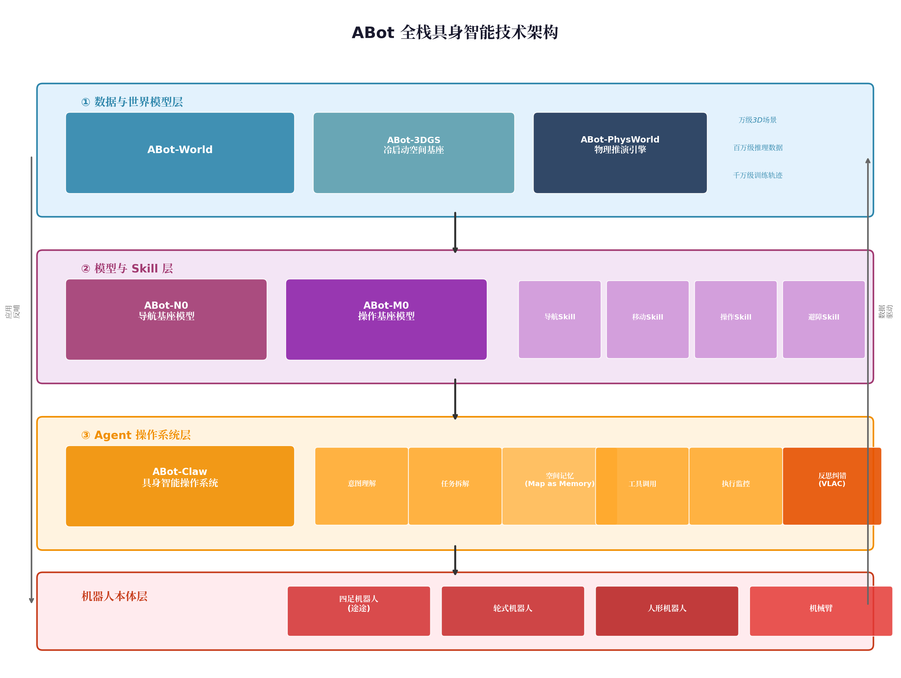
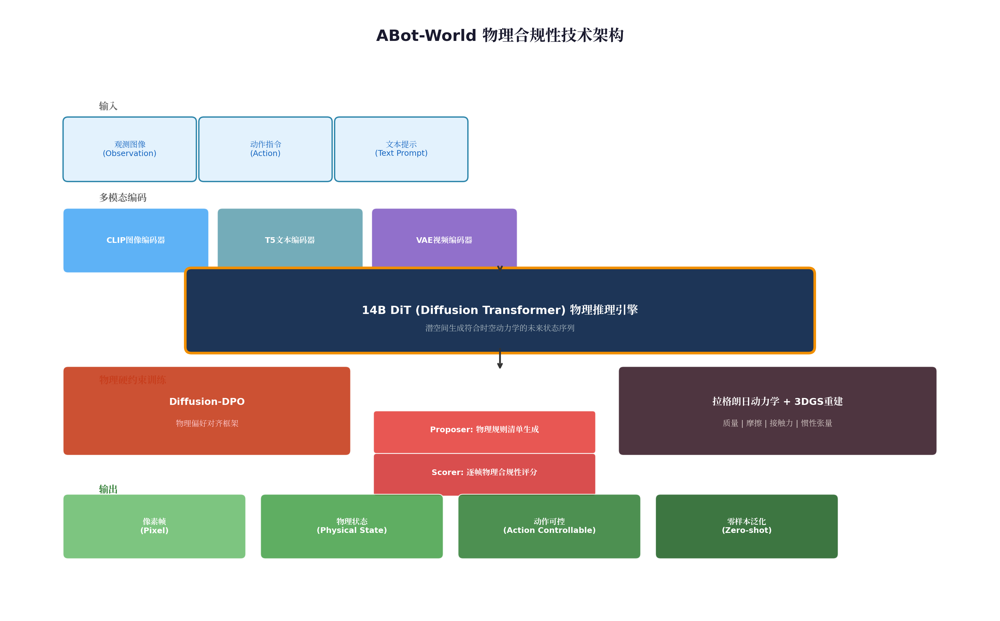
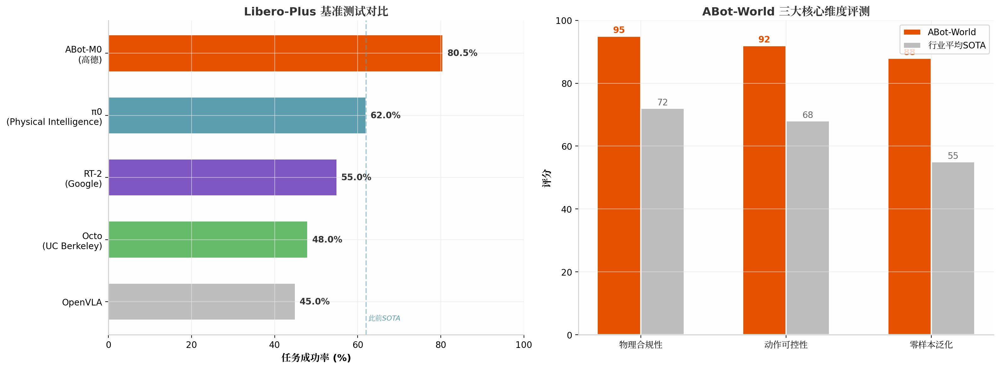
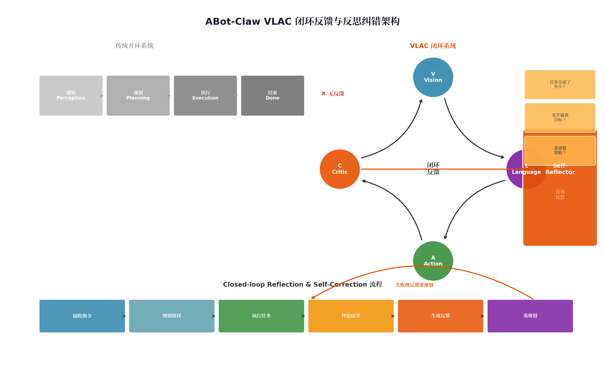

# 高德 ABot：从地图到具身的全栈智能导盲犬技术体系

> **核心来源**：晚点 LatePost 深度报道、高德公开技术资料、量子位、DoNews、知乎等公开报道  
> **发布时间**：2026 年 4 月（途途首次公开展示）  
> **开源仓库**：https://github.com/amap-cvlab/ABot-Claw

---

## 摘要

2026 年 4 月，高德在亦庄机器人半程马拉松上首次公开展示了其首款开放环境全自主具身机器人"途途"——一只能够引领视障人士在真实开放环境中自主行走的四足智能导盲犬。这并非又一款实验室 Demo 产品，而是高德**ABot 全栈具身智能技术体系**的首次完整落地。ABot 体系以**数据与世界模型层（ABot-World）**、**模型与 Skill 层（ABot-N0/M0）**、**Agent 操作系统层（ABot-Claw）**的三层架构为核心，构建了"数据驱动模型、模型服务应用、应用反哺数据"的闭环飞轮。该体系在**15 项全球权威基准评测**中达到 SOTA，其中 ABot-World 成为全球唯一在**物理合规性、动作可控性、零样本泛化**三大维度同时斩获第一的具身世界模型。

---

## 1. 导盲：为何是具身智能的"终极考场"

### 1.1 开放环境 vs. 封闭场景：难度跃迁的鸿沟

过去两年，具身智能最典型的展示画面往往发生在**封闭空间**或**人工预设遥控**的场景中：在整洁的实验室里叠衣服、弯腰提起一个杯子、沿着预先安排好的路线完成一段表演。这些 Demo 的共同前提是——环境被事先周密整理过，背景干净、变量有限、任务边界清晰，偶发因素被压到最低。

然而，**"导盲"几乎与上述所有"可控要素"背道而驰**。在一个无限开放、持续变化的真实世界里，机器需要同时判断空间、障碍和每一步的风险：人会突然停下、自行车会斜穿路口、盲道被占、低垂的树枝、台阶、积水——所有时刻变动的要素都不会提前打招呼。

高德工作人员在接触视障用户和相关机构后有一个明显感受：很多普通人默认成立的通行条件，对视障者并不成立。普通人把"到达"理解为从 A 点到 B 点；视障者面对的却是另一套问题——这个路口能不能过？有什么？怎么过？安不安全？**对视障者而言，独立出门是极其困难的一关；对机器人来说，也是如此。**"走出家门"意味着机器要有极高的开放环境导航能力，对物理空间有持续且深入的理解，同时和人的步速配合、理解人的指令，最后还要满足近乎苛刻的安全标准。

### 1.2 高德的选择：用"不允许出错"的场景验证具身智能

高德具身业务负责人诚卿、具身算法负责人徐牧将目前具身智能面临的问题概括为三大痛点：**数据缺乏、泛化能力不足，以及模型和产品之间的断层**。这也是具身智能和语言智能最大的不同：语言模型可以靠互联网语料快速扩张能力边界，哪怕有噪音和偏差，也能在海量试错中摸索出稳定运行的范式；具身智能则不同，机器人和世界打交道，需要对物体、空间、动作、时间、意图之间的复杂交互关系有深刻理解，容错率更低，也更难标准化。

高德给"途途"的定义是**"开放环境全自主具身机器人"**——重点不在"具身机器人"，而在**"开放环境"和"全自主"**。前者意味着它面对的并非一个被规划好的空间，后者意味着它不能依赖遥控和预设路线。高德挑选了一个几乎不允许出错的场景，就是想要验证：具身智能，到底能不能真正融入现实世界？

---

## 2. ABot 全栈架构：三位一体的具身智能操作系统

如果只把途途理解成"另一个机器人产品"，很容易低估高德做具身智能的决心。高德真正想展示的并不只是硬件，而是一整套把**地图导航能力、空间环境数据和机械执行操作**连接起来的全栈具身技术架构——无论场景和本体形态如何变幻，其背后的架构应该是统一的。



支撑途途的是一套名为**"ABot"**的完整具身技术架构，大体分成三层，形成了高德所称的**"飞轮式"技术路线**：涵盖数据、模型、应用三层，彼此深度咬合、互为引擎，实现"数据驱动模型、模型服务应用、应用反哺数据"，克服数据稀缺、仿真鸿沟与技能泛化三大行业瓶颈，形成持续自我进化的完整闭环。

| 架构层级 | 核心组件 | 功能定位 | 关键技术 |
|---------|---------|---------|---------|
| **数据与世界模型层** | ABot-World、ABot-3DGS、ABot-PhysWorld | 为具身模型提供千万级真实训练场景，理解物理规律 | 14B DiT、3DGS 冷启动、Diffusion-DPO 物理偏好对齐 |
| **模型与 Skill 层** | ABot-N0（导航）、ABot-M0（操作）、Skill 模块 | 解决"去哪里"和"做什么"的基础指令 | 大脑-动作分层架构、Flow Matching、AML 动作流形学习 |
| **Agent 操作系统层** | ABot-Claw | 意图理解、任务拆解、空间记忆、反思纠错 | VLAC 闭环反馈、Map as Memory、端云协同 |

### 2.1 数据与世界模型层：ABot-World

数据是具身智能的核心"燃料"，直接决定其泛化能力的天花板。不同于大语言模型，传统真机采集难以规模化，成本呈指数级攀升。作为数据层的核心，ABot-World 通过**批量合成 Video、Depth、Point Cloud、Trajectory 四类训练数据**，配合 RL Training Engine 在虚拟环境里定义奖惩、反复试错，以高保真仿真替代高昂的真机采集，从根本上弥合 Sim-to-Real 鸿沟，将数据成本压缩数个数量级。

ABot-World 并非传统意义上的视频生成器，而是**全球首个将物理定律深度嵌入生成全流程的可微分、可进化动力学引擎**。它的核心突破由四大支柱构成：

**（1）具身原生架构——14B DiT（Diffusion Transformer）**

ABot-World 专为具身智能设计了**140 亿参数的 DiT 架构**，以观测与动作为输入，在潜空间直接生成符合时空动力学的未来状态序列。其技术实现基于 **Wan2.1-I2V-14B-480P** 主干网络进行全量微调，采用 **LoRA 低秩适配技术**进行高效参数优化，通过并行上下文块实现动作条件的空间注入。整个流水线使用 **bfloat16 混合精度**训练，支持 **CPU offload**机制以优化显存使用。



该架构的核心组件包括：

| 组件 | 模型/技术 | 功能 |
|------|----------|------|
| 物理推理引擎 | **14B DiT** (Diffusion Transformer) | 核心物理推演，在潜空间生成未来状态序列 |
| 文本编码器 | **T5** (umt5-xxl) | 理解任务指令的语义信息 |
| 视频编码器 | **VAE** (Wan2.1_VAE) | 处理视频特征，编码/解码潜空间表示 |
| 图像编码器 | **CLIP** (open-clip-xlm-roberta-large-vit-huge-14) | 提取视觉语义，对齐图文表征 |

**（2）3DGS 冷启动空间基座——从稀疏输入到高质量 3D 场景**

ABot-World 的 3DGS 冷启动空间基座面向**手机拍摄、航测图等稀疏输入**，构建"**粗建模→高保真修复→蒸馏回环**"的自动化流程，将低质量视频转化为高质量 3D 场景，大幅拉低数据成本。依托高德自有地图与脱敏数据，结合 3DGS 技术实现**厘米级重建与光照一致性**，系统已累计生产**万级 3D 真实场景、百万级推理数据与千万级训练轨迹**，覆盖**99%的典型生活场景**。

**（3）物理硬约束训练——Diffusion-DPO 物理偏好对齐框架**

这是 ABot-World 最具技术原创性的部分。传统世界模型采用**最大似然估计（MLE）**进行训练，优化目标为最小化生成帧与真实帧之间的像素级差异。这种方式在通用视频生成任务中有效，但在机器人操作场景中存在**结构性缺陷**：它无法区分物理合规与物理违规样本。例如，物体穿透、无接触抓取、反重力运动等行为，只要像素分布接近真实数据，仍可能被模型视为合法输出。

ABot-PhysWorld 的训练方法引入**物理判别机制**，将优化目标从"像素相似度"转向"物理一致性"。该机制包含两个核心组件：

- **Proposer Module**：负责根据初始状态与指令，动态构建该任务下的物理检查清单——即哪些行为是允许的、哪些是致命违规（如穿透、无接触抓取、反重力运动），哪些属于细微但关键的物理保真点（如接触力反馈、摩擦响应）。
- **Scorer Module**：对多个候选生成结果进行逐帧评估，不仅判断是否完成任务，更关注其过程是否符合物理常识，并输出**结构化推理路径**作为反馈信号。

基于上述判别结果，模型采用 **Diffusion-DPO（Diffusion Direct Preference Optimization）**强化学习框架，构建优劣样本对，驱动模型主动抑制违反物理规律的行为。同时，**拉格朗日动力学与 3DGS 重建的融合**使得每一帧画面都成为包含**质量、摩擦、接触力等属性的可微分物理快照**。

**（4）"训练+数据"双引擎并行架构——模型自进化**

ABot-World 构建了训练引擎与数据引擎双轨并行的自进化架构。通过接入 **VLA（Vision-Language-Action）闭环**，模型实现"**预测即训练，演练即学习**"的持续进化：机器人根据推演执行动作，若失败，误差信号回传给 ABot-PhysWorld，模型自动调整参数，下次预测更精准。并经由**跨形态动作映射**，统一支持多种机械形态的精确控制。

### 2.2 ABot-World 的三大核心能力

基于上述技术架构，ABot-World 实现了三大核心能力，在 **PBench、EZSbench、WorldArena、Agibot World Challenge、WorldScore、GigaBrain**等主流评测中全部登顶，成为**全场唯一在物理合规性、动作可控性与零样本泛化三大核心维度同时斩获 SOTA 的模型**。

| 能力维度 | 技术内涵 | 评测表现 |
|---------|---------|---------|
| **物理合规性** | 生成每一帧严格遵守牛顿力学定律，杜绝穿透、反重力等低级物理错误 | PBench 物理感知评测第一 |
| **动作可控性** | 给定动作指令（如"下降 5 厘米、夹爪闭合"），精准计算接下来会发生什么 | WorldArena 纯文本控制任务第一 |
| **零样本泛化** | 即使遇到从未见过的物体或机器人，也能根据通用物理规律做出合理判断 | EZSbench 零样本评测刷新历史纪录 |



---

## 3. 模型与 Skill 层：ABot-N0 与 ABot-M0 的分工协作机制

若将 ABot 全栈体系视为具身智能的"运行大脑"，ABot-N 与 ABot-M 便是其**"运动双核"**，分别掌管机器人的"双腿"与"双手"，直接响应物理世界中"去哪里"与"做什么"的基础指令。

### 3.1 ABot-N0：全球首个五大导航任务"大一统"VLA 基座模型

ABot-N0 是全球首个在**单一模型中完整集成五大导航任务**的全栈导航基座模型，涵盖**点位导航（Point-Goal）、目标导航（Object-Goal）、指令跟随（Instruction Following）、兴趣点导航（POI Navigation）、人物跟随（Person Following）**。

**架构设计：层次化"大脑-动作"架构**

ABot-N0 采用**层级式"大脑-动作"设计**，由"认知大脑"理解指令并做推理，由基于**流匹配（Flow Matching）**的"动作专家"生成精确且多峰分布的连续轨迹。训练层面，研究人员先让模型做**认知训练**，再用部分认知数据和海量导航动作进行**联合监督微调**，最后用**强化学习**把导航决策对齐到人类偏好的行为价值，最终打造出真实环境中更通用的 VLA 基座模型。

**训练数据：业内最大规模具身导航数据引擎**

ABot-N0 依托约**8000 个高保真 3D 场景**及近**1700 万条专家示例**训练。高德将其在空间智能领域积累的海量真实导航数据——来自卫星、街景车、众包探针的多源时空数据——注入训练流程，使模型不仅具备室内环境的精细感知能力，更能理解开放城市空间的宏观语义。

**评测成绩：7 大权威基准全部 SOTA**

| 评测基准 | 任务类型 | ABot-N0 表现 | 提升幅度 |
|---------|---------|------------|---------|
| **CityWalker** | 开环点位导航 | SOTA | 显著领先 |
| **SocNav** | 闭环社会导航 | SOTA | **成功率提升 40.5%** |
| **R2R-CE / RxR-CE** | 视觉语言导航 | SOTA | 刷新纪录 |
| **HM3D-OVON** | 开放词汇目标导航 | SOTA | **成功率提升 8.8%** |
| **BridgeNav** | 桥接导航 | SOTA | 刷新纪录 |
| **EVT-Bench** | 事件驱动导航 | SOTA | 刷新纪录 |

ABot-N0 已部署于真实四足机器人平台，在**边缘侧实现推理与闭环控制**。

### 3.2 ABot-M0：全球首个统一架构的机器人操作基座模型

ABot-M0 为全球首个基于**统一架构**的机器人操作基础模型，其整合**超 600 万条真实操作轨迹**，构建当前**规模最大的通用机器人数据集 UniACT**（覆盖**9500 多小时训练数据、20 多种机器人形态**），并通过**动作流形学习（Action Manifold Learning, AML）算法**实现跨平台动作预测。

**技术架构：动作流形学习与双流感知**

ABot-M0 的核心技术突破在于：

- **动作流形学习（AML）**：让模型直接预测**结构合理、物理可行的动作序列**，而非传统的逐帧像素预测，大幅提升解码效率。动作流形的核心洞察是：真实机器人的有效动作并非均匀分布在高维动作空间中，而是集中在某些低维流形上。通过显式建模这些流形结构，模型能够以更少的参数实现更精准的动作生成。
- **双流感知架构**：弥补了传统 VLA 模型在**3D 推理**方面的短板，强化空间理解能力。该架构同时处理 2D 视觉特征和 3D 点云特征，通过交叉注意力机制实现两者的深度融合。

**评测成绩：4 大权威基准全面刷新世界纪录**

| 评测基准 | ABot-M0 表现 | 业界标杆对比 |
|---------|------------|------------|
| **Libero** | SOTA | 全面领先 |
| **Libero-Plus** | **80.5%** | 较 π0 提升**近 30%** |
| **RoboCasa** | SOTA | 全面领先 |
| **RoboTwin 2.0** | SOTA | 全面领先 |

### 3.3 Skill 机制：从基座模型到可组合的能力单元

在 ABot 体系中，ABot-N0 和 ABot-M0 并非孤立运行，而是被抽象为可组合的 **Skill 模块**——导航 Skill、移动 Skill、操作 Skill、避障 Skill 等。一个机器人从接受用户指令，到导航行走，再到进入室内找到目标位置，这个过程理应是**多种技能需求的混合调用**。

Skill 机制的设计哲学类似于软件工程中的**模块化编程**：每个 Skill 是一个独立的功能单元，具有清晰的输入输出接口，可以被 ABot-Claw 动态组合和调度。这种设计的优势在于：

- **可扩展性**：新增 Skill 无需修改现有模型，只需注册到 Claw 的技能库中
- **可复用性**：同一 Skill 可以跨场景、跨机器人形态复用
- **可解释性**：任务执行过程透明，每个决策步骤可追溯

---

## 4. Agent 操作系统层：ABot-Claw 的 VLAC 闭环与反思纠错

ABot-Claw 是整个 ABot 技术体系与物理世界交互的**关键枢纽**。模型能力再强，如果缺少一个中枢把**意图理解、空间记忆、任务拆解、工具调用、执行监控和纠错重规划**串联起来，系统依旧只能停留在"有劲使不出"的阶段。

### 4.1 ABot-Claw 的核心定位：从"被动执行器"到"主动调度者"

ABot-Claw 处于 ABot 技术体系的 Agent 层，**承上启下**：向下接收 ABot-M0（操作模型）和 ABot-N0（导航模型）的能力输出，向上统一调度四足、轮式、人形等不同形态的机器人本体。它不是又一个基座模型，而是让基座模型能力真正落地的**"中枢神经系统"**。

ABot-Claw 基于 **OpenClaw**构建（而非从零造轮子），将最初为高级软件操作和任务编排设计的 OpenClaw 运行时，扩展为一个适用于真实世界环境的**通用具身运行时**。其技术架构围绕三个密切相关的组件构建：



| 核心组件 | 功能描述 | 技术实现 |
|---------|---------|---------|
| **统一具身接口** | 连接多种类型机器人，暴露共享技能层 | 基于 ROS 的适配器，将原生功能映射到共享可调用技能 |
| **视觉多模态记忆** | 存储位置锚点、物体观察和语义图像 | Map as Memory：几何地图+语义地图+图像特征索引 |
| **Critic 风格反馈模块** | 任务进度评估，支持终止、局部纠正或重规划 | VLAC 闭环：Vision-Language-Action-Critic |

### 4.2 VLAC 闭环反馈：让机器人学会"自我检查"

**VLAC（Vision-Language-Action-Critic）**是 ABot-Claw 框架最具创新性的部分。传统机器人系统的流程是开环的：**感知→规划→执行→结束**，一旦执行偏离目标，系统无从知晓，只能"祈祷成功"。ABot-Claw 引入 VLAC 闭环，在执行链中增加了一个 **Critic（评估器）**环节：

```
传统开环：感知 → 规划 → 执行 → 结束
VLAC 闭环：感知 → 规划 → 执行 → 评估 → [调整策略] → 继续执行
```

Critic 在每一步都追问三个核心问题：
1. **任务完成了多少？** —— 对当前任务进度进行量化评估
2. **当前执行是否偏离目标？** —— 检测执行偏差并发出警告
3. **需不需要调整策略？** —— 决策是否需要重新规划

这与 Anthropic 提出的 Agent Loop 模式异曲同工——都是让 AI 在执行过程中**持续监控和调整**，而非一口气跑完才发现结果不对。

VLAC 的技术实现基于一个**通用奖励模型（General Reward Model）**。该模型在**大规模异构数据集**上训练，给定成对观测数据和语言目标，输出**密集的进度增量**和**完成信号**，无需任务特定的奖励函数设计，并支持**零样本上下文迁移**至未见过的任务和环境。通过提示词控制，单个 VLAC 模型可**交替生成奖励和动作标记**，实现评论器与策略的统一。

### 4.3 闭环反思与自我纠错：处理真实世界的长尾分布

面对充满不确定性的真实世界，高德在 ABot-Claw 中首创了 **Closed-loop Reflection & Self-Correction（闭环反思与自我纠错）**机制，赋予系统"**尝试-判断-调整**"的类人循环能力。

每个子任务完成后，系统的 **Self-Reflector 模块**会对执行结果进行评估。如果成功，继续下一步；如果失败，反思器生成**结构化的失败诊断反馈**，触发规划器重新规划。

**典型场景示例**：用户说"我渴了"

| 步骤 | 传统机器人 | ABot-Claw（途途） |
|------|----------|-----------------|
| 意图理解 | 字面理解"渴了" | 推理出"需要获取饮料"的隐含需求 |
| 初始规划 | 无规划能力 | 规划去最近的零食货架 |
| 执行结果 | 直接失败（若货架无货） | 到达货架，发现无货 |
| 错误处理 | 报错/卡死 | Self-Reflector 生成反馈："目标位置无目标物体，建议尝试自动售货机" |
| 重规划 | 无 | 规划器接收反馈，重新规划路径 |
| 最终结果 | 任务失败 | 在售货机前精准锁定一瓶可乐，任务完成 |

这种类人的"尝试-判断-调整"循环，是处理真实世界**长尾分布（Edge Cases）**的关键，也是 ABot-Claw 比传统机器人更"聪明"的根本原因。

### 4.4 Map as Memory：终结"一机一图"的历史

传统机器人往往只有**局部感知**，看到什么处理什么，视野之外的信息很快变成空白。高德提出了 **Map as Memory**的核心概念：先给机器人一张**持续存在的世界底图**，再把视觉、感知、动作嵌进这张底图里，实现像人类一样在**更长、更稳的空间记忆里做决策**。

ABot-Claw 的记忆系统包含三个层级：

| 记忆类型 | 存储内容 | 作用 |
|---------|---------|------|
| **几何地图** | 空间结构、位姿、轨迹 | 定位与路径规划 |
| **语义地图** | 物体类别、场景标签、关系 | 理解与推理 |
| **图像特征索引** | 视觉特征向量 | 场景识别与回环检测 |

这套记忆系统是**动态可维护**的。每一次任务执行的结果——无论成功还是失败——都会作为新的观测证据回写到拓扑图中。临时道路封闭、新开的店铺、调整后的室内布局，都能通过持续的"维护-反馈"机制动态更新。高德每天处理的海量导航数据——来自卫星、街景车、众包探针——也会**实时注入**这套记忆系统。这意味着机器人不仅能记住"静态的世界"，还能感知"变化的世界"。

### 4.5 多机器人协作：一个大脑控制一群机器人

ABot-Claw 首创了**"一个运行时、多智能体共生"**的具身智能范式。统一的技能抽象打破了异构机器人之间的边界——机械臂、人形、四足，不管什么形态，都可以在同一个框架下协同作业。任务上下文能**无缝移交**：如果一台四足机器人电量不足，另一台可以接手继续执行，不需要重新理解任务、重新规划路径。

Claw 采用**"云端大脑-边缘响应"的两级架构**：

| 层级 | 职责 | 响应时延 |
|------|------|---------|
| **云端（L3/L4 Planning）** | 高层任务分解与规划、全局地图维护、多机调度 | 百毫秒级 |
| **边缘侧（L1/L2 Control）** | 本地高频实时控制、避障、姿态稳定 | 毫秒级 |

这种架构的好处是：即便网络断了，边缘侧仍能保证基本功能运转；云端重连后，立刻同步状态，无缝续上。机器人遇到突发障碍时，不需要等云端响应，边缘侧直接避障，**毫秒级响应**。

---

## 5. 高德"从地图到具身"的战略路径

### 5.1 空间智能：高德的自然延伸

把具身智能放到高德自身的发展脉络里看，这并不算一次突兀的跨界。如果说高德过去做的，是把世界描述清楚——路在哪里、店在哪里、拥堵怎么出现、用户该怎么走、怎么更准确地到达——具身则是把这件事**再往前推一步**：不仅描述世界，还要**理解世界**，并最终通过机器，在这个世界里**自主行动**。

2025 年，高德对外宣布**"AMAP-AI Inside"**战略，将自身发展主题升格为**"空间智能"**。导航不再只是静态底图和路线规划工具，而是具备思考和推理能力的空间智能体。在当时，这种智能体还主要存在于手机和车机里；如今则是第一次拥有了途途这个身体，开始真正走进物理世界。

高德 CEO 郭宁说，空间智能对高德而言是**"终局"**，并且不是高德选择了空间智能，而是本身就长在了这片土壤之上。

### 5.2 数据护城河：近 10 亿月活的空间智能飞轮

高德具身智能业务最深的护城河，是多年来积累的**海量物理世界理解**。那些每天在高德地图各终端发生的**导航纠错、定位漂移、路况变化、入口偏差**，还有规模化的**行为验证与反馈**，汇聚成高德对物理世界的理解。

ABot 体系的设计逻辑直接沿袭自高德的**空间智能飞轮**：依托近**10 亿月活**场景产生的海量时空数据与实时反馈，算法在闭环中持续迭代，推动模型对物理世界的认知不断加深，飞轮每日在真实世界中自动演进。从根本上界定了高德的体系化优势：**不依赖单点技术突破，而是依靠飞轮在真实场景中持续运转的"转速"**。

| 数据资产 | 规模/特征 | 在 ABot 体系中的作用 |
|---------|----------|------------------|
| 道路与路口数据 | 覆盖全国，实时更新 | ABot-N0 导航训练的核心语义 |
| 建筑与 POI 数据 | 数亿级兴趣点 | 开放环境语义理解与目标导航 |
| 交通流数据 | 实时动态，秒级更新 | 开放环境中的动态障碍物预测 |
| 街景与航测图 | 海量历史积累 | ABot-3DGS 场景重建的输入源 |
| 导航纠错反馈 | 日均亿级用户交互 | 强化学习的人类偏好对齐信号 |
| 定位漂移数据 | 多源融合，全局覆盖 | Sim-to-Real 鸿沟的弥合 |

### 5.3 从"为人的导航"到"为机器人的导航"

为"人"导航的智能沉淀，正在成为引导"机器人"走进现实世界的操作系统。高德的空间智能基础设施为具身智能提供了三个层面的赋能：

**（1）超视距感知能力**

传统机器人的感知受限于传感器视野，而高德地图赋予机器人"**开了天眼**"的能力——超视距外的路况变化也能提前预判。依托导航模型与实时交通数据融合，途途可以在人车混流、突发施工等复杂路况中实现**超视距预判**，这是纯局部感知系统无法实现的。

**（2）开放环境的语义理解**

高德地图中的道路等级、交通规则、人行道/盲道语义、建筑物出入口信息等，为机器人提供了**先验的开放环境语义知识**。ABot-N0 正是将这些地图语义与机器视觉深度融合，实现了视距内与视距外的**双重安全保障**。

**（3）持续进化的数据闭环**

高德每天处理的海量导航数据实时注入 ABot-World 的记忆系统，使得机器人不仅能记住"静态的世界"，还能感知"变化的世界"。这种**数据-模型-应用**的飞轮效应，是具身智能从实验室走向大规模商用的关键基础设施。

---

## 6. 行业定位：ABot 在具身智能版图中的坐标

### 6.1 与主流具身智能方案的对比

| 维度 | 高德 ABot | 特斯拉 Optimus | 波士顿动力 | 宇树科技 |
|------|----------|---------------|-----------|---------|
| **核心定位** | 开放环境全自主具身 OS | 通用人形机器人 | 高性能运动控制 | 四足/人形硬件平台 |
| **软件架构** | 三层飞轮（数据-模型-Agent） | 端到端神经网络 | 传统控制+感知 | 硬件+基础 SDK |
| **世界模型** | ABot-World（14B DiT，物理合规） | 自研世界模型（侧重驾驶） | 无 | 无 |
| **导航能力** | ABot-N0（五大任务统一） | FSD 迁移（有限） | 预设路径为主 | 基础避障 |
| **开放环境** | **原生设计目标** | 实验室阶段 | 遥控/预设为主 | 室内/简单户外 |
| **数据优势** | 地图+导航海量数据 | 车队数据 | 无 | 有限 |
| **开源策略** | ABot-M0/Claw 已开源 | 闭源 | 闭源 | 部分开源 |

### 6.2 ABot 的开源生态战略

高德的目标不仅仅是做一台名为"途途"的机器狗，而是成为**物理世界智能化的智能基座提供者**。2026 年 3 月 31 日，高德宣布**全量开源 ABot-M0**，涵盖数据、算法与模型三大维度：

- **数据层面**：开源规模最大的通用机器人数据集 **UniACT**（超 600 万条真实操作轨迹）
- **算法层面**：开源**动作流形学习（AML）算法**、**双流感知架构**等核心技术
- **模型层面**：开源端到端预训练模型与完整工具链

近期高德团队还开源了 **ABot-PhysWorld**，作为 World Arena 的比赛基线。ABot-Claw 框架也已开源（GitHub: github.com/amap-cvlab/ABot-Claw），基于 OpenClaw 构建，支持多机器人协作、视觉语义建图、人机协作等场景。

---

## 7. 技术总结与未来展望

### 7.1 ABot 的核心技术创新

高德 ABot 全栈具身智能技术体系的核心创新可以总结为以下五点：

**（1）物理优先的世界模型范式**。ABot-World 首创将拉格朗日动力学深度嵌入 DiT 生成流程，通过 Diffusion-DPO 物理偏好对齐框架，将世界模型的优化目标从"像素相似度"转向"物理一致性"，从根本上解决了具身智能的"物理失真"问题。

**（2）导航与操作的双基座统一**。ABot-N0 和 ABot-M0 分别实现了五大导航任务的"大一统"和跨形态操作的统一架构，通过 Skill 机制实现灵活组合，打破了传统"一个任务一个模型"的碎片化局面。

**（3）VLAC 闭环反馈机制**。在传统 VLA（Vision-Language-Action）架构中引入 Critic 评估器，形成 VLAC 闭环，使机器人具备"执行-评估-调整"的类人反思能力，大幅提升了长周期任务的成功率。

**（4）Map as Memory 的空间记忆范式**。将高德二十余年的地图数据积累转化为机器人的持久化世界记忆，通过几何地图+语义地图+图像特征索引的三层记忆结构，终结了"一机一图"的行业现状。

**（5）飞轮式持续进化架构**。数据层、模型层、应用层深度咬合形成闭环飞轮，依托近 10 亿月活的真实场景数据，实现"预测即训练、演练即学习"的自进化能力。

### 7.2 挑战与展望

尽管 ABot 体系在技术上取得了显著突破，但面向 AGI 的具身智能仍面临诸多挑战：

- **Sim-to-Real 鸿沟的持续弥合**：尽管 ABot-World 大幅降低了仿真到真实的差距，但在极端天气、复杂光照、非结构化地形等场景下的鲁棒性仍需验证。
- **社会规范的深度学习**：机器人在人类社会中的行为规范（如电梯礼让、行人避让）需要更精细的强化学习训练，SocialNav 模型虽以高分入选 CVPR 2026 Oral，但真实场景的泛化仍需时间。
- **计算成本与边缘部署**：14B DiT 世界模型的推理成本较高，如何在低功耗边缘设备上实现实时运行是规模化部署的关键。

高德选择从机器导盲犬这一"几乎不允许出错"的场景切入，既是技术自信的体现，也是"科技向善"价值观的实践。中国有**1700 万视障群体**，而导盲犬仅有约**400 只**。途途不仅符合专业导盲犬的极高标准，还没有情绪波动、不会疲劳生病、服役周期长且能随着算法迭代持续进化。从"为人的导航"到"为机器人的导航"，高德正在用 ABot 体系书写具身智能走向 AGI 的中国答案。
