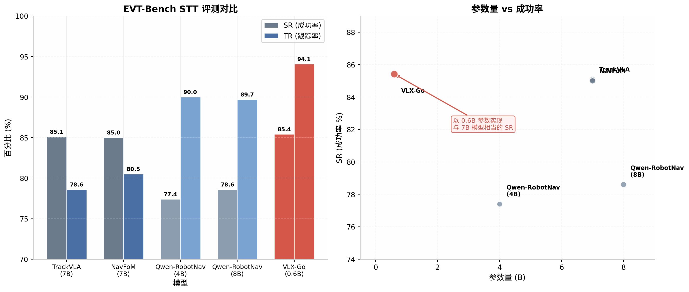
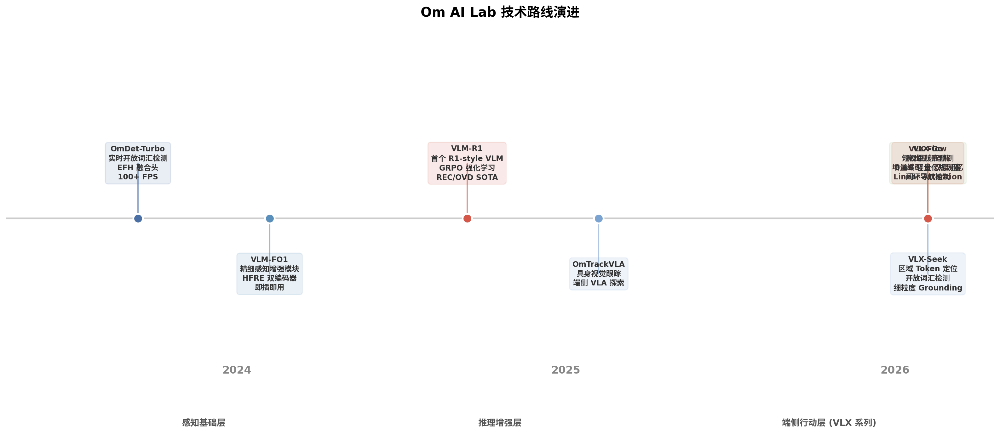

# VLX-Go: 0.6B 端侧视觉-语言行动决策模型

> **调研来源**：GitHub 仓库、项目主页、量子位报道、Om AI Lab 技术博客、学术论文（arXiv）、Hugging Face 等  
> **项目主页**：https://om-ai-lab.github.io/2026_06_28_vlx_go_en.html  
> **GitHub**：https://github.com/om-ai-lab/VLX-Go  
> **Hugging Face**：https://huggingface.co/blog/omlab/vlx-go

---

## 执行摘要

VLX-Go 是 Om AI Lab（联汇科技）发布的 VLX 端侧流式多模态模型系列中的**行动决策层**，以仅 **0.6B 参数**在 EVT-Bench STT 任务上达成了 **85.42% 成功率（SR）**和 **94.08% 跟踪率（TR）**，后者为当前所有对比模型中的最高水平。它代表了一种"小而准"的端侧具身智能设计范式：不追求通用 VLM 的泛化能力，而是将视觉-语言状态直接映射为机器人可执行的短视距航点，在规划-控制解耦的架构下实现闭环高频推理。在 VLX 三层体系（VLX-Flow 感知 → VLX-Seek 定位 → VLX-Go 行动）中，它为端侧设备提供了从"看得懂"到"动得了"的关键桥梁。

---

## 1. VLX 系列：端侧流式多模态的完整能力体系

### 1.1 系列定位与设计理念

VLX 系列是 Om AI Lab 提出的**全球首个面向物理世界的端侧流式多模态模型系列**，其核心设计理念是"流式多模态"——区别于传统视频理解模型将整段视频切帧后一次性离线处理的方式，VLX 面向物理世界中持续涌入的视频流，以**流式编码与缓存增量推理**实现毫秒级实时感知，并首次在端侧打通"持续感知 → 精准定位 → 行动决策"的完整闭环。

| 层级 | 模型 | 核心功能 | 参数量级 | 技术关键词 |
|------|------|----------|----------|------------|
| **感知层** | **VLX-Flow** | 实时流式视觉感知，增量编码 + 双层记忆机制 | 未公开 | 流式分块、视觉缓存、语义记忆、Linear Attention |
| **定位层** | **VLX-Seek** | Region Token 驱动的开放词汇检测与细粒度 Grounding | 3B | Region Token、HFRE、开放词汇检测、区域推理 |
| **行动层** | **VLX-Go** | 短视距航点预测，闭环导航控制 | **0.6B** | 航点回归、滚动时域、规划-控制解耦 |

三款模型共享同一基座，在同一条视频流上端到端协作。VLX-Flow 持续吸收视频流并维护内部记忆，VLX-Seek 在需要时对特定区域进行精细定位和 Grounding，VLX-Go 则将视觉-语言状态转化为可执行的运动目标。

### 1.2 VLX-Flow：流式感知层

VLX-Flow 是 VLX 系列的感知基础层，负责将持续涌入的视频流转为模型可理解的内部表示。其设计目标是解决传统 VLM 在流式场景下的根本矛盾：全量重处理导致延迟随历史线性增长，而固定窗口则丢失关键上下文。

**核心架构设计**：VLX-Flow 将输入视频分割为连续的**视频块（chunk）**，每个块包含少量帧，按时间顺序处理。对于每个新到达的块，视觉编码器将新帧转换为视觉特征，语言模型消费这些特征并更新内部记忆。历史信息以压缩形式保存在双层记忆结构中，而非作为原始帧反复追加。

**双层记忆机制**是 VLX-Flow 的核心创新：

- **视觉缓存（Visual Cache）**：保留近期帧级别的细节信息，用于即时交互和事件检测。当用户提出与当前画面相关的问题时，模型可以从视觉缓存中快速检索细节。
- **语义记忆（Semantic Memory）**：存储从视频流和交互中积累的高层次上下文，包括流式描述、先前观测、用户问题、模型回答和对话上下文。语义记忆负责维护长期时间叙事的连贯性。

两层记忆协同工作：视觉缓存保护近期细节，语义记忆保持长期时间叙事连贯。

**Linear Attention 缓存感知推理**：VLX-Flow 在语言模型中引入了 Linear Attention 组件。与标准自注意力（需要随序列长度增长的 KV Cache）不同，Linear Attention 可以通过**循环状态（recurrent state）**保存历史并增量更新。这带来了两个实际收益：延迟更稳定（无需为每次新交互重新计算完整历史），以及内存增长更平滑（长视频流可以以更低的内存压力保持语义连续性）。

### 1.3 VLX-Seek：精准定位层

VLX-Seek 是 VLX 系列的定位层，负责将视觉信号中的候选区域建模为可寻址的**Region Token**，实现开放词汇检测和细粒度 Grounding。其关键创新在于将传统的"坐标生成"问题转化为"区域检索"问题——不是让模型"猜坐标"，而是从候选区域中"选区域"。

**Region Token 机制**：VLX-Seek 将候选视觉区域建模为可寻址的区域 Token（如 `<obj0>`、`<obj1>`、`<obj2>`）。当用户询问"Find the people wearing red"时，模型无需从头写出四个数值坐标，而是检查候选区域 Token，识别最匹配描述的区域，并输出对应的 `<obj*>` 区域引用。例如：

```
<ground>people wearing red</ground><object><obj2><obj5></object>
```

这种输出方式相比长数字坐标序列更加紧凑、易于解析，且更符合语言模型的行为特征。在多目标场景下，VLX-Seek 只需输出短区域 ID，而非为每个目标输出完整的 `[x1, y1, x2, y2]` 坐标元组，显著降低了解码成本。

**两阶段训练策略**：

| 阶段 | 训练内容 | 目标 |
|------|----------|------|
| **区域-语言对齐** | 主 VLM 骨干大部分冻结，训练 HFRE（混合区域编码器）、区域-语言连接器和新增的特殊 Token | 建立区域 Token 与视觉实体之间的基本对应关系 |
| **感知指令微调** | 引入更丰富的感知指令，包括检测、指代表达理解、区域描述、区域推理、计数和 OCR | 在保持通用 VLM 能力的同时增强细粒度感知 |

在第二阶段训练中，VLX-Seek 特别处理了两种风险：**灾难性遗忘**（混入通用 VLM 指令数据以保持广泛的图像理解能力）和**幻觉定位**（通过负样本和拒绝样本教会模型在没有匹配目标时回答"未找到"）。

**技术脉络**：VLX-Seek 的技术积累来源于 Om AI Lab 此前的多个开源项目：**OmDet-Turbo**（实时开放词汇检测，EFH 融合头实现 100+ FPS）、**VLM-R1**（强化学习增强的视觉推理）和 **VLM-FO1**（HFRE 双编码器精细感知增强模块）。VLX-Seek 将这些能力汇聚并延伸，成为 VLX 系列中定位能力的核心承载。

---

## 2. VLX-Go 架构设计深度解析

### 2.1 输入输出接口与数据流

VLX-Go 的输入输出接口设计体现了"从感知到行动"的直接映射哲学：

**输入三元组**：
- **近期视觉历史** $H_t = \{I_{t-k}, \dots, I_{t-1}\}$：单目帧序列，提供时序上下文以理解目标运动、遮挡变化和场景动态
- **当前帧** $I_t$：即时视觉观测，提供当前时刻的环境状态
- **语言指令** $q$：如 "follow the target person and avoid obstacles"，定义任务意图

**输出**：
- **短视距航点序列** $W_t = \{w_1, \dots, w_T\}$：每个 $w_i$ 为局部运动目标（位置、朝向等），直接交由下游控制器消费。

数据流可以概括为：历史帧 + 当前帧 + 指令 → VLX-Go 航点规划器 → 短视距航点 → 控制器/仿真器。

### 2.2 核心设计选择的深层逻辑

| 设计决策 | 具体实现 | 设计逻辑 | 工程价值 |
|----------|----------|----------|----------|
| **0.6B 轻量化规划器** | 紧凑型 Transformer 架构 | 闭环高频推理需要极低的单次推理延迟 | 适合端侧部署，低功耗、低散热，可集成至边缘设备 |
| **滚动时域预测** | 不规划全局路径，只预测下一小段局部目标 | 新观测到来即重新规划，避免过时路径 | 适应动态环境（目标移动、障碍物进入视野、执行偏差） |
| **规划-控制解耦** | 规划器输出航点，控制器处理速度命令和安全约束 | 将"理解"与"执行"清晰拆分 | 便于评测、调试、从仿真迁移到真实部署 |
| **时序视觉上下文** | 利用近期帧理解目标运动、遮挡变化 | 单帧信息不足以支撑连续跟踪 | 提升遮挡恢复能力和目标运动预测精度 |

**与通用 VLM 的关键区别**：通用 VLM（如 GPT-4V、Qwen-VL）擅长生成语言描述、回答视觉问题，但输出的是文本形式的建议。VLX-Go 直接输出紧凑的运动接口信号（航点），更适合闭环具身系统。这种差异不是能力高低的差异，而是**接口形态的差异**——前者服务于人机交互，后者服务于机-机（模型到控制器）交互。

### 2.3 内部处理流程

根据 GitHub 仓库披露的信息，VLX-Go 的内部处理分为四个阶段：

| 阶段 | 操作 | 说明 |
|------|------|------|
| **视觉编码** | 将当前帧和近期视觉历史编码为视觉特征 | 提取空间信息和时序动态信息 |
| **语言条件** | 使用指令作为规划的任务条件 | 将自然语言意图嵌入到规划过程中 |
| **航点预测** | 使用 0.6B 规划器预测短视距局部运动目标 | 核心推理阶段，输出紧凑航点表示 |
| **闭环执行** | 执行预测航点，收集下一观测，预测下一段 | 滚动时域设计的实现 |

这种滚动时域设计在动态场景中具有实用价值：目标可能移动、障碍物可能进入相机视野、早期预测可以通过新观测得到校正。与一次性规划完整路径的方法相比，滚动时域设计让系统能够持续回应环境变化，而非被过时的全局计划锁死。

---

## 3. 训练策略与数据

### 3.1 两阶段训练框架

VLX-Go 采用**离线监督学习 + 在线强化优化**的两阶段训练框架：

| 阶段 | 数据/信号 | 训练目标 | 解决的问题 |
|------|-----------|----------|------------|
| **离线轨迹学习** | 演示轨迹、视频帧、语言指令 | 学习目标跟随与局部航点生成 | 建立基本的视觉-语言到航点的映射能力 |
| **在线仿真优化** | 仿真反馈、碰撞信号、目标状态、奖励信号 | 提升对遮挡、障碍物、闭环漂移的鲁棒性 | 补充离线数据未覆盖的失败模式 |

**离线阶段的监督目标**包括：
- **航点回归损失**：预测航点与真实航点之间的位置误差
- **轨迹方向损失**：确保预测轨迹的运动方向合理
- **可选速度/动作辅助损失**：联合优化运动学参数
- **平滑正则项**：避免航点序列出现不合理的抖动或跳跃

**在线阶段的核心作用**在于暴露策略于执行时的反馈信号。离线演示数据通常只覆盖"成功轨迹"，而在线仿真可以让模型经历碰撞、目标丢失、遮挡恢复等失败模式，从而学习如何从错误中恢复。这种**从失败中学习**的机制对于闭环系统的鲁棒性至关重要。

### 3.2 EVT-Bench 训练数据来源

VLX-Go 的训练和评测基于 **EVT-Bench**（Embodied Visual Tracking Benchmark），这是由 TrackVLA 团队构建的具身视觉跟踪评测基准。

EVT-Bench 基于 **Habitat 3.0** 仿真器构建，包含多样化的室内场景，场景中分布着数百个独立控制外观和运动的数字人。数据集关注三个渐进难度的任务：

| 任务 | 难度 | 说明 |
|------|------|------|
| **STT（Single-Target Tracking）** | 基础 | 单目标跟踪，每回合指定一个唯一目标，无干扰物 |
| **DT（Distracted Tracking）** | 中等 | 引入干扰物，测试目标身份持久性 |
| **AT（Ambiguity Tracking）** | 困难 | 模糊的自然语言目标描述，进一步增加辨识难度 |

在 STT 任务中，机器人需要跟随语言描述的目标人物（如"Follow the man in the blue t-shirt"），在拥挤的室内环境中保持追踪，同时保持适当的跟随距离并避开障碍物。相比物体导航，这一设定引入了时间关键性要求：运动预测、遮挡处理、目标重识别，以及在追逐与安全约束之间的平衡。

Qwen-RobotNav 的技术报告披露，其目标跟踪训练数据包含 **1,486K 样本**，全部来自 EVT-Bench 的 STT 划分。可以合理推断 VLX-Go 的离线训练阶段也主要依赖 EVT-Bench STT 数据。

---

## 4. 评测结果与深度分析

### 4.1 EVT-Bench STT 评测对比

VLX-Go 在 EVT-Bench STT 任务上与当前主流具身导航模型进行了对比评测：

| 模型 | 参数量 | STT SR ↑ | STT TR ↑ | STT CR ↓ | 推理速度 |
|------|--------|----------|----------|----------|----------|
| TrackVLA | 7B | 85.1 | 78.6 | **1.65** | ~0.1 FPS |
| NavFoM | 7B | 85.0 | 80.5 | — | ~5.1 FPS |
| Qwen-RobotNav-4B | 4B | 77.4 | 90.0 | 6.4 | 未公开 |
| Qwen-RobotNav-8B | 8B | 78.6 | 89.7 | 5.7 | 未公开 |
| **VLX-Go** | **0.6B** | **85.42** | **94.08** | 6.55 | **高频** |

> **SR（Success Rate）**：任务成功率，衡量回合级别任务完成能力  
> **TR（Tracking Rate）**：目标跟踪率，衡量时间步级别有效跟踪比例——**VLX-Go 在列出的模型中最高**  
> **CR（Collision Rate）**：碰撞率，衡量碰撞导致的回合终止比例——仍有优化空间



### 4.2 关键结论分析

**"小而准"的设计验证**：VLX-Go 以 0.6B 参数实现了与 7B 模型（TrackVLA、NavFoM）相当的任务成功率（85.42% vs ~85.0），同时在跟踪率上以 **94.08% 大幅领先**所有对比模型（高出次优 Qwen-RobotNav-4B 约 4 个百分点）。这验证了端侧轻量化设计路线在特定任务上的有效性：**参数规模并非导航性能的唯一决定因素，任务聚焦和接口设计同样关键**。

**跟踪率的领先意义**：TR 指标衡量的是时间步级别的持续跟踪能力。VLX-Go 在此指标上的领先表明，其滚动时域设计和时序视觉上下文的利用使其能够在长程跟踪中保持更高的稳定性——目标短暂丢失后能够更快恢复，遮挡处理后能够更准确地重新锁定目标。

**碰撞率的优化空间**：VLX-Go 的 CR 为 6.55%，高于 TrackVLA 的 1.65%。这一差距可能源于多个因素：TrackVLA 使用 7B 大模型具有更强的场景理解能力；VLX-Go 的 0.6B 参数在安全推理方面存在固有限制；碰撞率也与下游控制器的实现密切相关。优化方向包括：仿真环境中的奖励设计改进、安全约束的显式编码、以及控制器层面的避障策略增强。

---

## 5. 竞品深度对比分析

### 5.1 竞品技术路线概览

| 维度 | VLX-Go (0.6B) | TrackVLA (7B) | NavFoM (7B) | Qwen-RobotNav (4B/8B) |
|------|---------------|---------------|-------------|----------------------|
| **基础架构** | 轻量 Transformer | Qwen2-7B VLA | Qwen2-7B + TVI Token | Qwen3-VL + MLP Head |
| **输出形式** | 短视距航点 | 8-waypoint 轨迹 | 8-waypoint 轨迹 | 8-waypoint 轨迹 |
| **时序处理** | 近期帧历史 | 32帧滑动窗口 | BATS 动态采样 | 参数化观察配置 |
| **训练数据** | EVT-Bench STT | 1.7M 样本 (EVT+VQA) | 8M 导航样本 | 15.6M 样本 (5任务) |
| **训练策略** | 离线+在线两阶段 | 端到端 SFT | 端到端 SFT | 联合训练 + 配置随机化 |
| **核心创新** | 滚动时域、规划-控制解耦 | 并行分支 VLA | TVI Token、BATS 采样 | 参数化观察接口 |
| **部署定位** | **端侧原生** | 云端/服务器 | 云端 (RTX 4090) | 云端/服务器 |
| **多任务支持** | 跟踪为主 | 跟踪 | VLN/搜索/跟踪/驾驶 | VLN/搜索/跟踪/驾驶/问答 |

### 5.2 TrackVLA（7B）深度分析

TrackVLA 是北京大学与 Galbot 联合提出的具身视觉跟踪 VLA 模型，基于 **Qwen2-7B** 构建。其核心架构采用**并行分支设计**，同时处理视觉跟踪和视频问答任务，训练数据包含 **170 万**新收集的样本（具身视觉跟踪 + 视频问答）。

TrackVLA 的技术贡献在于证明了大规模 VLA 模型在具身跟踪任务上的可行性，并开源了 EVT-Bench 评测基准。然而，其 7B 参数规模和 ~0.1 FPS 的推理速度使其难以部署在端侧设备上，主要面向云端或服务器端应用。VLX-Go 与 TrackVLA 的关系可以看作是"同一任务的不同解法"——前者走轻量化端侧路线，后者走大模型云端路线。

TrackVLA 的后续版本 **TrackVLA++** 进一步引入了 **Polar-CoT**（极坐标思维链）空间推理机制和 **TIM**（目标识别记忆）模块，在 EVT-Bench DT 任务上超越此前最优方法 **5.1%（单目）**和 **12%（多相机）**。

### 5.3 NavFoM（7B）深度分析

NavFoM（Navigation Foundation Model）是北京大学提出的**跨具身、跨任务导航基础模型**，训练于 **800 万**导航样本，涵盖四足机器人、无人机、轮式机器人和车辆，覆盖视觉语言导航（VLN）、物体搜索、目标跟踪和自动驾驶等任务。

NavFoM 的核心创新包括：
- **TVI Token（Temporal-Viewpoint Indicator）**：嵌入相机视角信息和任务时间上下文的标识符 Token，实现对不同相机配置和时间跨度的统一处理
- **BATS（Budget-Aware Temporal Sampling）**：在有限 Token 预算约束下，基于遗忘曲线动态采样导航历史 Token，平衡性能和推理速度

NavFoM 在真实世界部署中使用配备 NVIDIA RTX 4090 的远程服务器，在 1600 Token 预算下生成 8-waypoint 轨迹最多需要 **0.5 秒**。与 VLX-Go 相比，NavFoM 的优势在于跨任务和跨具身的通用性，劣势在于端侧部署的不可行性（7B 参数 + RTX 4090 需求）。

### 5.4 Qwen-RobotNav（4B/8B）深度分析

Qwen-RobotNav 是阿里云基于 **Qwen3-VL** 构建的可扩展导航模型，其核心创新是将多任务导航的核心挑战重新定义为**观察上下文建模**问题而非架构设计问题。

**参数化观察接口**是 Qwen-RobotNav 最具特色的设计：
- **任务模式**（Task Modes）：VLN、PointNav、ObjNav、Tracking 等，允许上层规划器选择导航行为
- **可控观察参数**：视觉 Token 预算 $B$、时间衰减 $\gamma$、每相机权重 $w_c$ 等，控制模型如何消费观察流

训练时对所有参数进行随机化，确保模型在推理时可以零样本适应任何配置。Qwen-RobotNav 在 **15.6M 样本**上训练，联合多任务训练开发了跨任务族共享的空间规划基底。在 EVT-Bench 上，Qwen-RobotNav-4B 达到 77.4% SR / 90.0% TR，8B 版本达到 78.6% SR / 89.7% TR。

与 VLX-Go 相比，Qwen-RobotNav 的优势在于多任务通用性和参数化接口的灵活性，劣势在于参数量仍然较大（4B-8B），且 CR 指标（5.7-6.4）与 VLX-Go（6.55）处于相近水平。

---

## 6. Om AI Lab 技术路线梳理

### 6.1 技术演进脉络

Om AI Lab（杭州联汇科技股份有限公司）由 CEO 兼首席科学家**赵天成博士**带领，技术团队成员来自 CMU、清华、浙大、微软、阿里云等机构。公司已获得**工信部首张多模态模型认证**（OmModel 001 号），并开源了国内首个多模态智能体框架。



Om AI Lab 的技术演进可分为三个阶段：

**感知基础层（2024）**：以 **OmDet-Turbo** 和 **VLM-FO1** 为代表，构建实时开放词汇检测和精细视觉感知能力。OmDet-Turbo 提出 Efficient Fusion Head（EFH），实现 100+ FPS 的实时 OVD；VLM-FO1 提出 Hybrid Fine-grained Region Encoder（HFRE），作为即插即用模块增强 VLM 的感知能力。

**推理增强层（2025）**：以 **VLM-R1** 和 **OmTrackVLA** 为代表，将强化学习引入视觉语言模型。VLM-R1 是**首个将 DeepSeek R1 强化学习范式引入视觉语言模型的开源项目**，基于 GRPO 算法在 REC 和 OVD 任务上达到 SOTA，并揭示了"OD aha moment"等重要现象。OmTrackVLA 则探索了端侧 VLA 在具身跟踪任务上的可行性。

**端侧行动层（2026，VLX 系列）**：以 **VLX-Flow、VLX-Seek、VLX-Go** 三剑客为代表，首次在端侧打通"持续感知 → 精准定位 → 行动决策"的完整闭环，面向 AI PC、具身装备、可穿戴设备、机器人、无人机和 AIoT 等场景提供感知-决策-执行一体化能力。

### 6.2 核心技术栈关联

| 技术积累 | 在 VLX 系列中的延续 |
|----------|---------------------|
| OmDet-Turbo (EFH, 实时 OVD) | VLX-Seek 的区域检测能力基础 |
| VLM-FO1 (HFRE, 精细感知) | VLX-Seek 的 Hybrid Region Encoder |
| VLM-R1 (GRPO, RL 增强) | VLX-Go 在线优化阶段的 RL 方法参考 |
| OmTrackVLA (端侧 VLA 探索) | VLX-Go 的直接技术前身 |

### 6.3 开源生态布局

Om AI Lab 的开源生态覆盖多个维度：

- **旗舰 VLX 模型系列**：VLX-Flow（流式感知）、VLX-Seek（精准定位）、VLX-Go（行动决策）
- **推理增强**：VLM-R1（GRPO 强化学习）、ZoomEye（多模态放大探索）
- **实时感知**：OmDet-Turbo（实时 OVD）、VLM-FO1（精细感知增强）
- **多模态智能体**：OmAgent（多模态语言智能体框架）
- **评测基准**：OVDEval（开放词汇检测评测）、VL-CheckList（VLP 模型评测）

---

## 7. 端侧部署与工程实践

### 7.1 端侧 VLM 部署的技术挑战

将视觉语言模型部署在端侧设备（如机器人、无人机、AIoT 设备）上面临三重核心挑战：

| 挑战 | 具体表现 | VLX-Go 的应对策略 |
|------|----------|-------------------|
| **算力约束** | 端侧设备通常配备嵌入式 NPU/GPU（如 Jetson Orin、昇腾 Atlas），算力远低于服务器 GPU | 0.6B 参数轻量化架构，大幅降低计算需求 |
| **延迟敏感** | 导航闭环要求毫秒-秒级响应，大模型推理延迟可能超过安全阈值 | 滚动时域设计允许高频重新规划，单次推理负担轻 |
| **功耗限制** | 电池供电设备对功耗和散热有严格限制 | 小模型低功耗，适合长时间运行 |

根据边缘部署 VLM 的实践经验，Jetson Orin NX（16GB 统一内存）可以运行 3B-7B 量化模型，而 0.6B 级别的模型则可以轻松部署在更轻量的设备上（如手机 NPU、嵌入式 AI 芯片）。

### 7.2 VLX-Go 的端侧适配优势

VLX-Go 的 0.6B 参数规模使其在端侧部署上具有天然优势：

- **内存占用低**：0.6B 参数的 FP16 模型仅需约 **1.2GB** 显存/内存，远低于 7B 模型（约 14GB）
- **推理速度快**：轻量化架构可实现高频推理（目标 5-10+ FPS），满足闭环控制需求
- **量化友好**：小模型对 INT8/INT4 量化的敏感度更低，可进一步压缩至数百 MB 级别
- **功耗极低**：适合电池供电的移动机器人和无人机场景

### 7.3 部署架构建议

对于团队内部的技术选型，VLX-Go 的部署可以采用以下架构：

```
[相机] → [VLX-Flow 流式感知] → [VLX-Seek 区域定位] → [VLX-Go 航点规划] → [控制器] → [执行器]
          ↓
     [端侧设备/边缘节点]
```

在实际部署中，可以根据硬件资源灵活调整：
- **纯端侧部署**：三款模型全部运行在设备本地（适合高隐私要求、无网络环境）
- **边缘-端协同**：VLX-Flow 在端侧运行，VLX-Seek 和 VLX-Go 在边缘节点运行
- **云端增强**：复杂场景下可调用云端大模型进行辅助决策

---

## 8. 局限、优化方向与技术选型建议

### 8.1 当前局限

| 局限 | 影响程度 | 根因分析 |
|------|----------|----------|
| **碰撞率偏高** (6.55%) | 高 | 0.6B 参数限制场景理解深度；与控制器耦合度影响安全 |
| **数据集与 checkpoint 未开源** | 中 | 当前 GitHub 标注 "Coming soon"，开源完整度待观察 |
| **仅在仿真环境验证** | 中 | EVT-Bench 基于 Habitat 3.0，真实部署效果待验证 |
| **航点表示依赖数据集** | 中 | 航点维度依赖数据集和控制接口，跨平台通用性需验证 |
| **任务范围较窄** | 低 | 当前主要聚焦目标跟踪，VLN/ObjNav/驾驶等多任务支持待扩展 |

### 8.2 优化方向

**碰撞率优化**：可从三个层面入手——
- **模型层面**：增大规划器容量（如从 0.6B 扩展到 1-2B），引入显式的障碍物感知模块
- **仿真层面**：在在线优化阶段引入更丰富的碰撞场景和奖励塑形（reward shaping）
- **控制层面**：在控制器中增加安全约束层（如可达性分析、碰撞检测），作为规划器的安全网

**多任务扩展**：参考 Qwen-RobotNav 的参数化接口设计，为 VLX-Go 引入任务模式选择机制，使其能够处理 VLN、ObjNav、跟踪等多种导航任务。

**真实世界验证**：通过 sim-to-real 迁移技术（如领域随机化、对抗训练）缩小仿真-真实差距，在真实机器人平台上验证模型性能。

### 8.3 技术选型建议

**选型场景一：端侧移动机器人/无人机**
- **推荐**：VLX-Go（0.6B）+ VLX-Flow + VLX-Seek 组合
- **理由**：轻量化、低延迟、低功耗，适合电池供电设备
- **风险**：碰撞率需结合控制器安全层优化

**选型场景二：云端/服务器端通用导航**
- **推荐**：Qwen-RobotNav（8B）或 NavFoM（7B）
- **理由**：多任务通用性强，参数化接口灵活
- **代价**：高算力需求，高延迟，高成本

**选型场景三：研究探索/快速原型**
- **推荐**：TrackVLA / TrackVLA++
- **理由**：学术社区活跃，EVT-Bench 生态完善，便于对比实验
- **局限**：端侧部署不可行

**选型场景四：混合架构（端侧+云端）**
- **推荐**：VLX-Go 作为端侧实时规划器 + Qwen-RobotNav/NavFoM 作为云端高层规划器
- **架构**：端侧处理高频短视距规划（10+ Hz），云端处理低频长程决策（1-2 Hz）
- **优势**：兼顾实时性和智能性

---

## 9. 总结与展望

VLX-Go 代表了一种**面向具身导航的实用中间层设计范式**。它不追求通用 VLM 的泛化能力，而是将视觉-语言状态直接映射为机器人可执行的短视距航点。其 0.6B 轻量化架构 + 滚动时域闭环预测 + 规划-控制解耦的设计，在 EVT-Bench 上取得了有竞争力的导航表现（TR 94.08% 为当前最高），同时为端侧高频部署和仿真到真实的迁移提供了工程可行性。

在更宏观的视角下，VLX-Go 与 VLX-Flow、VLX-Seek 共同构成了 Om AI Lab 对"端侧物理智能"的系统性回答。三款模型分别对应感知、定位、行动三个层面，共享基座、协同工作，指向的是让 AI 从回答问题走向真实设备中的持续感知、目标定位和行动执行。

**核心判断**：VLX-Go 的价值不在于参数规模或通用能力，而在于它提供了一个**从多模态理解到导航控制的紧凑接口**。这正是当前具身智能从"看得懂"走向"动得了"的关键环节之一。随着 VLX 系列数据集的开放、真实世界验证的推进，以及与其他 VLX 组件的深度融合，VLX-Go 有望成为端侧具身导航系统中的重要基础模块。

---

**相关链接**：
- VLX-Go GitHub: https://github.com/om-ai-lab/VLX-Go
- VLX-Go 项目主页: https://om-ai-lab.github.io/2026_06_28_vlx_go_en.html
- VLX-Go Hugging Face: https://huggingface.co/blog/omlab/vlx-go
- VLX-Flow GitHub: https://github.com/om-ai-lab/VLX-Flow
- VLX-Seek GitHub: https://github.com/om-ai-lab/VLX-Seek
- Om AI Lab GitHub: https://github.com/om-ai-lab
- Om AI 体验平台: https://om-agent.cn/
- Om AI X: https://x.com/OmAI_lab
- VLX 系列报道（量子位）: https://www.qbitai.com/2026/07/441124.html
